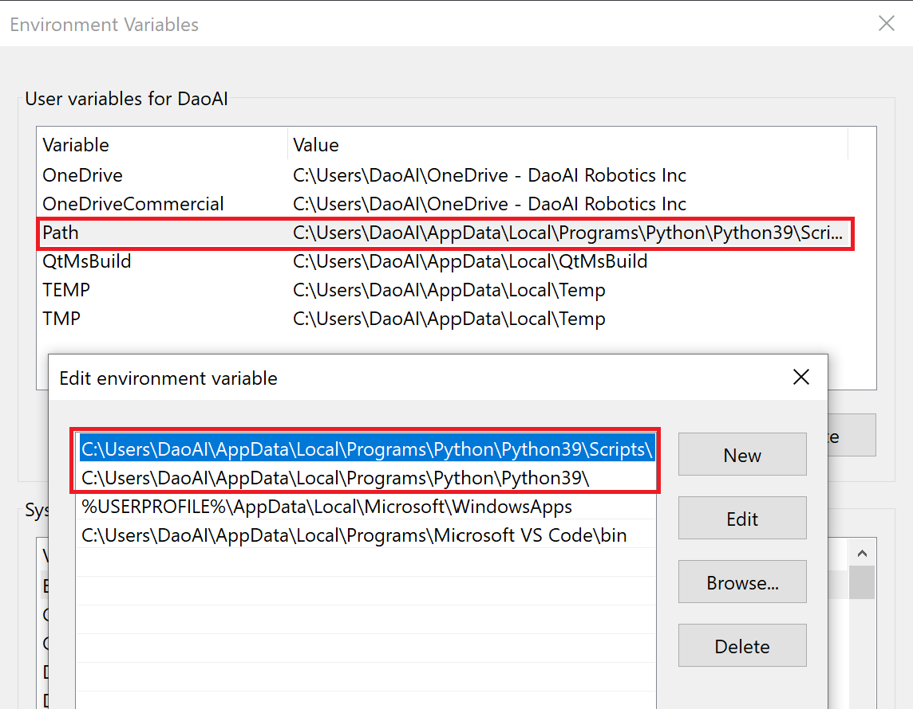
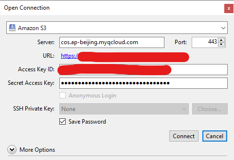

# DaoAI Vision: User Manual

This user manual is powered by Read the Docs, which works as a hosting provider and a continuous integration (CI) service for deploying Sphinx or MkDocs documentation in Git repositories. We are using Sphinx as the document site generator which uses reStructuredText (reST) as the markup language.

## Convetions for the document writting
   - All file and folder name should be using lower case, and use `-` for separating word
   - images folder should be kept right next to the rst file
   
## Key concepts in Read the Docs for Business

- Organization: For hosting multiple projects, adding user accounts as members, and managing teams. Subscription fees are charged per organization.
- Team: For limiting a group of members' access to only the specified projects. There are two types of teams: admin and read-only. Members of an admin team have full access to settings of projects managed by the team, while members of a read-only team can only read the documents.
- Project: For continuously building multiple versions of the documentation website from a repository. A webhook is automatically configured to enable triggers, and a pair of SSH keys are generated to get access to private repositories.
- Version: By default, Read the Docs enables a version named `latest` which keeps track of the `main` branch. There is also a `stable` version which is built on the commit of the latest tagged release. Read the Docs admins can also manually enable previous releases. Each version can be made either public (no login required) or private (login required; only members of the team that manages the project can view).
- Build: During a build, Read the Docs clones the repository and deploys the website based on the configuration. Triggered whenever the `main` branch is updated (`latest` version is built), a new release tag is created (`stable` version), or a pull request is created/updated ("Pull Request" version). You can also manually initiate a new build or rebuild an existing build.

## Create a new Sphinx project and preview on the local machine

1. Install Sphinx from pip:
   ```sh
   pip install sphinx
   ```
2. Create a new project folder, and then create a new folder named `docs` under the project root folder:
3. Under the `docs` folder, run the following to create a default documentation site with a configuration file (`conf.py`) and an index page (`index.rst`):
   ```sh
   sphinx-quickstart
   ```
4. To build the website locally, run the following in the `docs` folder:
   ```sh
   make html
   ```
5. Output files can be found under `docs/_build`. Open `docs/_build/html/index.html` to view the result.

## How to contribute to the documentation (requires write permission for a repository)

1. Create a new branch from the `main` branch of the documentation repository you want to contribute to.
2. Clone the repository to the local machine.
3. Add or edit documentation files under the `docs` folder by using your favorite editor. Check out `cheat-sheet.rst` for examples of embedding images, videos, links, table of contents, and more.
4. Because this project uses custom themes and extensions, install the following pip packages for your Python environment of choice. You can then run `make html` to check the result on the local machine.
   ```sh
   pip install sphinx furo sphinx-inline-tabs git+https://github.com/sphinx-contrib/video.git
   ```
5. Push your changes to the repository.
6. When you make a pull request, Read the Docs will automatically deploy a version of the website based on the latest commit. This also works whenever you push to that branch. To preview this build, click "Show all checks" and then "Details".
7. After the pull request gets approved, Read the Docs will redeploy the `latest` version of the project.

## (Optional) Set up a WYSIWYG environment using Visual Studio Code

1. Install [VS Code](https://code.visualstudio.com/) and the following extensions:
   * Python
   * reStructuredText
2. Open the project folder in VS Code.
3. On the status bar (at the bottom), choose a Python environment. Note that Python version must be 3.7 or later for the reST extension to work. If you need to install another Python version for this reason, make sure to keep only one Python version in the `Path` **user** environment variable.
   
   For example, if you have installed both Python 3.6 and 3.9, remove entries containing `Python36` generated during the installation of Python 3.6.
4. Make sure pip packages listed above are installed for your Python environment of choice.
5. Open any `.rst` file and then choose Sphinx as the HTML generator from rst files (which also shows the path to the configuration file `conf.py`).
6. Click "Install" when prompted.
7. If configured correctly, you can preview rst files by clicking the preview button in the upper right.

## How to upload videos (or any large files) to our file server and get a URL

1. We are storing and hosting large files using object storage and CDN hosted by Tencent Cloud. Because their object storage service is compatible with AWS S3 API, you can use any client software that supports S3 API to upload files, for example, [Cyberduck](https://cyberduck.io/). We will be using for the following steps, but other software works similarly.
2. Launch Cyberduck and open a new connection using the following credentials:
   
   ```
   Server: cos.ap-beijing.myqcloud.com:443
   Access Key ID: AKIDSkmX1FCsIRJuEI5bqoVv4yavznKZXEfp
   Secret Access Key: uWv4wXrviETSAbkdFaeRyEDuLVNyJNAg
   ```
3. Once successfully connected, you may upload files like using an FTP client.
4. To get the URL of a file, right-click a file and then go to "Copy URL". You cannot access the file by using this link because only the CDN has access to it. You need to change its domain to the CDN domain: change `https://cos.ap-beijing.myqcloud.com/daoai-robotics-1305756387/your-path-to-file` to `https://daoai-robotics-1305756387.file.myqcloud.com/your-path-to-file`.
5. Use the converted URL in your documentation files.

## How to create a new release version (requires write permission for a repository)

1. On GitHub, go to the repository and click "Create a new release" on the right.
2. Enter a new release version in the format `vX.Y.Z` and make sure the target branch is `main`.
3. Click "Publish release". This will create a Git tag which triggers Read the Docs to rebuild the `stable` version of the project.

## How to create a new documentation project (requires Read the Docs admin team membership)

1. Get a Read the Docs for Business account on <https://readthedocs.com/> and let the owner add you to the admin team member of the organization.
2. Create a new repository or use an existing code repository.
3. Add document files and configuration files.
4. On Read the Docs, link your GitHub account with access to the documentation repository and grant permissions.
4. Add a new project from this repository. Make sure the webhook is configured correctly. For private repositories, the SSH public key should be added in the GitHub repository settings with write permission. If not automatically configured for you, you need to manually configure them.
5. You may want to enable the `stable` version and building pull requests under the admin page of the Read the Docs project.

## Links

Most if not all of the following pages are built with Sphinx and Read the Docs, which often means you can easily view the ``.rst`` files.

- reStructuredText Primer: https://www.sphinx-doc.org/en/master/usage/restructuredtext/basics.html
- Another reST guide from TYPO3: https://docs.typo3.org/m/typo3/docs-how-to-document/master/en-us/WritingReST/Index.html
- Furo theme sample site: https://sphinx-themes.org/sample-sites/furo/
- Furo theme documentation: https://pradyunsg.me/furo/
- Read the Docs documentation: https://docs.readthedocs.io/en/latest/index.html
- Sphinx configuration (`conf.py`): https://www.sphinx-doc.org/en/master/usage/configuration.html
- Read the Docs configuration (`.readthedocs.yaml`): https://docs.readthedocs.io/en/stable/config-file/v2.html