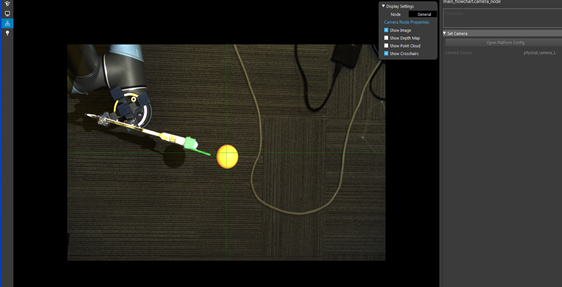
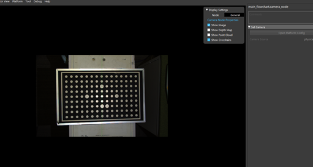

Calibration
===========

Calibration is the process by which the camera and the robot determine their relative positions in relation to one another, allowing the camera to direct the robot to the proper positions within the work cell.
Calibration can begin once the camera and robot are properly installed in the work cell. Calibration can be performed Eye-to-hand (flanged on the frame) or Eye-in-hand (mounted on the camera) in order to produce a coordinate system between the camera and the robot base, or between the camera and the gripper, depending on the case scenario. 

.. Attention:: 
    The coordinating system for both case scenarios need to be reset whenever the robot base gets moved or the camera gets taken off from the gripper. 

Sphere Calibration 
-------------------

Overview
~~~~~~~~~

The sphere calibration procedure establishes a coordinate system between the camera and the robot base (Eye to hand), or between the camera and the gripper (Eye in hand). Given that we will be detecting things in the images and that the images can only be translated directly to the camera coordinates, we will need a method for informing the robot about the location of the items in the actual world. And this can be accomplished by evaluating the object's accuracy in the scene cloud generated by the camera using the sphere mesh and its point cloud. Depending on the application type, the object's position will be displayed in relative coordinates.

Preparation
~~~~~~~~~~~~

* To obtain the best results, it is necessary to prepare the laboratory environment prior to running the sphere calibration program.
* The recommended size of the ball for calibration is 40 millimeters. To improve accuracy, the ball should be attached 20 to 25 cm away from the gripper's TCP. 

.. Attention::
    Due to the robotic vibration, the ball's coordinates displayed in the camera will be distorted, reducing the accuracy of the final result significantly. It is strongly recommended that you connect the ball and the gripper with a solid object rather than a bendable object. 
    
* When attaching the ball onto the gripper, the stick cannot be aligned to the X,Y, and Z axis of the flange. Orientations should occur on 3 axis in 100mm,100mm, and 100 mm respectively. 
* The ball should be positioned within the camera's optimal working distance. When generating the ball's coordinating system, the initial pose should always be in the center of the camera's field of view. Then, either clockwise or counterclockwise, gradually adjust the ball's position around the first pose to create at least eight additional poses. The more poses you generate, the more precise the result.

|
.. Attention:: 
    To ensure the ball is centered in the camera, the operator can enable the crosshair function in the view section display setting dialogue, which will center the ball in the cross. 

|
* When generating the pose for the ball, it is necessary to have both X and Y orientations exerted on the flange. 
* Each pose generated should maintain the same altitude. Too much height deviation will have a significant impact on the final result's accuracy.
* In the software, the user needs to adjust the value loaded inside the “Manage Variable” dialog based on the number of poses used in the calibration. 
  

|
Flowchart Setup
~~~~~~~~~~~~~~~~

The sphere calibration template comprises four different flowcharts: manual, calibration, SC_Eye_to_hand, and SC_Eye_in_hand. Each flowchart performs a distinct and crucial role inside the template.

|

The manual flowchart is the first flowchart that must be executed. The flowchart's purpose is to manage and save the camera's data, which includes the image, point cloud, depth image, camera intrinsic, and pose. 

The vision software will decide which case to execute based on the command constants received from the robot. In general, the operator must initiate a handshake between the robot and the vision software first. Once the connection is established, the vision software uses the Assemble Bag node to trigger the camera to capture the image and save the data. From the Writer Node, the data will be assembled into a bag file.

The operator can specify the mode of generating the bag file within the writer node. By selecting the source type into "From file", a single bag file can be saved. 

|

If there is a sequence of bag files, the operator can select “From Numbered” by defining the folder path and the file name along with its start and end index for each file. 

.. Attention:: 
    Normally we would set the end index into a large number to avoid editing the box in the future if the operator wants to add more poses for the calibration. 

|

Until all poses are executed, the flowchart will continuously run the second case for each pose. The flowchart will then transition to case three and terminate. All bag files will be saved in the operator-defined folder path.

After running the manual flowchart, the operator must import the bag file folder that was previously saved into the Calibration flowchart in order to generate the yml file that will be used for the actual bin-picking applications. The yml file specifies the accuracy threshold for locating the object in the image. The lower the value, the more precise. 

|

The operator can either manually filtering out the ball, or using the color filtering option to select the ball's cloud automactically. 

Manually filter the ball
~~~~~~~~~~~~~~~~~~~~~~~~~

    Inside the Reader node, uses the Folder path to load the bag file. 

|

    After disassembling the bag file, using the cloud process node, adjust the Bounding Box to select the ball's point cloud in the scene. 

|

Auto selecting
~~~~~~~~~~~~~~~

    To speed up the process of finding the sphere cloud, the operator can also use the color filter function in the operation list to exclude the colors which do not belong to the targeting object or just include the color of the aiming object. 

|

Inside the 3D Object Finder, the operator needs to load the model's mesh into the node. Based on the requirement, the operator can configure feature detail and sample strength in the dialog as well. 

|

After defining the model, the operator can use it to map the targeting object in the scene. The operator can define multiple models for associating objects of varying shapes. 

|
The operator can use the Alignment node to map the model and point cloud even better. 

|

In the first Sphere Calibration node, the final pairing data will be accumulated. To achieve a better result, the operator must adjust the Hand Eye Config to the desired mode and type in the value measured previously in the Sphere in Gripper Fields. 

.. Attention:: 
    To enable Eye-in-hand operation, change the Hand Eye Configuration to eye-in-hand.

The flowchart will iterate indefinitely until the number of poses is reached and the loop is broken. The final yml file will be generated in the template folder's "sphere calibrations" folder. 

|

.. Attention:: 
    Each time the operator generates a new yml file, the operator should change the file name to avoid overwriting the previous one.

|

Validation
~~~~~~~~~~~~~

The SC_Eye_to_hand and SC_Eye_in_hand flowcharts are similar to each other. Regarding to the application kind, the operator can select between the two flowcharts to visualize the final result based on application type. 

.. image:: Sphere_Calibration/Sphere_Calibration_image/image1/Picture18.png
    :width: 80%
    :align: center

|

In both flowcharts, the yml file should be loaded into the Sphere Calibration Node. Using the first Reader and the second Reader node to load bag file and gripper mesh. The operator should be able to check how well the gripper mesh matches with the point cloud in the visualize node.  

For Eye-to-hand and Eye-in-hand applications, the output generated by the transformation is between sphere to cloud shown in Pic 20. The operator can validate the final result by viewing the mapping result between the sphere model and the sphere cloud point displayed in the scene cloud. However, in the Eye-to-hand flowchart, the operator can also see the pairing result by changing the output result from sphere to tool in the Transformation Tree output. 

|

.. Attention:: 
    By recapturing the bag file for the gripper only and loading the same yml file generated previously, the operator can also check the pairing result of the tool's model mesh and scene cloud.  

For result validation, the operator needs to recapture the gripper bag file by using different poses instead of using the original poses generated in the beginning. 

|

Chessboard Calibration
----------------------

This algorithm attempts to calibrate the camera and the robot in order to determine the robot's relative position to the camera. After calibration, all coordinate systems will be accessible: Absolute (world), Camera, Gripper, and Robot Base. This enables the robot to position the gripper on a specific part of an object selected from the point cloud.

Preparation
~~~~~~~~~~~~~~

* To obtain the best results, it is necessary to thoroughly prepare the laboratory environment prior to running the chessboard calibration program.
* Attach the chessboard to the gripper's top.
  
.. Attention::  
    Due to the robotic vibration, the chessboard coordinates displayed in the camera will be distorted, reducing the accuracy of the final result significantly. It is strongly advised to reduce the robot's speed and set up the waiting time between each pose in order to capture a clear image.

* The chessboard should be positioned at the camera's optimal working distance. When generating the chessboard's coordinating system, the initial pose should always be in the center of the camera's field of view. Then, either clockwise or counterclockwise, gradually adjust the chessboard's position around the first pose to create at least eight additional poses. These poses should be angled approximately 30 degrees in relation to the Z direction of the world coordinates (as defined by the world points), and they should encompass the entire chessboard (even though the outer part of the chessboard may not contain any internal corners). Additionally, it is recommended to capture a small area around the chessboard to aid in the accuracy of later image corner detection. The more poses you generate, the more precise the result. 
* To ensure that the chessboard's initial pose is in the center of the camera, the operator can activate the crosshair function in the view section display setting dialogue, which will center the chessboard in the cross. The chessboard's maximum tilt angle is 40 degrees.
* The chessboard calibration can be done two ways: The operator can use the samll circle or use the large circle to calibrate; however, each method has different approach to setup poses for generating the bag file as shown in the picture. 

Small circle

|

|
large circle 

.. Attention:: 
    If using the large circle orientation function inside the calibration, the operator can turn the chessboard or camera in 180 degrees from -90 to 90 depending on the application type as shown in the picture. For Eye-to-hand, the camera is placed in the center. The arrow shows the direction of the chessboard (Eye-to-hand) or the camera (Eye-in-hand) should be facing at each pose location. 

|

|

* In comparison to the sphere calibration, the chessboard calibration requires more adjustments prior to running the flowchart. To begin, the operator must specify the number of poses to be used in the calibration. 
  

| 

| 

* Then the operator needs to choose the calibration type depending on the application requirement. By default, the variable will be set to 1 as calibration.  
  

| 

* Lastly, the operator needs to choose the approach for result validation, either using the pen on board, or gripper on TCP. 

| 

Flowchart Setup
~~~~~~~~~~~~~~~~

The first flowchart the needs to execute is the Manual flowchart. The purpose of the flowchart is to manage and save the data obtained from the camera including image, point cloud, depth image, camera intrinsic, and poses.

The vision software will decide to execute a specific case, based on the request command constants got from the robot. In general, the operator needs to perform a handshake first between the robot and vision software.  Once the connection is made, the vision software will trigger the camera to capture the image and save the image data by using Assemble Bag node. The data will be assembled into a bag file from the Writer Node.

Inside the writer node, the operator can specify the mode for generating the bag file. A single bag file can be saved by selecting the source type into “From file”. 

| 

| 

If there is a sequence of bag files, the operator can select “From Numbered” by defining the folder path and the file name along with its start and end index for each file. 

.. Attention:: 
    Normally we would set the end index into a large number to avoid editing the box in the future if the operator wants to add more poses for the calibration. 

| 

The flowchart will be continuously running the second case for each pose until all the poses have been executed. Then, the flowchart will switch into case three and stop. All the bag files will be saved inside the folder path defined by the operator.

| 

Instead of manually setting up the pose and generating the bag file, the operator can autonomously set up everything by using the Auto flowchart.  

| 

