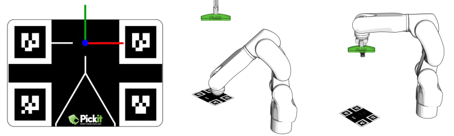

3D Calibration 
===========

Robot-camera calibration is the process where the **camera** and the **robot** learn their relative position with respect to each other, which allows the camera to guide the robot to correct positions in the work cell.

Calibration can be performed once the camera and robot have been mounted in the work cell, and needs to be redone if the camera moved relative to the robot base (fixed camera) or flange (robot mounted camera).

.. tip:: 
    You can learn about the main ideas behind robot-camera calibration by watching this video tutorial (TODO).

DaoAI ships with a calibration plate that has circles printed on it (below left). During robot-camera calibration, the robot shows this plate to DaoAI Vision from different viewpoints, and DaoAI Vision learns the relative position between camera and robot:

* For a **fixed camera mount** (below center), the plate is attached to the robot end-effector, and Pickit learns the location between the camera and the robot base.
* For a **robot-mounted camera** (below right), the plate is located at a fixed position in the work cell, and Pickit learns the location between the camera and the robot flange.

Calibration uses the color image in addition to 3D information to detect the plate, so it’s important for the markers in the plate to be clearly visible, without reflections, artifacts or over-illumination from external light sources learn more (TODO, to show what will be a good calibration board captured image).

Perform Calibration 
===========

The most accurate results are obtained when the calibration target is detected from multiple viewpoints, using multi poses calibration.

There are two types of calibration supported:

* Circle board calibration 
* Sphere calibration

Circle board calibration is suitable for situations where you can mount the calibration board on the robot end-effector easily, or you want to perform eye-in-hand calibration. Sphere calibration is suitable for situations when mounting the calibration board on the end-effector is hard, or you have mounted a tool on the end-effector already, and you don't want to remove the tool. In this situations, you could easily attach the sphere.

(TODO: Images for circle board, and sphere[the red ball on the scissor])

Validating calibration
===========
An **incorrect** or **outdated** calibration can lead to unexpected robot motions. An incorrect calibration can result from not following correctly the calibration prodecure. A calibration can become outdated if the camera moved relative to the robot since the last successful calibration.

.. note:: The robot-camera calibration quality relies on the robot accuracy(TODO, follow pickit doc) and on the camera accuracy (TODO, follow pickit doc). Therefore, if you observe a persistent robot-camera calibration error that cannot be fixed with better calibration poses, it is recommended to verify the accuracy of both camera and robot.

There are two ways in which robot-camera calibration can be validated:

* Quantitative validation (to link), using the DaoAI calibration template with corresponding robot program.
* Qualitative validation (to link), using the DaoAI calibration template and manual inspection.

.. Attention:: The first picks after performing calibration should be executed at a **low robot speed**, so unexpected behavior can be identified early enough to prevent the robot from colliding with people or the environment.

