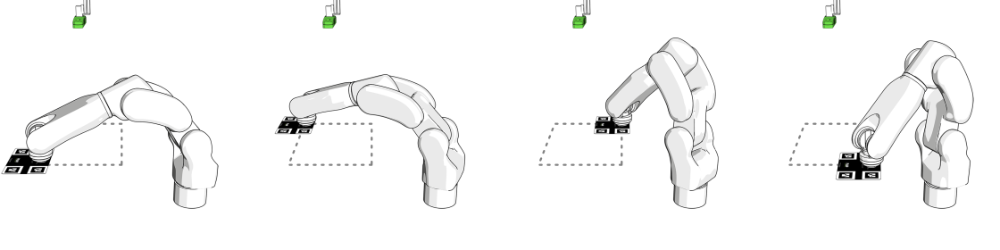
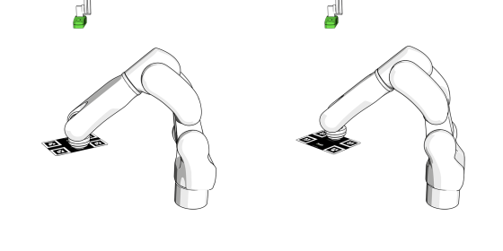
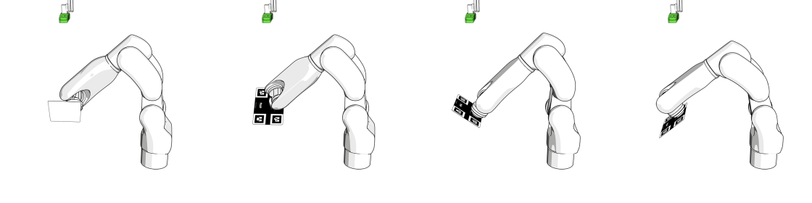

Circle Board Calibration
=============

Circle board calibration is the recommended method for performing robot-camera calibration in Pickit. With this method, the robot shows the calibration plate to Pickit from different viewpoints.

.. tip:: You can learn about the main ideas behind multi poses robot-camera calibration by watching this video tutorial (To add).

The placing of the calibration plate and the poses from which it is detected depend on the camera mount.

Fixed camera mount
===========

If the camera is fixed to a static structure, the calibration plate must be attached to the robot flange. It does not matter how the plate is mounted, as long as it’s rigidly attached to the flange (TO ADD A LINK). It can be, for instance, directly attached to the flange (below left) or grasped by the robot gripper (below right). You should not attach it, for instance, to a suction cup with flexible bellows, as the plate will wobble.

The calibration poses are such that:

* The calibration plate is at a distance to the camera similar to the distance at which parts are expected to be picked.
* The calibration plate can be correctly detected.(TO ADD A LINK)
* The poses are distinct enough to produce an accurate calibration.
* The order in which the poses are captured is not important.

DaoAI recommends collecting the ten poses shown below to obtain an accurate calibration. It is however allowed to collect a different amount of poses, as long as their quality is good enough.

* The first four poses capture variation in plate position:

* The next two poses capture variation in the camera-facing rotation of the plate:

* The last four poses capture variation in plate tilt:

Robot mounted camera
=======
(COPY THE SAME CONTENT AS PICKIT)    [https://docs.pickit3d.com/en/latest/documentation/calibration/multi-poses-calibration.html#calibrating-from-the-web-interface]

