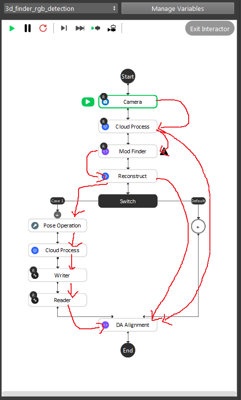
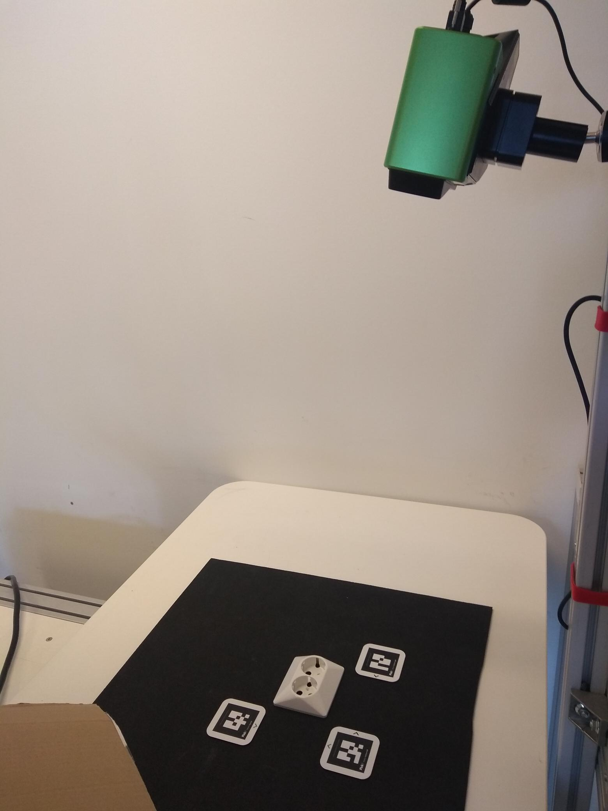
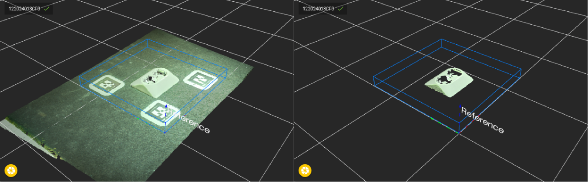

Gray Mod Finder
===================

The gray mod finder pipeline has 3 stages, one is to find the object on gray(rgb) image, then map to 3d space, and finally use alignment to get accurate result.

Pipeline Overview
~~~~~~~~~
.. image:: Images/gray_mod_finder_det.png
    :width: 40%
    :align: center 
As the image above shows, the gray mod finder contains 5 sections in the whole flow:

* Section 1: Used the camera to capture 3D data, then use cloud process (adjust bounding box feature) to set the working cell of the project.
* Section 2: Used mod finder 2d mode to find the object in the 2d image.
* Section 3: Use the reconstruct node projecting feature to map the 2d result from mod finder node into the 3d space.
* Section 4: This section was used to crop the 3d model of the object, and use it for the alignment. And this section will only be executed once during the defining time.
* Section 5: The alignment in this section was used to align the 3d model from section 4 into the 3d space. It takes in the output from section 3, where the reconstruct node output the initial pose of the object.

During the runtime, the execution flow is section 1 -> 2 -> 3 -> 5. And during the defining time, the execution flow is section 1 ->2 -> 3 -> 4 -> 5. 

As the above image shows (TODO, draw professional image), the red line is the data flow for the nodes. And more details can be found with this `workspace <https://domain.invalid/>`_ (TODO, upload a sample workspace for this flowchart, and also upload testing data the user can test with). 

Teach model from camera
~~~~~~~~~~~~
REFERENCE (https://docs.pickit3d.com/en/latest/documentation/detection/teach/teach-from-camera.html#teach-from-camera)

Teaching an object model is the most important step when setting up the DaoAI Mod Finder engine to detect your object. The model is the only thing that is used by vision studio to search for your objects in a scene, so a better quality model results in better detections. A high-quality camera model has the following characteristics:

* It contains as many details of the object as possible,
* It contains only points that belong to the object itself and
* It exactly matches the side of the object that you want to detect.
  
Continue reading to learn how to build a high-quality model.

Placing the object under the camera
~~~~~~~~~~~~~~

Place your object under the camera and try to put it as close as possible to the center of your working enviroment (center height of the working cell, and at the center of the image) to capture the sample image while making sure that the object is lying fully in the field of view of the camera. It’s useful to run the camera node continously, and turn on the point cloud view to see the image quality of the object. 

Setting up the ROI 
~~~~~~~~~~~~~~
Usually the camera field of view will be larger than the region of interest, thus the first step usually is to setup the boundary for the useful information. You could run to the first cloud process node, and make sure the **adjust bounding box** options was on in the cloud process display setting. The run the cloud process node. Then you could adjust the bounding box. 

.. tip:: When adjust the bounding box, you could press **R** to reset to the original view, and blabla for the operation trick

Define the 2D model with the image
~~~~~~~~~~~~~~~

We use the RGB output from the cloud process node, and now we run the mod finder node once to load in the image. Then click **add model**, then select a bounding box on the image. To define a good model, see the following sections and the mod finder node introduction (TODO, add the link).

After define the 2d model, head to the reconstruct node, and run it. You will see the object position in the 3d space, blabla. 

.. tip:: * To define the model more clearly, you could first enlarge the image view in the display.
    * To make sure the reconstruct node work properly, need to be sure that there is valid point on the reference point of the object. See more details of the reconstruct node (TODO: add link)

Isolating the object
~~~~~~~~~~~

As the pipeline flowchart shows, you will need to make sure the switch go to the left branch, we usually use the variable ** to control. blabla 

Detect the object 
~~~~~~~~~~

.. tip:: You can learn about the main ideas behind the gray mod finder engine by watching this video tutorial. (TODO, record a video)

How to teach a good model
~~~~~~~~~~

How to set good model matching parameters
~~~~~~~~~~~~~~~~~~~~

