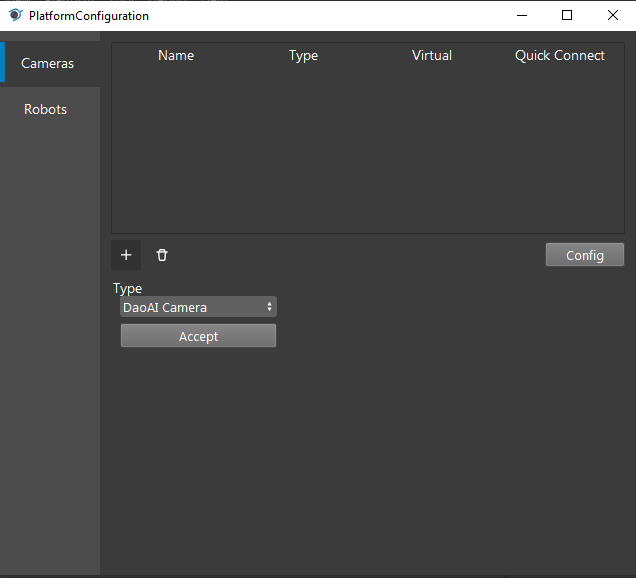
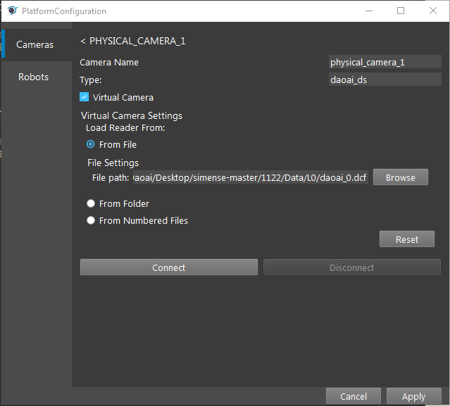
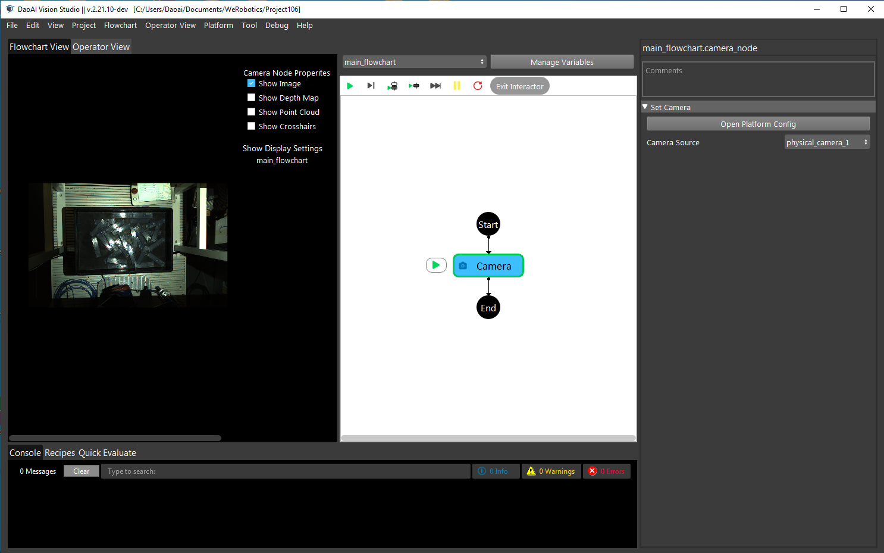

DaoAI Camera (DS)
=================

In addition to allowing the connection of Physical Daoai Camera, **DaoAI Vision Studio** offers the Virtual Camera function in order to allow user to load existing image files.

On the top menu bar, select ``Platform`` ->  ``Platform config page``. 

.. image:: Images/Camera0.png
    :align: center
    
|

Select ``Cameras`` on left side menu bar and click ``+``, then choose **DaoAI Camera**, Then click ``Accept`` button below.

    
|

Now you have two options to proceed: **Vritual Camera** or **Physical Camera** (Default).

Physical Camera
~~~~~~~~~~~~~~~

Click ``update Camera list`` and select the Serial Number of the camera, then click ``Connect``.

.. image:: Images/Camera5.png
    :align: center
    
|

Virtual Camera
~~~~~~~~~~~~~~

Select ``Virtual Camera``, Click ``Browse`` to Choose the image files you want to load, then click ``Connect``.

.. note:: 
    | There are three options to load the image file.
    | 1. From file: loading single image file
    | 2. From Folder: loading all image files in the folder one by one
    | 3. From Numbered Files: loading image files based on numbered file name one by one.

    
|

Select the camera name you just created in the ``Camera Source`` and run the camera node in the flowchart.

    
|

