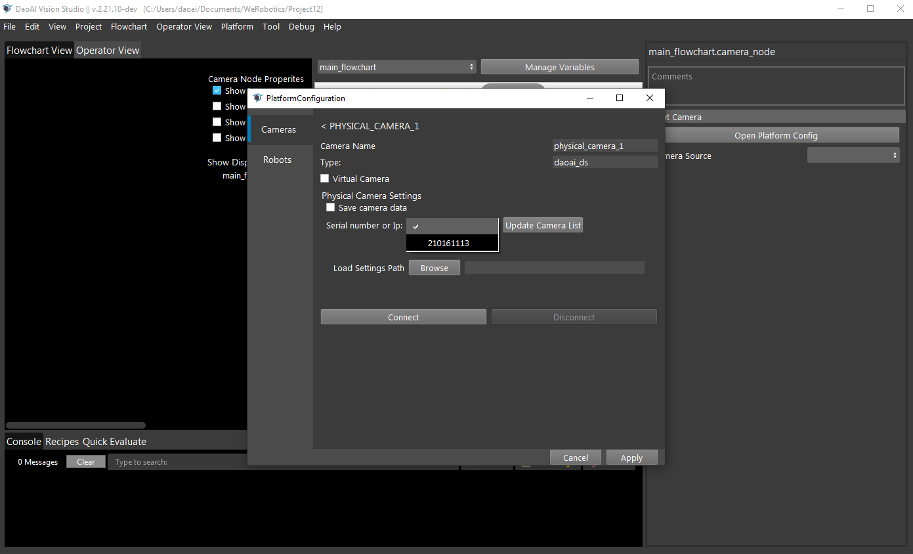

DaoAI Camera (DS)
=================

Physical Camera Wire Connection
~~~~~~~

Connect the camera via DaoAI Camera Studio
~~~~~~~~~~~~~
Connect, capture, save out cfg files

Connect the camera via DaoAI Vision Studio
~~~~~~~~~~~~~

Connect the virtual camera via DaoAI Vision Studio
~~~~~~~~~~~~~

Use Camera with Camera Node
~~~~~~~~~~~~~~~~~~~~

Common Issues
~~~~~~~~~~~~~~
* USB 3.0 cable issue
* cfg file doesn't match 
* Not able to find the camera

In addition to allowing the connection of Physical Daoai Camera, **DaoAI Vision Studio** offers the Virtual Camera function in order to allow user to load existing image files.

On the top menu bar, select ``Platform`` ->  ``Platform config page``. 

.. image:: Images/Camera0.png
    :align: center
    
|

Select ``Cameras`` on left side menu bar and click ``+``, then choose **DaoAI Camera**, Then click ``Accept`` button below.

.. image:: Images/Camera2.png
    :align: center
    
|

Now you have two options to proceed: **Vritual Camera** or **Physical Camera** (Default).

Physical Camera
~~~~~~~~~~~~~~~

Click ``update Camera list`` and select the Serial Number of the camera, then click ``Connect``.

    
You can also load a camera setting file when connecting to a camera. The settings include projector/camera parameters when capturing 2d images and parameters used when generating the point cloud.
The camera config file (.cfg file) is created by DaoAI Camera Studio Program.
Refer to Camera Studio User Manual for details on how to adjust camera parameters and exporting config as a file.

Virtual Camera
~~~~~~~~~~~~~~

Select ``Virtual Camera``, Click ``Browse`` to Choose the image files you want to load, then click ``Connect``.

.. note:: 
    | There are three options to load the image file.
    | 1. From file: loading single image file
    | 2. From Folder: loading all image files in the folder one by one
    | 3. From Numbered Files: loading image files based on numbered file name one by one.

.. image:: Images/Camera3.png
    :align: center
    
|

Select the camera name you just created in the ``Camera Source`` and run the camera node in the flowchart.

    
|

