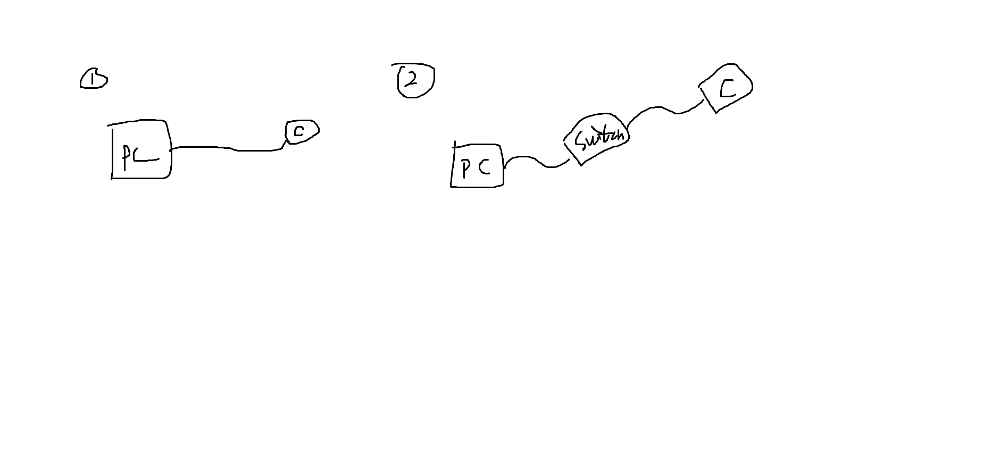
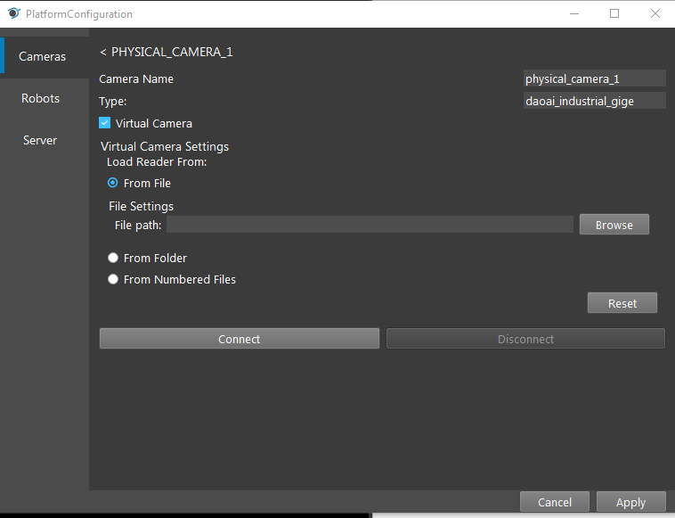

Daoai Gige Camera
=================

Physical Camera Wire Connection
~~~~~~~~~~~~~

The Gige camera can directly connect to the **POE** port of the industrial PC, or through a **POE** switch.  

.. Attention:: 
    * In order to have stable connection, the ethernet cable need to meet industrial usage standard, and CAT6 above. If there is any sudden disconnection, most likely it's the cable issue. 
    * Once camera connected, the **power** and **POE** connection status indicator on the camera and industrial pc should be green. Otherwise, could check if the industrial PC/switch **POE** power is stable or not.

Connect the camera via DaoAI Vision Studio
~~~~~~~~~~~~~

Once physically connected, open **Platform** config, click the **+** button, and select **DaoAI Gige Camera**, click accept. {Insert Image}

Click the **Update Camera List**, and select the camera you wanna connect. Then connect. {Insert Image}

In order to tune the camera, sometime you want to change the Exposure time and Gain. You will need to disconnect, then connect if you would like to change the value. {Insert Image}

.. Attention:: 
    * In order to connect the PC with the Gige camera, both has to fall within the same sub network. Check the **Network configuration**
    * The larger the exposure time and gain, the brighter the image. Some model of the camera has a available range for the exposure time and gain, will need to check the model. 

Connect the virtual camera via DaoAI Vision Studio
~~~~~~~~~~~~~

The virtual camera will read the \*.png files, and select the way you would like the system to find the \*.png files.

.. Attention:: 
    * From file: Select a single png file
    * Fron folder: It reads out all the \*.png file from the folder
    * From numeric: Read specific files with dedicated prefix.

Use Camera with Camera Node
~~~~~~~~~~~~~~~~~~~~

{Insert a image of using camera node to use the connected camera system}
Insert a camera node, and select the camera system that was just connected. And run it, so that you will be able to see the captured image.

Network configuration
~~~~~~~~~~
In order to let the camera and industrial pc to connect, they both need to fall in the same subnet. Usually the camera was configured to automatically get an IP from the industrial PC, in this way, the camera can get an IP which can directly communicate.

Sometimes, the Gige camera was configured to a different subnet that the **POE** network driver. In this way, you need to either change the **PC** network to a static Ip that could match the Gige camera, or set the camera to automatically get a new IP address (usually this could through the factory reset). The subnet usually means the last number of the ip is different, but all the other numbers are the same, and the mask is 255.255.255.1

(https://daoairoboticsinc-my.sharepoint.com/:v:/g/personal/xchen_daoai_com/EYtBcbhQ_81BsRhaVsQl3joBTeXz-xN8_h55dBTXGgIFig?e=6rkjyP) Convert this video to gif, and document to explain how to configure the subnet.

Common Issues
~~~~~~~~~~~~~~

To be filed.