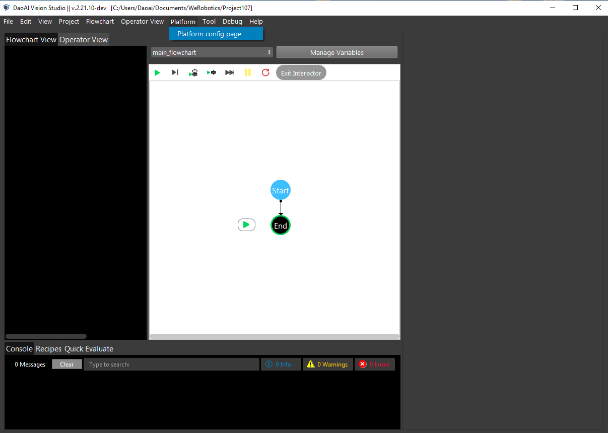

Virtual Camera
=================

Connect with virtual camera
~~~~~~~~~~~~~~
In addition to allowing the connection of Physical Daoai Camera, **DaoAI Vision Studio** offers the Virtual Camera function in order to allow user to load existing image files.

On the top menu bar, select ``Platform`` ->  ``Platform config page``. 

|

Select ``Cameras`` on left side menu bar and click ``+``, then choose **DaoAI Camera**, Then click ``Accept`` button below.

.. image:: Images/Camera2.png
    :align: center
	
|

Now you have two options to proceed: **Vritual Camera** or **Physical Camera** (Default).   

|
Select ``Virtual Camera``,to using the virtual camrea, there are three methods to load the camera file, which are ``From File`` ,  ``From Folder`` , ``From Numbered Files``. to Choose which method you want to use, then click ``Connect``.

.. note:: 
    | There are three options to load the image file.
    | 1. From file: loading single image file
    | 2. From Folder: loading all image files in the folder one by one
    | 3. From Numbered Files: loading image files based on numbered file name one by one.

.. image:: Images/Camera3.png
    :align: center
    
|

From File
~~~~~~~~~~~~~
Select ``From File``, Click ``Browse`` to Choose the image files you want to load, then click ``Connect``.

Select the camera name you just created in the ``Camera Source`` and run the camera node in the flowchart.

.. image:: Images/Camera4.png
    :align: center
    
|

1.1.1 Browse: 

The browse button opens files from the user’s pc, but from file can only choose one file each time, if you want to choose more than one file, you can use from folder or from numbered files. 

 

1-1 

 

 

From folder
~~~~~~~~~~~~~
The browse button opens files from the user’s pc, but from file can only choose one file each time, if you want to choose more than one file, you can use from folder or from numbered files. 
1.2.1 browse: 

The same as button from file, user can choose a whole folder from their computer. 

1.2.2 File Extension: 

This part is for user to choose the files’ extension here.  

From Numbered Files
~~~~~~~~~~~~~
  
 1.3.1 Browse： 

Click this button and you will go to choose the folder show as 1-1. browse the dcf file from dcf folder. 

1.3.2 file prefix: 

In this area, it show the files prefix name for the files. Make sure the file prefix is the same from dcf folder.

1.3.3 start index: 

Choose the index number which you want to start from. set for the start index, check the start index from the dcf folder. 

1.3.4 End index: 

Choose the index number which you want to end with, we always set a large number to make sure all the files will be read. set end index, make sure the number is larger than the dcf files number.(you can keep this number because camera will stop when file does not exist).

1.3.5 File extension： 

Choose the extension for the files. choose the file extension, make sure choose .dcf.