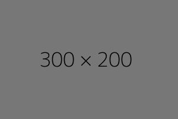

.. Use ``:orphan:`` to suppress warnings when the current file is not included in any toctree.

:orphan:

Heading 1
=========

Heading 2
---------

Heading 3
~~~~~~~~~

Paragraphs
==========

Paragraphs are text separated by blank lines. All lines of the same paragraph
must be left-aligned to the same level of indentation.

.. This is a comment. The following ``.. _label-name:`` line will be used later.

..
   Multi
   line
   comment.

   This is also part of the comment as long as it's still indented

.. _label-name:

Another paragraph.

Inline markup
=============

* one asterisk: *text* for emphasis (italics),
* two asterisks: **text** for strong emphasis (boldface), and
* backquotes: ``text`` for code samples.

Lists
=====

Bulleted lists
--------------

* List item
* List item

  * Nested list item
  * Nested list item

* List item

Numbered lists
--------------

1. Numbered list item
2. Numbered list item
#. Numbers can be inferred
#. Numbered list item

Definition lists
----------------

term (up to a line of text)
   Definition of the term, which must be indented

   and can even consist of multiple paragraphs

next term
   Description.

Quote-like blocks
=================

Quotes
------

Lorem ipsum dolor sit amet, consectetur adipiscing elit, sed do eiusmod tempor incididunt ut labore et dolore magna aliqua.

    Ut enim ad minim veniam, quis nostrud exercitation ullamco laboris nisi ut aliquip ex ea commodo consequat.
    Duis aute irure dolor in reprehenderit in voluptate velit esse cillum dolore eu fugiat nulla pariatur.

Excepteur sint occaecat cupidatat non proident, sunt in culpa qui officia deserunt mollit anim id est laborum.

Line blocks
-----------

| These lines are
| broken exactly like in
| the source file.

Literal blocks
==============

This is a normal text paragraph. The next paragraph is a code sample::

   It is not processed in any way, except
   that the indentation is removed.

   It can span multiple lines.

This is a normal text paragraph again.

Tables
======

Grid Tables
-----------

+------------------------+------------+----------+----------+
| Header row, column 1   | Header 2   | Header 3 | Header 4 |
| (header rows optional) |            |          |          |
+========================+============+==========+==========+
| body row 1, column 1   | column 2   | column 3 | column 4 |
+------------------------+------------+----------+----------+
| body row 2             | ...        | ...      |          |
+------------------------+------------+----------+----------+

Simple Tables
-------------

=====  =====  =======
A      B      A and B
=====  =====  =======
False  False  False
True   False  False
False  True   False
True   True   True
=====  =====  =======

Hyperlinks
==========

External links
--------------

Use `Link text <https://domain.invalid/>`_ for inline web links.
If the link text should be the web address, you don’t need special markup at all, the parser finds links and mail addresses in ordinary text.

Internal links
--------------

.. _my-reference-label:

Section to cross-reference
~~~~~~~~~~~~~~~~~~~~~~~~~~

This is the text of the section.

It refers to the section itself, see :ref:`my-reference-label`. You can refer to labels from a different file.

Labels that aren’t placed before a section title can still be referenced, but you must give the link an explicit title, using this syntax: :ref:`Link title <label-name>`.

Images
======

Videos
======

The `sphinxcontrib-video <https://github.com/sphinx-contrib/video>`_ extension allows you to embed videos without using the ``raw`` directive:

.. video:: https://test-1252620621.file.myqcloud.com/videos/tutorial%20vid%20-%20ROI.mp4
   :width: 100%

Code Blocks
===========

The following file, ``hello.cpp``, is an example program.

.. code-block:: cpp
   :linenos:

   // hello.cpp
   // A "hello, world" program.

   #include <iostream>

   int main() {
       std::cout << "Hello, world" << std::endl;
       return 0;
   }

Sidebar
=======

.. sidebar:: Ch'ien / The Creative

    .. image:: https://source.unsplash.com/200x200/daily?cute+animals

    *Above* CH'IEN THE CREATIVE, HEAVEN

    *Below* CH'IEN THE CREATIVE, HEAVEN

Lorem ipsum dolor sit amet, consectetur adipiscing elit, sed do eiusmod tempor incididunt ut labore et dolore magna aliqua. Ut enim ad minim veniam, quis nostrud exercitation ullamco laboris nisi ut aliquip ex ea commodo consequat. Duis aute irure dolor in reprehenderit in voluptate velit esse cillum dolore eu fugiat nulla pariatur. Excepteur sint occaecat cupidatat non proident, sunt in culpa qui officia deserunt mollit anim id est laborum.

Admonitions and other paragraph markups
=======================================

.. attention:: Attention

.. caution:: Caution

.. danger:: Danger

.. error:: Error

.. hint:: Hint

.. important:: This line is very important.

.. note:: Note

.. tip:: Tip

.. warning::
   Line 1

   Line 2

.. deprecated:: 5.5.5
   It might be removed in the future.

.. seealso:: reStructuredText Primer: https://www.sphinx-doc.org/en/master/usage/restructuredtext/basics.html

   `Another guide <https://docs.typo3.org/m/typo3/docs-how-to-document/master/en-us/WritingReST/Index.html>`_

Tabs
====

The `Sphinx Inline Tabs <https://github.com/pradyunsg/sphinx-inline-tabs>`_ Sphinx extension enables tabbed views.

.. tab:: One

   One is an interesting number.

.. tab:: Two

   Two is the even prime.

This will break the tab set!

.. tab:: Three

   Three is an odd prime.

.. tab:: Four

   Four is not a perfect number.

.. tab:: Five
   :new-set:

   Five is a nice number.

.. tab:: Six

   Six is also nice.

Table of contents
=================

.. toctree::
   :maxdepth: 2
   :caption: 目录

   getting-started
   flowchart-configuration
   node/index
   hardware-system/index
   operator-view
   hand-eye-calibration
   vision-detection-tutorial
   robot-communication-and-generating-full-location
   examples/index

.. toctree::
   :maxdepth: 2
   :caption: 外部链接

   示例 <https://www.example.com/>