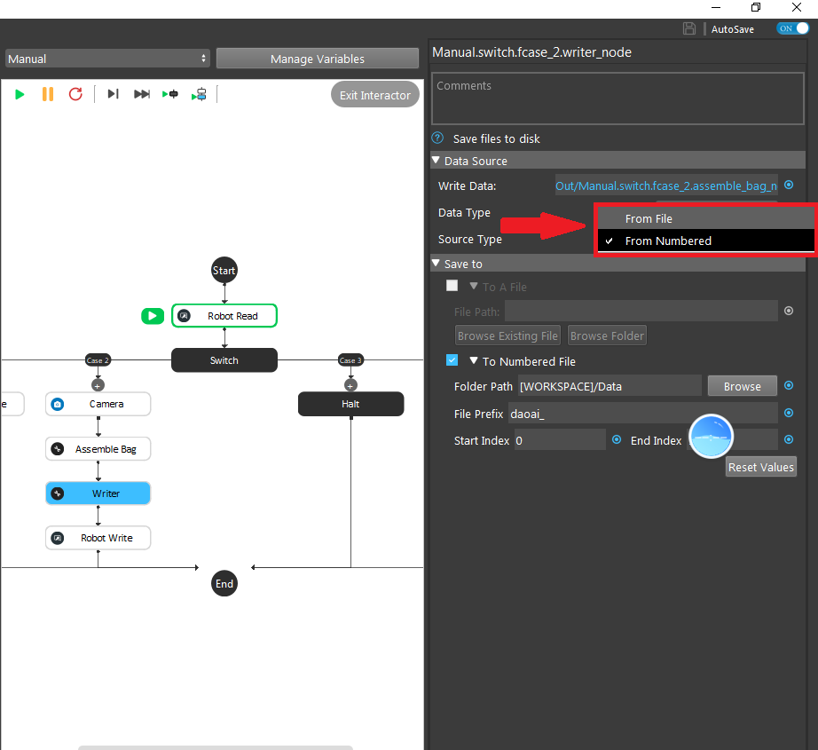
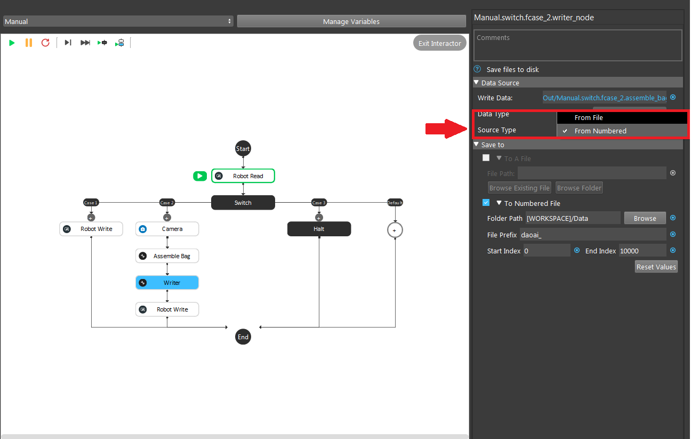
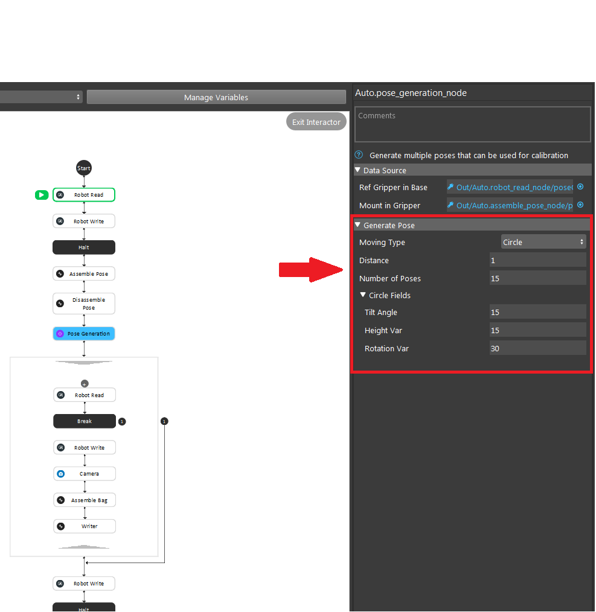
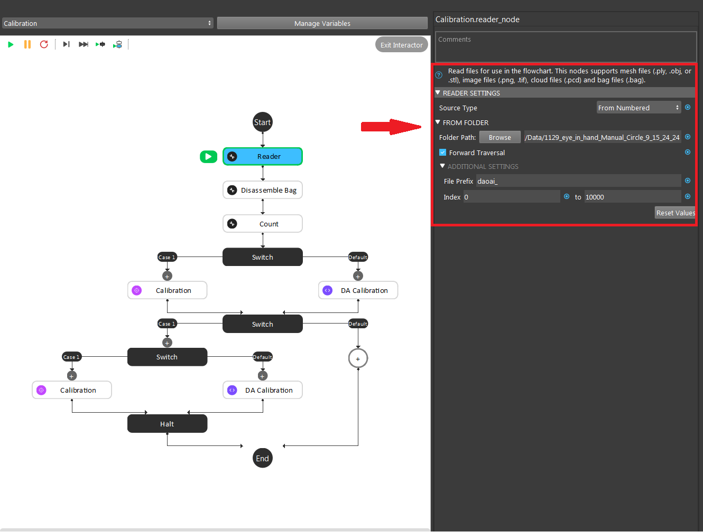
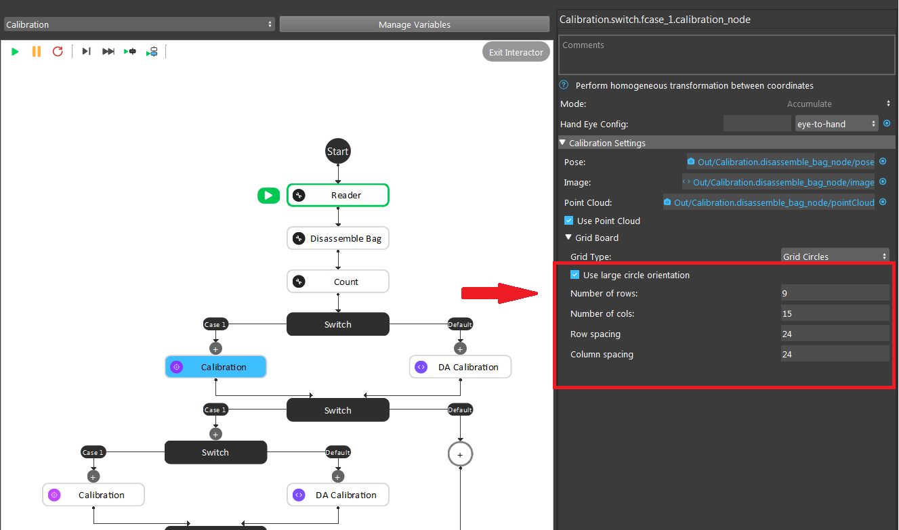
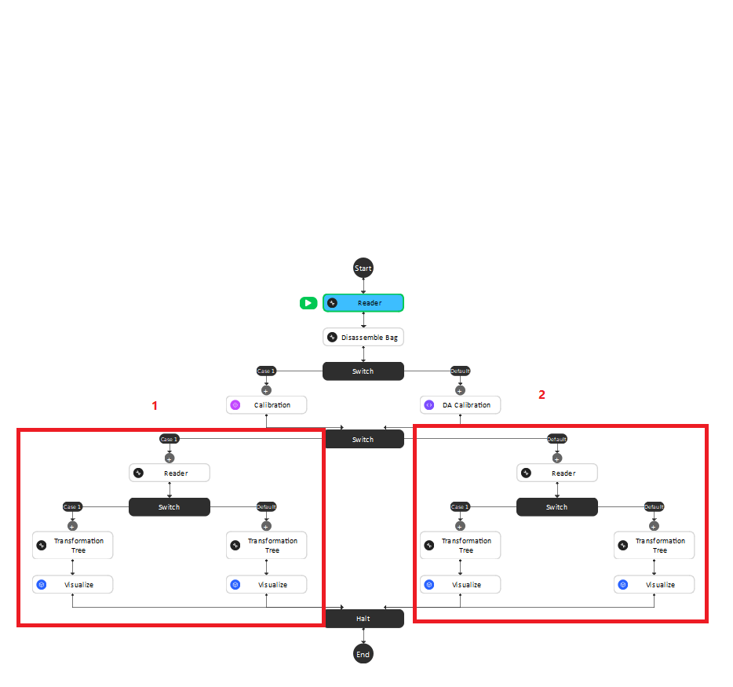
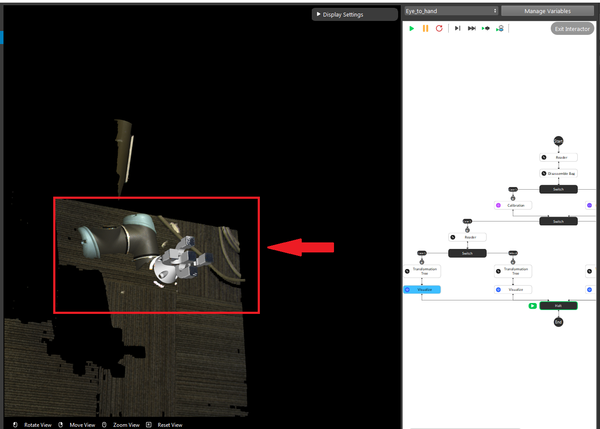
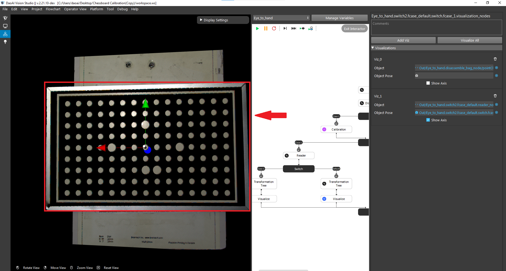
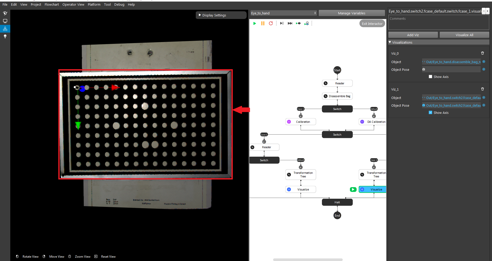

Circle Board Calibration
========================

Circle board calibration is the recommended method for performing robot-camera calibration in Pickit. With this method, the robot shows the calibration plate to Pickit from different viewpoints.

.. tip:: You can learn about the main ideas behind multi poses robot-camera calibration by watching this video tutorial (To add).

The placing of the calibration plate and the poses from which it is detected depend on the camera mount.

Fixed camera mount
================

If the camera is fixed to a static structure, the circle board calibration plate must be attached to the robot flange. It does not matter how the plate is mounted, as long as it’s rigidly attached to the flange. 

**How to install the circle board onto the flange**

DaoAI provides the necessary equipment for mounting the calibration plate on the flange. Including: ?

**Preparation**

**Installing DaoAI calibration plate on the robot flanges**

Align the plate, dowel pin, and holes with the robot flange. 
 
Pic 

Screw the plate to the flange.

**How to capture a good quality image**

- Due to the robotic vibration, the chessboard coordinates displayed in the camera will be distorted, reducing the accuracy of the final result significantly. It is strongly advised to reduce the robot's speed and set up the waiting time between each pose in order to capture a clear image.

- The chessboard should be positioned at the camera's optimal working distance. 

- When generating the chessboard's coordinating system, the initial pose should always be in the center of the camera's field of view. 

Pic

- Either clockwise or counterclockwise, gradually adjust the chessboard's position around the first pose to create at least sixteen additional poses.

- These poses should be angled approximately 30 degrees in relation to the Z direction of the world coordinates (as defined by the world points), and they should encompass the entire chessboard (even though the outer part of the chessboard may not contain any internal corners). 

Pic

**How to define a good quality image**

The first picture shows the good quality of image pose setting.

|

The second image shows a couple of bad quality of image poses setting.

|

The calibration poses are such that:

* The calibration plate is at a distance to the camera similar to the distance at which parts are expected to be picked.
* The calibration plate can be correctly detected.(TO ADD A LINK)
* The poses are distinct enough to produce an accurate calibration.
* The order in which the poses are captured is not important.

DaoAI recommends collecting the ten poses shown below to obtain an accurate calibration. It is however allowed to collect a different amount of poses, as long as their quality is good enough.

* The first four poses capture variation in plate position:
.. image:: Images/camera_fixed_position_poses.png
    :align: center

* The next two poses capture variation in the camera-facing rotation of the plate:
.. image:: Images/camera_fixed_camera_facing_rotation_poses.png
    :align: center
 
* The last four poses capture variation in plate tilt:
.. image:: Images/camera_fixed_tilt_poses.png
    :align: center

Robot mounted camera
====================

**How to place the circle board**

Compared to the Eye-to-hand, instead of fixing the camera, the Eye-in-hand application requires to have the circle calibration board stable. Therefore, it is highly recommended to place the board on a flat surface to proceed the calibration.

**How to capture a good quality image**

  - Due to the robotic vibration, the chessboard coordinates displayed in the camera will be distorted, reducing the accuracy of the final result significantly. It is strongly advised to reduce the robot's speed and set up the waiting time between each pose in order to capture a clear image.

  - The chessboard should be positioned at the camera's optimal working distance. 
  
  - When generating the chessboard's coordinating system, the initial pose should always be in the center of the camera's field of view.

  - Either clockwise or counterclockwise, gradually adjust the chessboard's position around the first pose to create at least sixteen additional poses.

  **How to define a good quality image**

  - The first picture shows the good quality of image pose setting 

  Pic 

  - The second image shows a bad quality of image pose setting 

  Pic 

  Show 10 different poses

Calibrate from DaoAI calibration template
==========================================

To perform a new calibration, open the DaoAI Vision Studio, create a workspace out from the **Chessboard Calibration (To Verifiy the name)** template, and following the steps below: (Use the new process mentioned here, https://daoai.atlassian.net/jira/software/projects/DV/boards/7?assignee=612fb8249976c30069458dbf&selectedIssue=DV-549 with the current approach 1)

1. :ref:`Create workspace and set up calibration`
2. :ref:`Set robot poses`
3. :ref:`Collect calibration bag files`
4. :ref:`Run calibration flowchart`
5. :ref:`Validate calibration result`

Create workspace and set up calibration 
~~~~~~~~~~~~~~~~~~~~~~~~~~~~~~~~~~~~~~~~~~~

Open the DaoAI Vision Studio, and select the Circle-board-calibration from the Template list. 

    
|

The chessboard calibration template includes five flowcharts: :ref:`Manual`, :ref:`Calibration`, :ref:`Auto`, :ref:`Eye-to-hand`, and :ref:`Eye-in-hand`. Each flowchart serves a unique and critical purpose within the template. 

You_ must specify the number of poses to be used in the calibration. 

    
|

Then you need to choose the calibration type depending on the application requirement. By default, the variable will be set to 1 as calibration. 

.. image:: circle-calibration-image/3Cali_type.png
    :align: center
    
|

You_ needs to choose the approach for result validation, either using the pen on board, or gripper on TCP. 

    
|

Set robot poses 
~~~~~~~~~~~~~~~~

Adjust the robot arm to the proper position

When the robot arm reaches the position, select the current pose as the :ref:`Robot` waypoint by clicking ok. 

To get good quality image poses, you should insert the camera node in the main flowchart and continuously run it by clicking the “Run” button. The camera will keep capturing the image poses so that you can constantly monitor the image pose making sure no bad image poses will be added into the bag files. More details for the camera to Vision Studio connection can be referenced by the previous topic :ref:`camera`.

.. image:: circle-calibration-image/24Set_robot.png
    :align: center
    
|

.. attention:: 
    More details for capturing image poses can reference by the previous topic :ref:`How to capture a good quality image`. 

Collect calibration bag files 
~~~~~~~~~~~~~~~~~~~~~~~~~~~~~~

Modify the name of the stored folder, run the robot program, remember to setup correctly the ip etc.. 

**Manual**

The first flowchart the needs to execute is the Manual flowchart. The purpose of the flowchart is to manage and save the data obtained from the camera including image, point cloud, depth image, camera intrinsic, and pose. 

    
|

The vision software will decide to execute a specific case, based on the request command constants got from the robot. In general, you need to perform a handshake first between the robot and vision software.  Once the connection is made, the vision software will trigger the camera to capture the image and save the image data by using Assemble Bag node. The data will be assembled into a bag file from the Writer Node. 

Inside the writer node, you can specify the mode for generating the bag file. A single bag file can be saved by selecting the source type into “From file”. 

    
|

If there is a sequence of bag files, you can select “From Numbered” by defining the folder path and the file name along with its start and end index for each file. 

    
|

.. attention:: 
     Normally we would set the end index into a large number to avoid editing the box in the future if you want to add more poses for the calibration. 

The flowchart will be continuously running the second case for each pose until all the poses have been executed. Then, the flowchart will switch into case three and stop. All the bag files will be saved inside the folder path defined by you. 

    
|

**Auto**

Instead of manually setting up the pose and generating the bag file, you can autonomously set up everything by using the Auto flowchart.  

    
|

You_ needs to choose the moving path of the gripper, the distance from the camera, and the number of poses wanted to generate to the bag first. 

In the circle field, you can adjust the tilting angle, height, and rotation var to adjust the pose of the chessboard. 

    
|

All bag files will be generated in the loop section and saved under the path defined in the writer node. 

Run calibration flowchart
~~~~~~~~~~~~~~~~~~~~~~~~~~

**Small Circle Method**

Run the calibration with the collected files, and store the calibration result out into the disk

After running the manual or auto flowchart, you need to load the bag file folder saved previously into the Calibration flowchart to generate yml file, which will be used for the real bin-picking applications. The yml file tells the threshold value of the accuracy of locating the object in the image. The smaller value, the better accuracy. 

Inside the reader node, use the folder path to load the bag file generated from the previous step. 

    
|

Inside the node, you can select the source type they want for loading the bag file. If you choose to load a file from Numbered, then it is necessary to define the parameter in the ADDITIONAL SETTINGS. 

    
|

All bag files will be accumulated in the first Calibration node. You_ should set up the number of rows, cols, spacing of the chessboard correctly to avoid mismatching between the bag file and the real board. 

.. image:: circle-calibration-image/11Calibration.png
    :align: center
    
|

The second Calibration node will generate the final yml used for the future application. You_ needs to name the file by typing in the File Name section. 

**Large Circle method**

You_ can also select the Use large circle orientation function. However, it is still necessary to make sure to config the number of rows, columns, spacing between each row and column correctly.  

|

Validate calibration result
~~~~~~~~~~~~~~~~~~~~~~~~~~~

**Eye-to-hand**

The first step is to load the testing bag file into the Reader node, and use the Disassemble Bag node to extract the data from inside. 

In the Calibration node, you need to type in the yml file name stored in the Calibration folder under the Chessboard Calibration template folder created by you. 

    
|

After the second switch, you need to load the gripper model they want to use based on the validation approach they chose in the beginning. 

    
|

The left sub-child path is to visualize how well the gripper model matches the gripper’s cloud. 

    
|

The right sub-child path is to visualize how good the world is located in the cloud. (The pen should plug right in the center of the first circle of the chessboard.) (Small circle) or check if the pen is located in the center of the central circle of the board. (Large circle)

    
|

    
|

.. attention:: 
    The testing bag file cannot be the same as the one used for generating the yml file. You_ needs to readjust the poses and check the result using multiple bag files with different orientations.

**Eye-in-hand**

**Small circle**

Use the first and second Readers to load the gripper model ply file and the bag file respectively. Then, use the Calibration node to load the yml file generated from the previous step.

.. image:: circle-calibration-image/23Eye-in-hand.png
    :align: center
|

Different from the Eye to hand flowchart, you can only validate the result by using the world in cloud method. 

**Large circle**

By using the large circle, the pen(world) should be located in the center of the scene cloud. 

.. image:: circle-calibration-image/19BigCircle.png
    :align: center
|

.. attention:: 
     The testing bag file cannot be the same as the one used for generating the yml file. You_ needs to readjust the poses and check the result using multiple bag files with different orientations.
     

