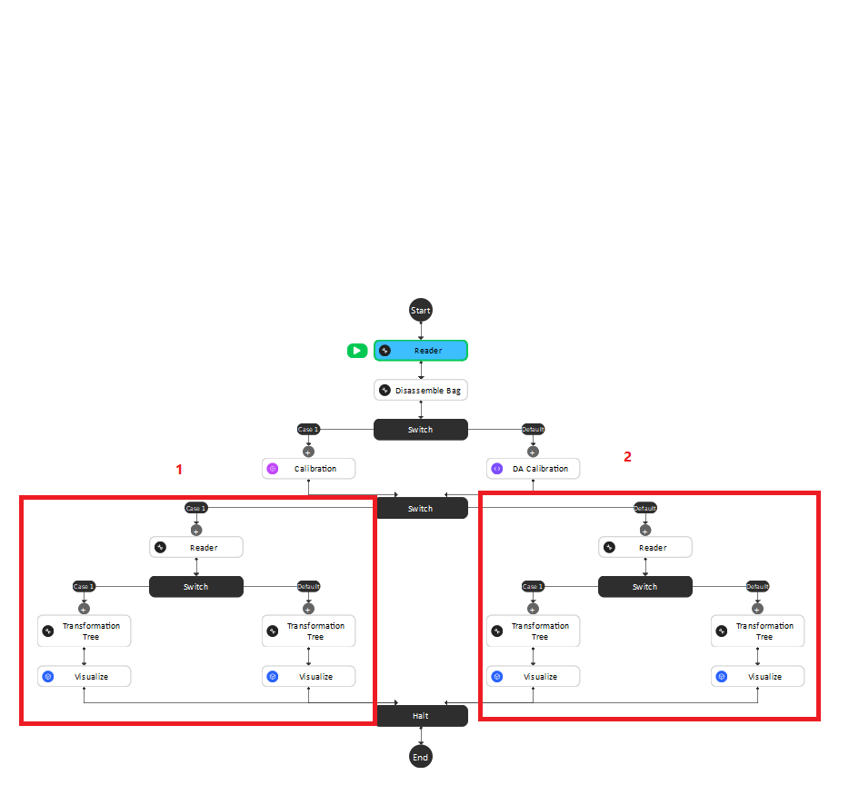
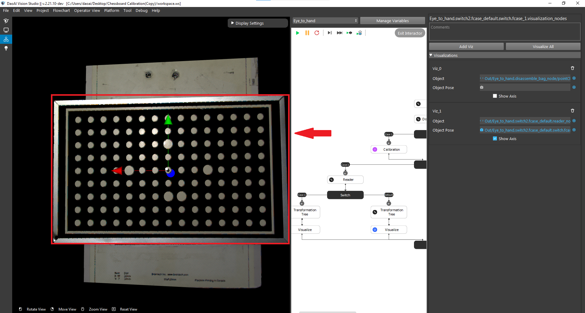
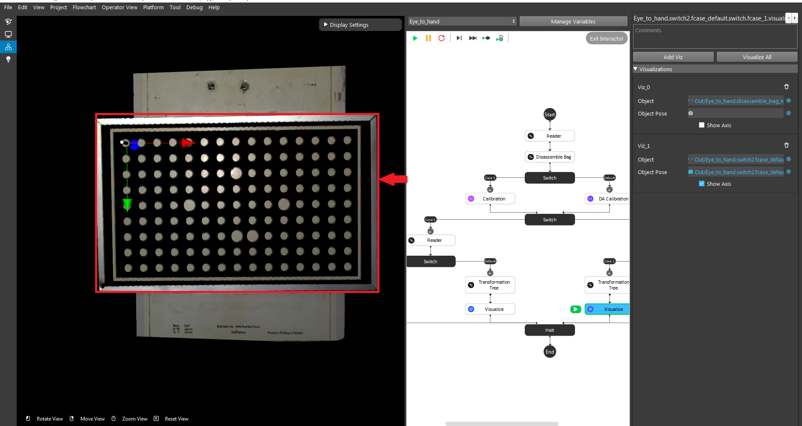
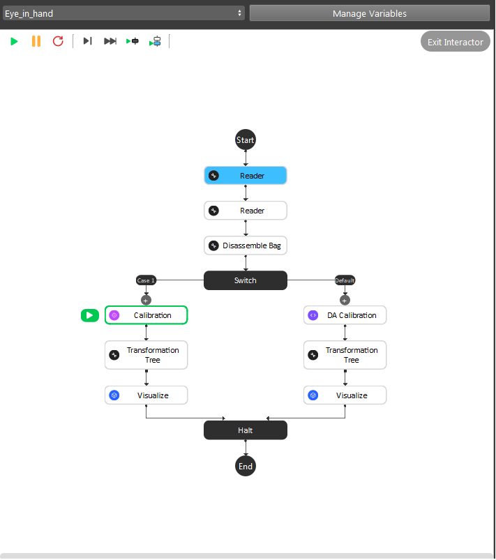

Qualitative calibration validation
==================================

.. attention:: This validation method relies on a human operator visually confirming the correctness of a calibration, hence is a coarse check. 
    
    DaoAI also allows to perform a :ref:`Quantitative calibration validation`, which is more accurate, and recommended for applications that need to keep an eye on sources of picking errors.

Quantitative validate the result means we are projecting back some known objects back to the cloud, and compare it with what we actually see from the camera. Following are general steps:

1. Collect validating bag data
2. Config the flowchart, and run dedicated flowchart to check the visual result

Collect validating bag data
---------------------------

Open the same workspace for running the calibration, and set the robot pose to different ones, and collect a group of validating data. Refer to :ref:`Collect calibration bag files` for more details about collecting data. 

Eye-to-hand Gripper visulization
--------------------------------
The first step is to load the testing bag file into the Reader node, and use the Disassemble Bag node to extract the data from inside. 

In the Calibration node, you need to type in the yml file name stored in the Calibration folder under the Chessboard Calibration template folder created by you. 

.. image:: images/14Eye-to-hand.png
    :align: center
    
|

After the second switch, you need to load the gripper model they want to use based on the validation approach they chose in the beginning. 

    
|

The left sub-child path is to visualize how well the gripper model matches the gripper's cloud. 

.. image:: images/17Grippertesting.png
    :align: center
    
|

Pin visualization 
-----------------
Eye-to-hand 
~~~~~~~~~~~
The right sub-child path is to visualize how good the world is located in the cloud. (The pen should plug right in the center of the first circle of the chessboard.) (Small circle) or check if the pen is located in the center of the central circle of the board. (Large circle)

    
|

    
|

.. attention:: 
    The testing bag file cannot be the same as the one used for generating the yml file. You need to readjust the poses and check the result using multiple bag files with different orientations.

Eye-in-hand 
~~~~~~~~~~~
**Small circle**

Use the first and second Readers to load the gripper model ply file and the bag file respectively. Then, use the Calibration node to load the yml file generated from the previous step.

|

Different from the **Eye To Hand** flowchart, you can only validate the result by using the world in cloud method. 

**Large circle**

By using the large circle, the pen(world) should be located in the center of the scene cloud. 

.. image:: images/19BigCircle.png
    :align: center
|

.. attention:: 
     The testing bag file cannot be the same as the one used for generating the yml file. You need to readjust the poses and check the result using multiple bag files with different orientations.
     

Sphere visualization
--------------------

Invalid robot-camera calibration?
---------------------------------
If the outcome of calibration validation is that the current calibration is invalid, the most likely cause is that the camera moved with respect to the robot base (Eye to Hand) or robot flange (Eye In Hand). When this is the case, robot-camera calibration needs to be performed again.

If the camera has not moved with respect to the robot, it could be that something went unexpectedly wrong during calibration. The following pointers can help you identify the cause:

* After capturing, the calibration plate moved before sending the current pose.
* The calibration poses don't comply with the requirement.
* If you are integrating a new robot brand with DaoAI Vision, there might be an incompatability in the way poses are communicated between DaoAI Vision and the robot.

.. note:: If you are having trouble with robot-camera calibration, contact our support team.