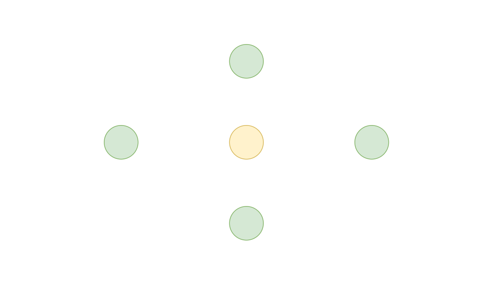
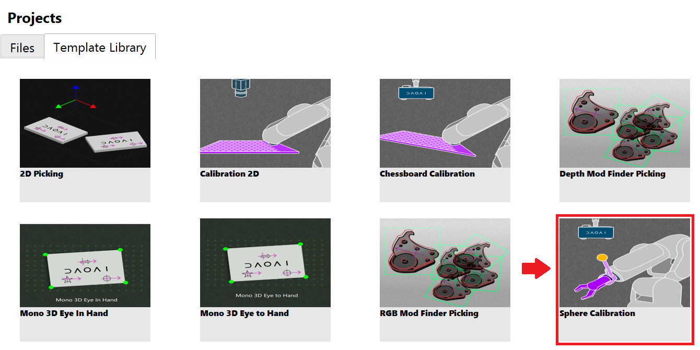
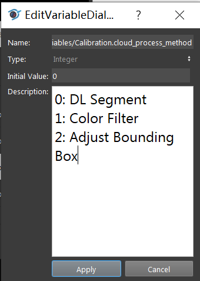
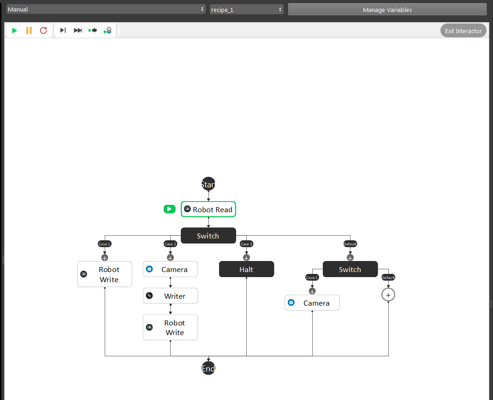
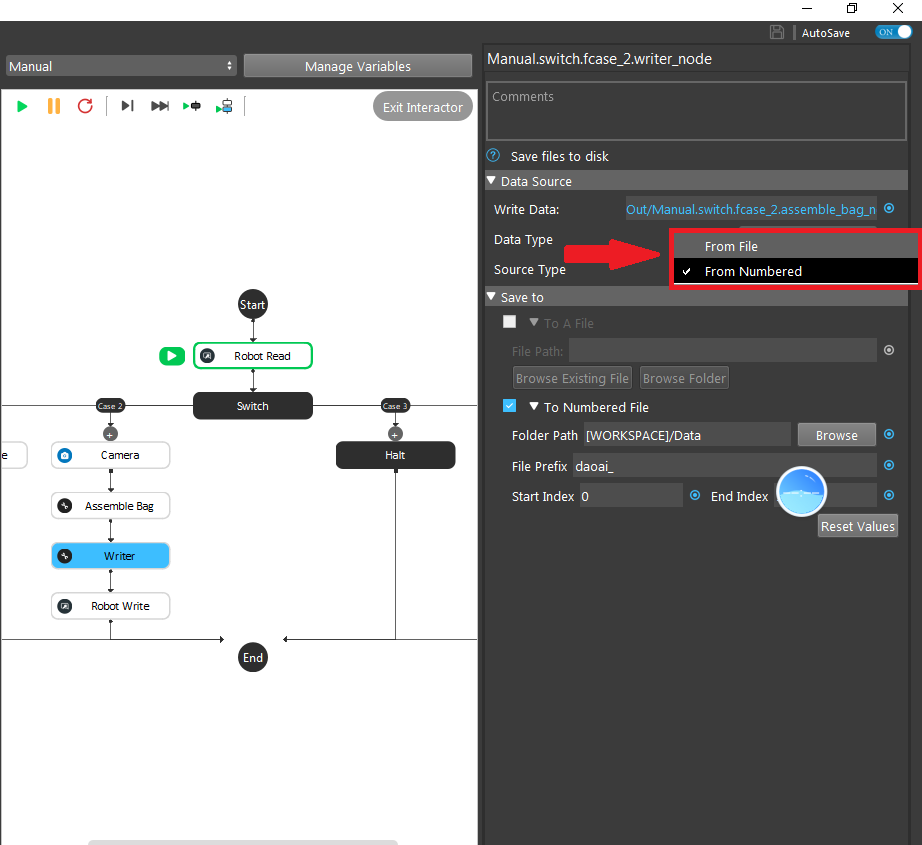
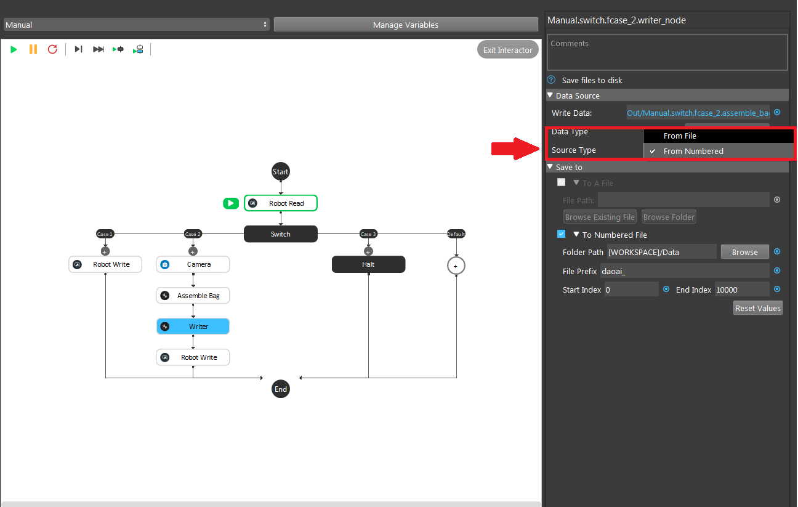
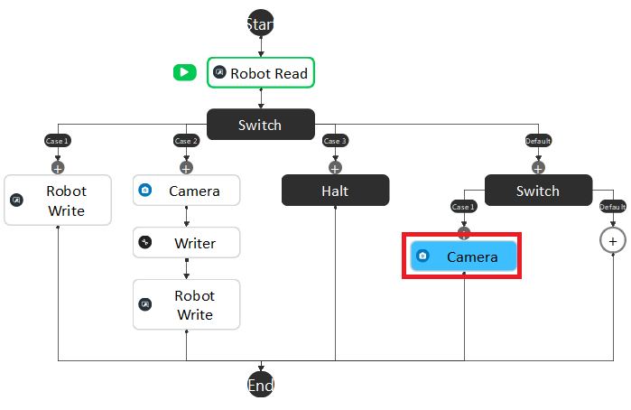
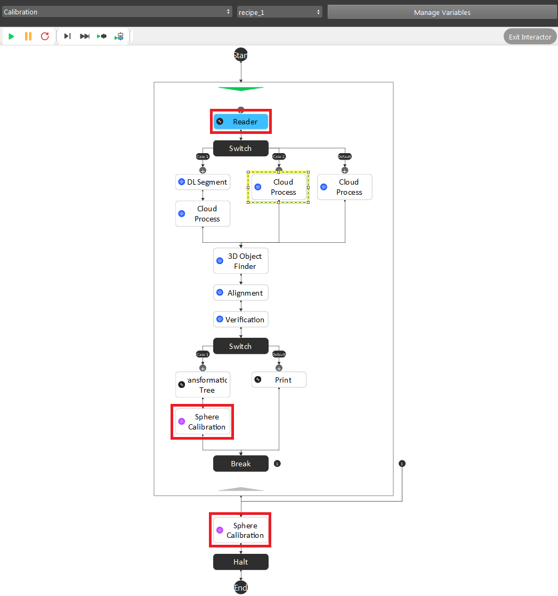
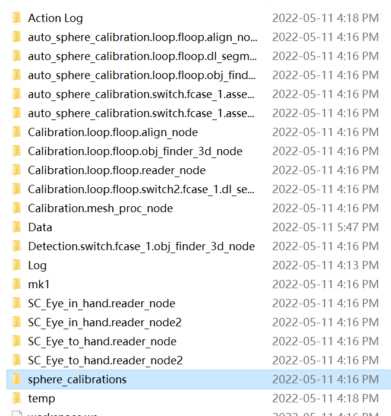

Sphere Calibration
==================

Sphere Calibration is more like a backup plan for :ref:`Circle Board Calibration`. It is suitable for situations when mounting the calibration board on the end-effector is hard, or you have mounted a tool on the end-effector already, and you don't want to remove the tool. In these situations, you might want to easily attatch the sphere onto the tool.

With this method, the robot shows the sphere to DaoAI Vision from different viewpoints.

General Settings
----------------
How To Capture a Good Quality Image
~~~~~~~~~~~~~~~~~~~~~~~~~~~~~~~~~~~
* Make sure your robot does not vibrate during the capturing process, otherwise the sphere point cloud displayed in the camera will be distorted, reducing the accuracy of the final result significantly. It is strongly advised to reduce the robot's speed and set up the waiting time between each pose in order to capture a clear image.
* The sphere should be positioned at the camera's optimal working distance.
* When generating the gripper calibration poses, the initial pose should always be in the center of the camera view.

Calibration Poses
~~~~~~~~~~~~~~~~~
* The sphere is at a distance to the camera similar to the distance at which parts are expected to be picked.
* Make sure there's at least 1/3 of the sphere visible in the point cloud.
* The poses are distinct enough to produce an accurate calibration.
* The order in which the poses are captured does **not** matter.

DaoAI recommends collecting poses from:

1. 1 pose of sphere set to center of the camera view, as the yellow circle shows.
2. at least 2 poses on each green circles halfway from center to the edge of camera view. For the total of 8 poses discribed here, you need to make large rotation and tiltings between each of them to get a good result.

.. warning:: For Eye in hand setting, you should move the camera to achieve the position discribed above. DO **NOT** move the sphere.

Fixed Camera Mount
------------------

How to attatch the sphere onto the Robot
~~~~~~~~~~~~~~~~~~~~~~~~~~~~~~~~~~~~~~~~
DaoAI provides the 40mm or 60mm calibration sphere and a sphere mounting gripper. 

.. TODO Make a XYZ[10,10,10] gripper that can hold sphere on top or bottom of it. Should look like a L shape. Place the picture below.

You can also choose to stick the sphere onto your current gripper.
.. warning:: Make sure you attatch the sphere to a stable position so when your robot moves, the sphere doesn't move.

Robot Mounted Camera
--------------------

How to place the sphere
~~~~~~~~~~~~~~~~~~~~~~~
Compare to the Eye-to-hand, instead of fixing the camera, the Eye-in-hand application requires to have the sphere fixed to one position. Therefore, it is highly recommended to glue sphere onto the surface where objects will be picked from.

Calibratie from DaoAI Sphere Calibration Template
-------------------------------------------------
To perform a new calibration, open the DaoAI Vision Studio follow the steps below:

1. :ref:`Create workspace and set up sphere calibration`
2. :ref:`Collect sphere calibration bag files`
3. :ref:`Run sphere calibration flowchart`

Create workspace and set up sphere calibration 
----------------------------------------------

Open the DaoAI Vision Studio, and select the **Sphere Calibration** from the Template list. 

    
|

The sphere calibration template includes five flowcharts: :ref:`Manual`, :ref:`Calibration`, :ref:`auto-sphere-calibration`, :ref:`Eye-to-hand`, and :ref:`Eye-in-hand`. Each flowchart serves a unique and critical purpose within the template. 

You need to choose the pre-process method depending on the project environment. By default, the variable will be set to 0 as using Deep learning segmentation node to cut out the sphere. 

    
|

You need also to choose the number of poses you will be using to calibrate. By default, the variable will be set to 9. 

.. image:: images/2Number_of_poses.png
    :align: center
    
|

Collect sphere calibration bag files
------------------------------------
Manual
~~~~~~

The first flowchart the needs to execute is the Manual flowchart. The purpose of the flowchart is to manage and save the data obtained from the camera and the robot including image, point cloud, depth image, camera intrinsic, and pose. 

    
|

Modify the path of the ``writer`` node output folder. The data will be assembled into a bag file from the Writer Node. 

Inside the writer node, you can specify the mode for generating the bag file. A single bag file can be saved by selecting the source type into “From file”. 

    
|

If there is a sequence of bag files, you can select “From Numbered” by defining the folder path and the file name along with its start and end index for each file. 

    
|

.. attention:: 
    Normally we would set the end index into a large number to avoid overwriting previous saved files.

To collect poses, you need to setup the ``Manual Calibration`` robot script.

To get good quality image poses, you should run the Manual flowchart before you setup the poses, with camera and robot connected. Click the **Camera** node one the right side so you can see the preview of the image being calibrated.

    
|

Adjust the robot arm to the proper position, select the current pose as the :ref:`Robot` waypoint by clicking ok. Then complete all waypoints in the robot script. More details for the camera to Vision Studio connection can be referenced by the previous topic :ref:`camera`.

.. tip:: The camera will keep capturing the image poses until you start the robot script so that you can constantly monitor the image pose making sure no bad image poses will be added into the bag files.

.. attention:: 
    More details for capturing image poses can reference by the previous topic :ref:`How to capture a good quality image`. 

Run the robot script to send the current robot pose to DaoAI Vision, then the current pose and image will be saved in a bag file.

Run sphere calibration flowchart
--------------------------------
Before you run the **Calibration** flowchart, there are a few things need to setup.

    
|

1. Reader node: set the path to the folder where you saved your bag data.
2. Sphere Calirbation node **Accumulate** mode: Set the hand eye config. Then enter the intitial guess of the position of the sphere center to the robot flange.
    .. image:: images/initial-guess.png
        :align: center
3. Sphere Calibration node *Final* mode: Set the file name to your desired output name.
4. *Optional* - Cloud Process node: If you set the **cloud_process_method** variable to 1, which will be using color filter, you should click the cloud process node, and double click the **Color Filter** from operation list, and set your color filter.

After setting up, you can just run your flowchart to generate your calibration result file.

Output File
-----------
You can get your output calibration file from the **sphere calibrations** folder inside the workspace. Copy and paste the folder to your Picking Workspace folder, then you will be able to load the calibration file.

