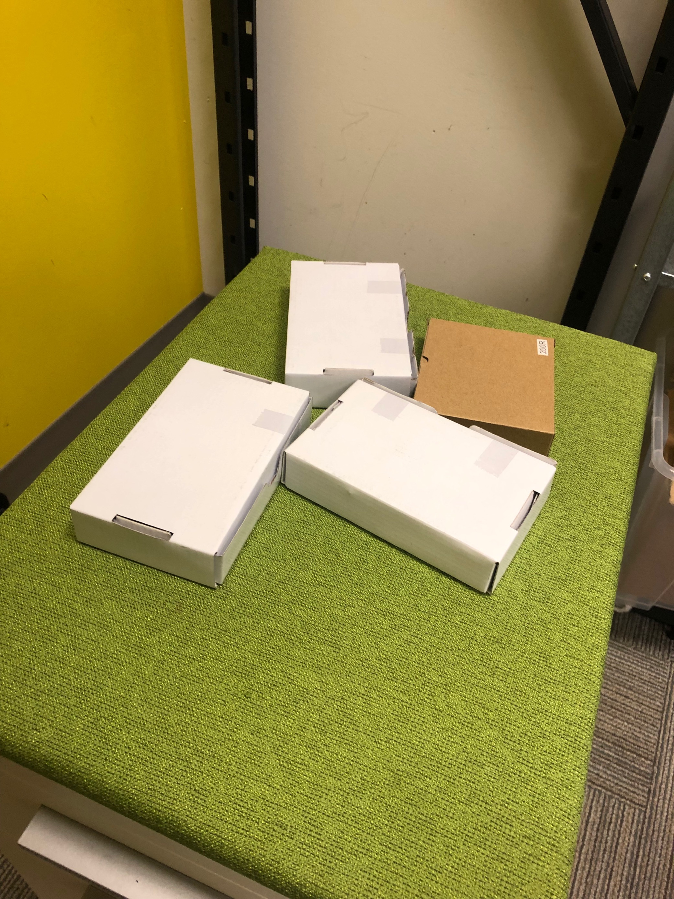
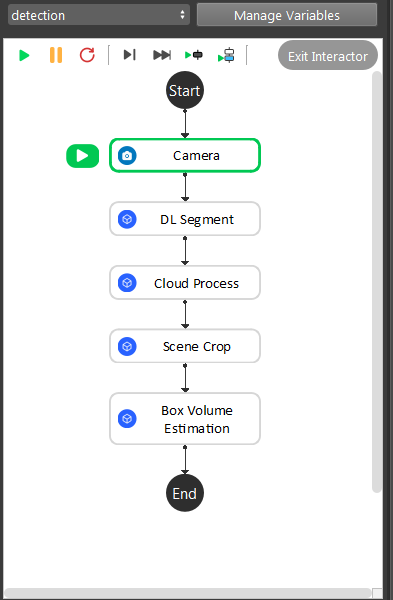
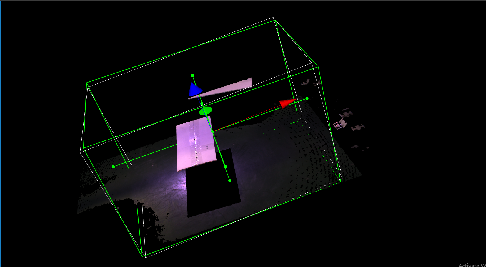
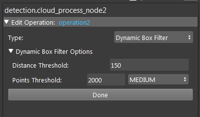
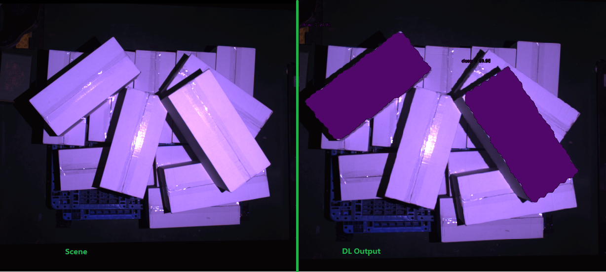
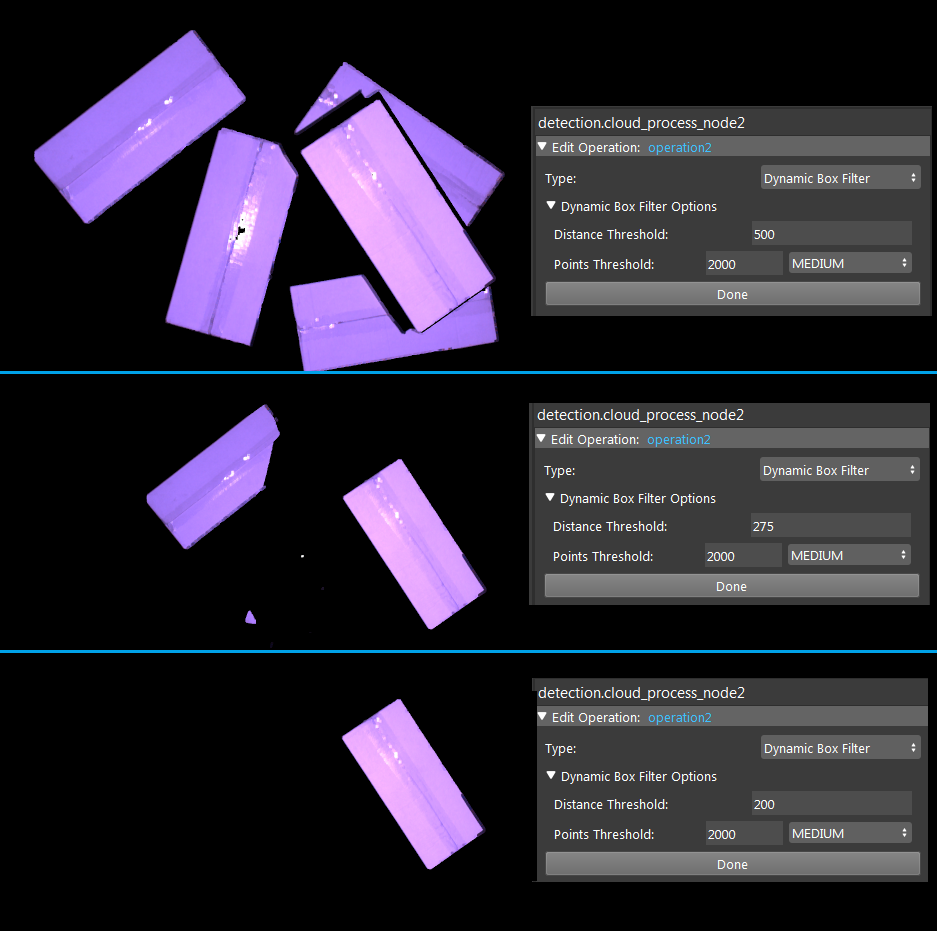
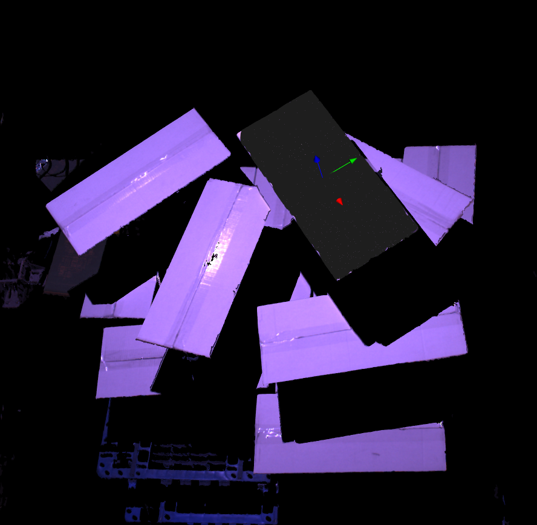

Box Volume Estimate
==============

The DaoAI Box Volume Estimate uses 2D box cloud to create 3D gripping pose for boxes. 
Usually this engine is applied to box like objects, since these objects do not have obvious distinct shapes. 
We feed the objects into deep learning engine, then uses the mature learning model to find the object locations in scene. 
The deep learning engine can learn from the object colour, relative size and object shape; then generate a model for the object which can be used by **DL Segement** node to indentify objects in scene. 
Hence, this would be useful for packages or boxes picking.

|

Objects like these boxes are rectangles for Vision, except for minor differences on the top(such as scraches or hole), if we try to use the Gray or Depth Mod Finder, results might not be accurate. 
Therefore we have **Deep Learning Engine** and **Box Volume Estimate** to help us!

Pipeline Overview
------------------

|

As the image above shows, the Box Volume Estimate is straight forward pipeline flow:
    #. Camera captures image, then feeds to DL Segement to detect the objects;
    #. Setup a region of interest in scene and apply dynamic box filter to this area to differentiate the layers of box(this is not necessary if boxes are not stacking up);
    #. Cropping out the point clouds using binary masks from the output segement from DL Segment;
    #. Applying the segement and clouds to generate the object in cloud relations;

.. tip:: You can also learn about the main ideas behind the Box Volume Estimate by watching this video tutorial. (TODO, record a video) You can also checkout this sample `workspace <https://drive.google.com/uc?export=download&id=1S4iL9rzlIMeGlSVbGf4RZbIEkDROQJNR>`_.

Deep Learning Model
------------------

Deep Learning Engine plays an important role in this detection stage. For more details about `Deep Learning <https://daoai-robotics-inc-daoai-vision-user-manual.readthedocs-hosted.com/en/latest/deep-learning/dataset.html>`_

After the model is trained, apply the model and configuration file to DL Segment node to indentiy the objects. 
This result includes the object masks, object type(within the trained dataset) and object 2D pose. 

Define Regoin of interest
------------------

Usually the camera field of view will be larger than the region of interest, thus the first step usually is to setup the boundary for the useful information. You could run to the Cloud Process node, and make sure the Adjust Bounding Box options was on in the cloud process display setting. Then execute the Cloud Process node. Then you could adjust the bounding box.

.. tip:: When adjust the bounding box, you could press **R** to reset to the original view, and blabla for the operation trick

Double click on the **Dynamic Box Filter** operation in Cloud Process node, the **Distance Threshold** is the value for depth interest: Vision based on the first valid point cloud, going down(-Z direction) the distance and crop this area, rest of the area outside of this depth would be exclued. 

For example, when the boxes are stacking up and robot is only able to grab the top boxes; DL would indentify every valid occurences of boxes in scene, we would need to exclude some of the bottom ones. 
Modify this Threshold until it is able to crop the top level only. Above scenario showing that the left top corner box is at the next level, hence we only want the right box to be picked.

|

The **Points Threshold** is to minimize the noise point influence. For example, if we set **Distance Threshold** as 200, we want calculate from the highest box. Vision is looking for valid points in scene. However, if some noise point is higher than the box, Vision would start calculating from this point, which is not the expected behavior. **Points Threshold** is able to define number of points for this highest object. Boxes are having large flat surface so that we set this value to a few hundreds to ensure Vision calculates from the highest box.

Generate Poses
------------------

Applying Scene Crop node to crop point clouds using binary masks from DL Segment node, outputs the box segments for Box Volume Estimate. 
Box Volume Estimate uses the segements, origin from the reference frame and scene point cloud to visualize the pose in scene.

|
