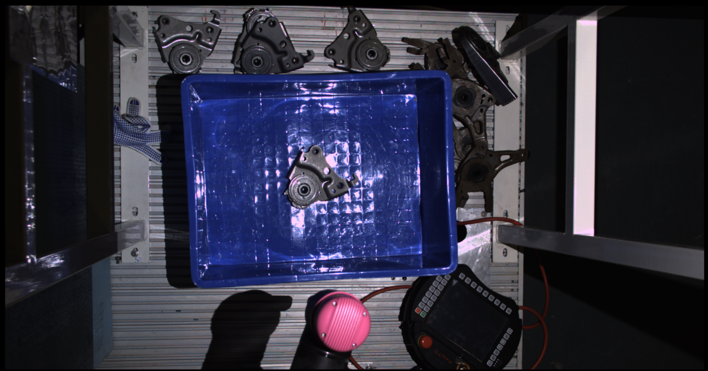
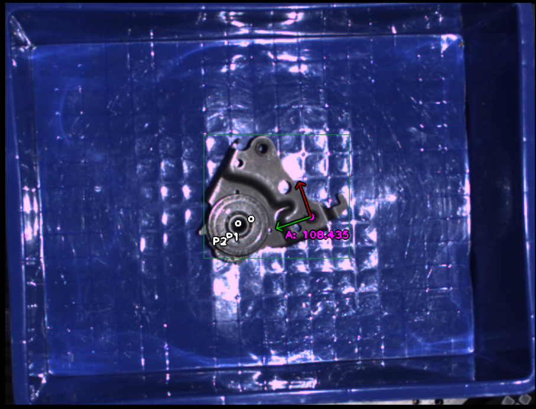
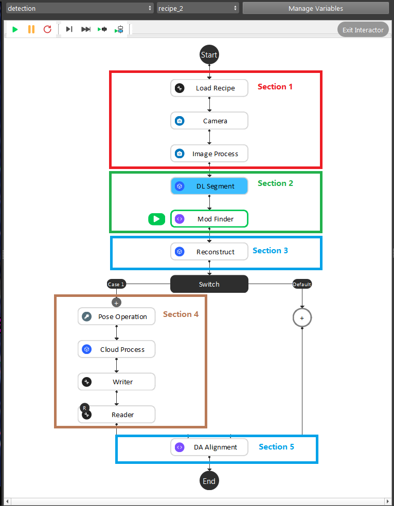
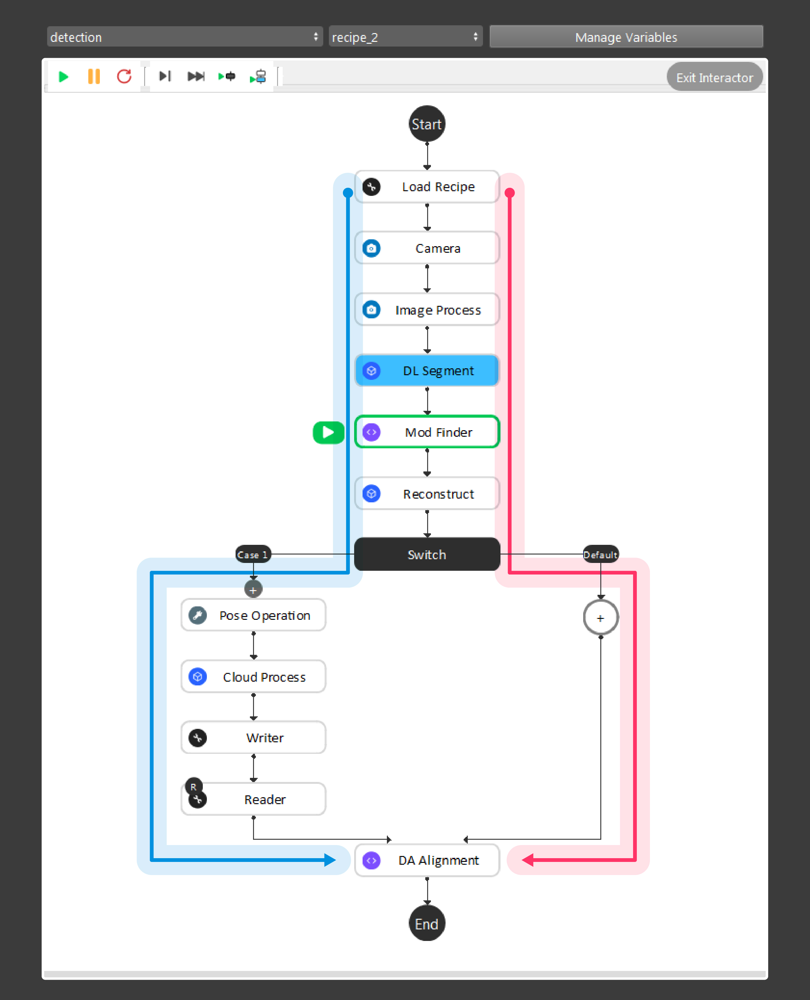
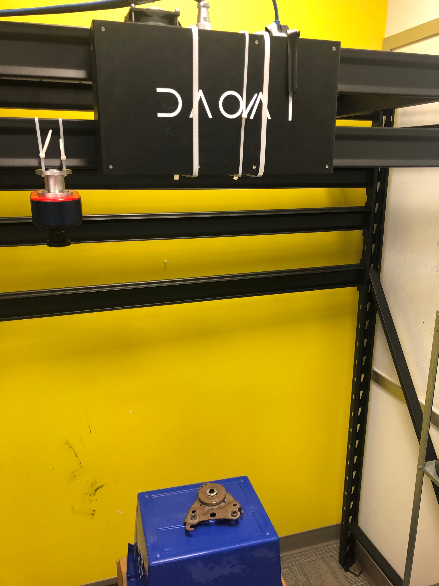
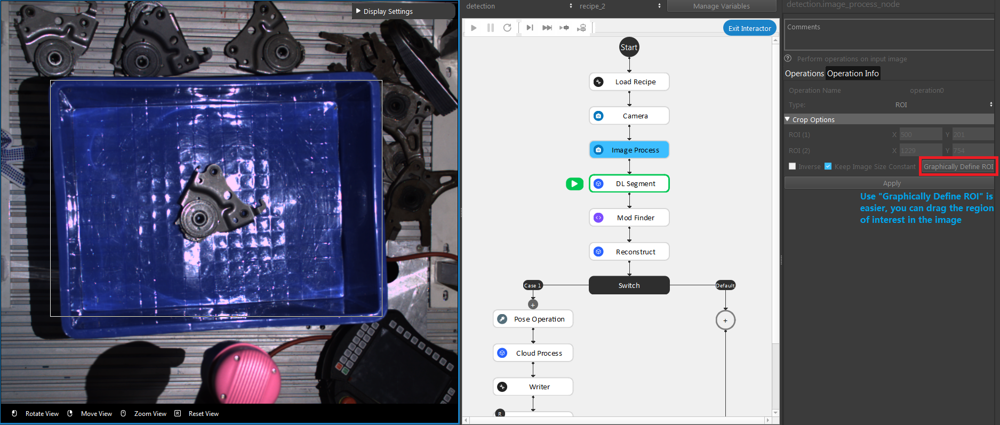
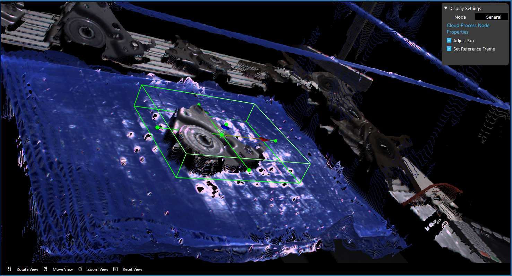
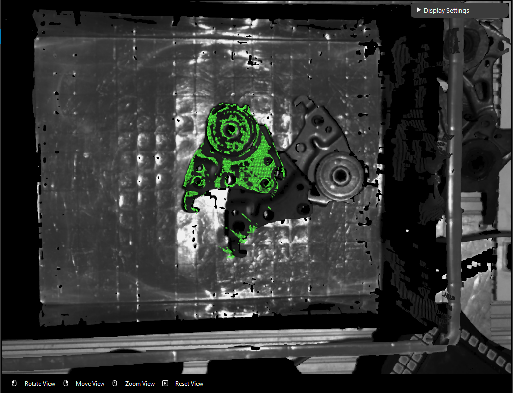

KeyPoint Deep Learning
============

The KeyPoint Deep Learning engine is using a different deep learning model to detect objects in scene. 
Usually this engine is objects which needed direction output from **DL Segment** node. 
Foe example, the object below is a metal part which has distinct directions. 

The part with hole is the top of this part. 
In order to have this result, we would need to apply key-points on the object during the annotation process. 

For detail about **Dataset Annotation**, checkout `Annotate your Dataset <https://daoai-robotics-inc-daoai-vision-user-manual.readthedocs-hosted.com/en/latest/deep-learning/annotation/index.html>`_

You can see there are ``P1`` and ``P2`` in the image above. They are the key-points of this object through deep learning model. 
Through these key-points on the model, **DL Segment** generates the object 2D poses and its x, y directions are defined when models were being trained. 
In this sample object, according to the order of you gave to these key-points, the direction of the metal part is now the green and red arrows. 
Further more, if you give different order to these key-points, direction is also changed. For example, if the image above giving order **P2** -> **P1** -> **A**, then the direction would have changed(The direction is specifically defined while training the models).

Pipeline Overview
-----------------

|

As the image above shows, the Gray Mod Finder contains 5 sections in the whole flow:
    * Section 1: Used the camera to capture 3D data, then use Image Process (ROI operation)) to crop the area of interest for detection.
    * Section 2: Used **DL Segment** node with trained model to detect the objects in cropped area; then feeds it to Mod Finder node to generate the 2D poses.
    * Section 3: Use the reconstruct node projecting feature to map the 2D result from Mod Finder node into the 3D space.
    * Section 4: This section was used to crop the 3D model of the object, and use it for the alignment. And this section will only be executed once during the defining time.
    * Section 5: The alignment in this section was used to align the 3D model from section 4 into the 3D space. 

During the runtime, the execution flow is section 1 -> 2 -> 3 -> 5. And during the defining time, the execution flow is section 1 ->2 -> 3 -> 4 -> 5.

As the above image shows, the red and blue arrow is the data flow for the nodes. 
Red arrow is the detection flow of the flowchart; blue arrow is the flow for defining model in scene. And more details can be found with this workspace(TODO)

.. tip:: 
    You can also learn about the main ideas behind the gray mod finder engine by watching this video tutorial. (TODO, record a video)

Placing the object under the camera
--------------------------------

Place your object under the camera and try to put it as close as possible to the center of your working environment (center height of the working cell, and at the center of the image) to capture the sample image while making sure that the object is lying fully in the field of view of the camera. It’s useful to run the camera node continuously, and turn on the point cloud view to see the image quality of the object.

|

Define Region of interest
---------------------------

Usually the camera field of view will be larger than the region of interest, thus the first step usually is to setup the boundary for the useful information. 
You could execute the Image Process node with **ROI** operation, you can drag the **ROI** in the image to define your region of interest. 

|

Define Model
---------------------

The object model is defined in deep learning training, however you still need the object point cloud in order to align the object mask to the object in scene.
For detail of deep learning model, checkout `Deep Learning <https://daoai-robotics-inc-daoai-vision-user-manual.readthedocs-hosted.com/en/latest/deep-learning/index.html>`_.

You still need to define object point cloud(.pcd) in **Section 4**. You should put the box area around the object. The box should includes the whole object and the object only. 
Sometimes might be hard to exclude the button of the container, it is okay to have a little bit of object excluded. To keep in mind that the box should still includes the major point cloud of the object.

Generate Poses
--------------------------------

Reconstruct node generate the 3D poses from 2D poses. Applying the Mod Finder outputs to Reconstruct node. Reconstruct node uses pixels around the 2D pose and calculates the Z axis direction. 
At the end, DA Alignment node aligns the model point cloud with the objects in scene to precisely output the picking pose.

    