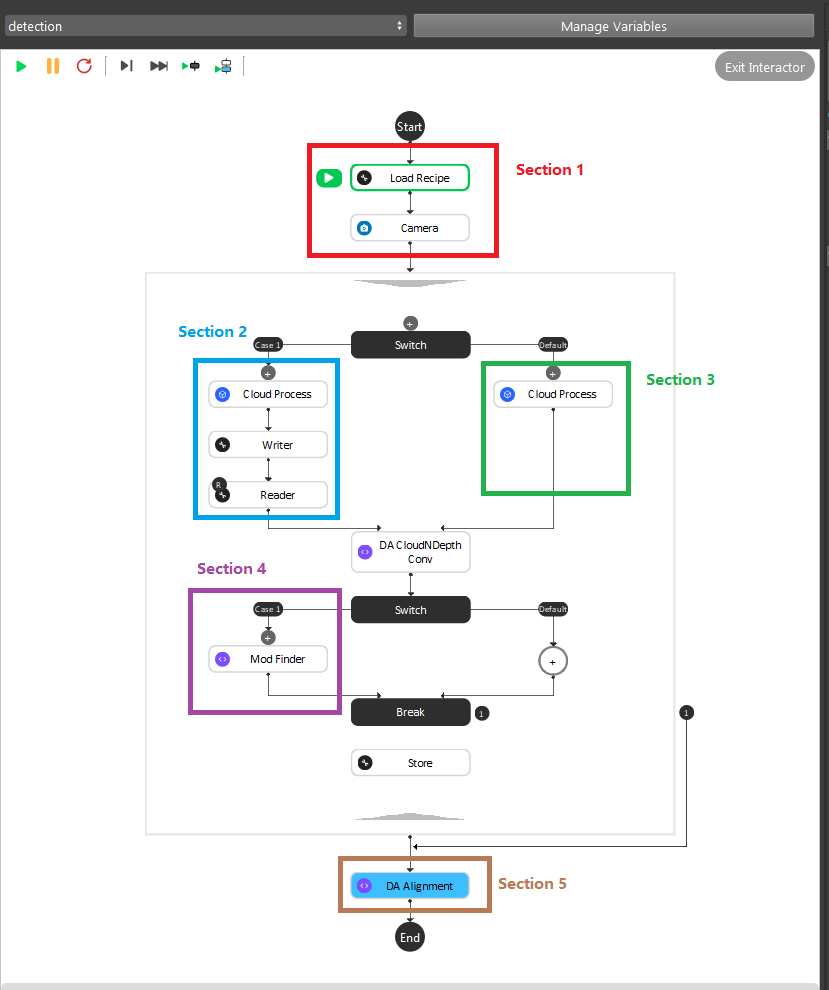
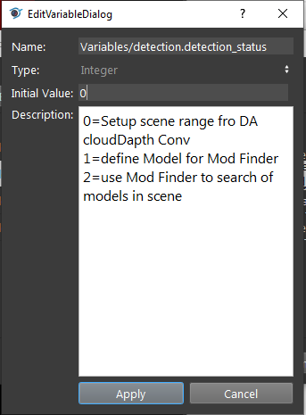
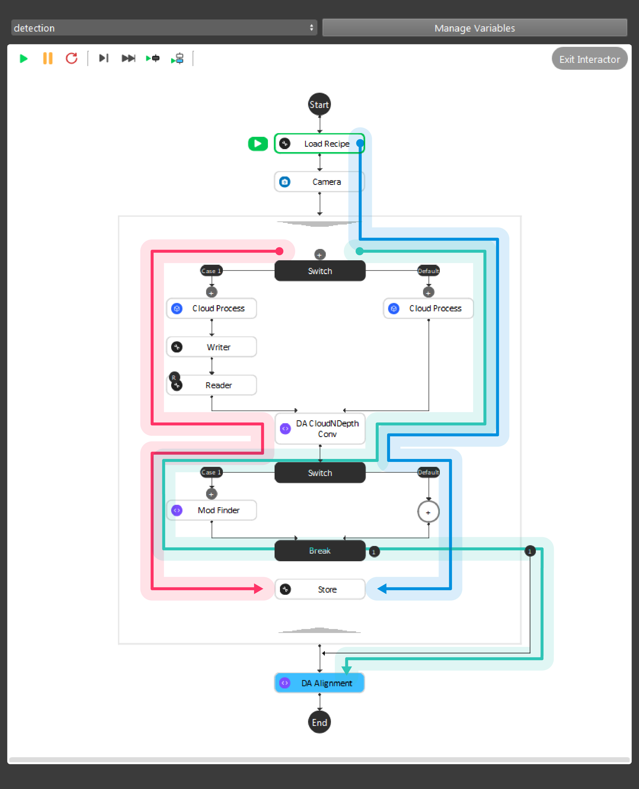
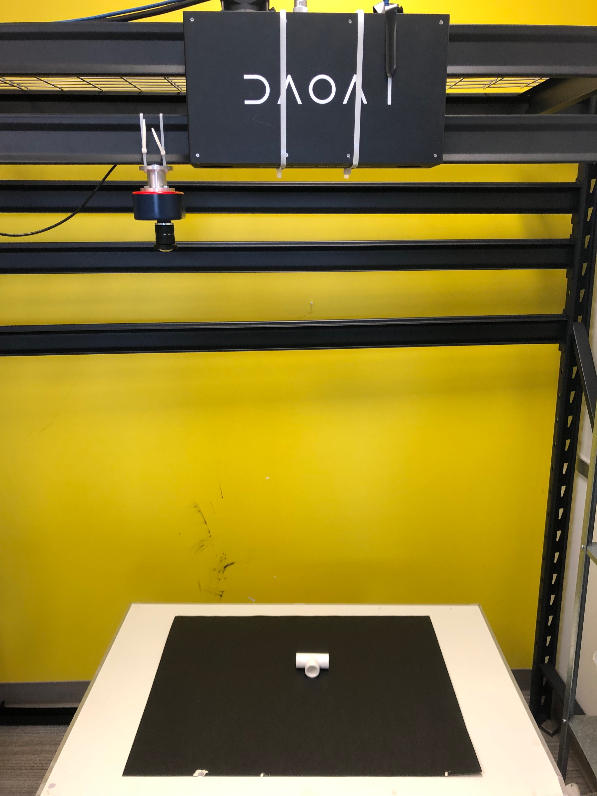
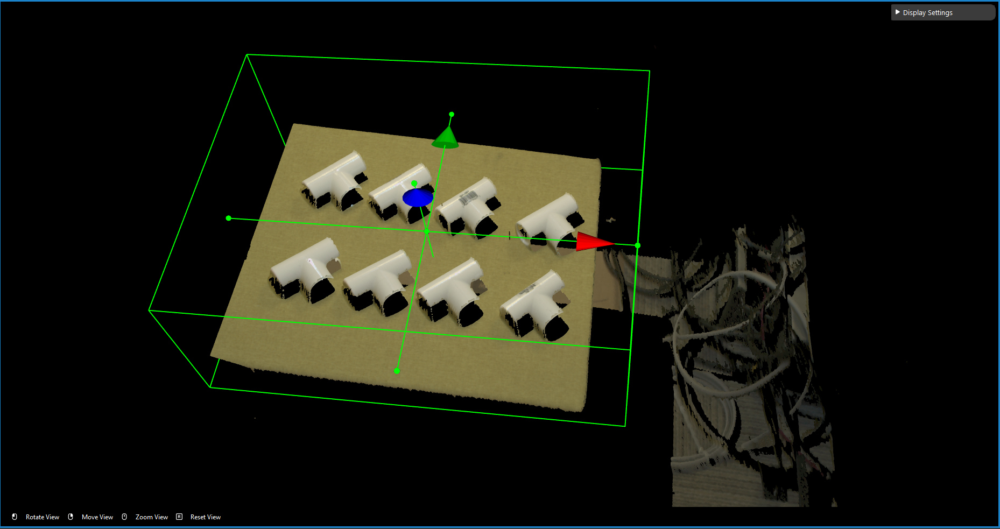
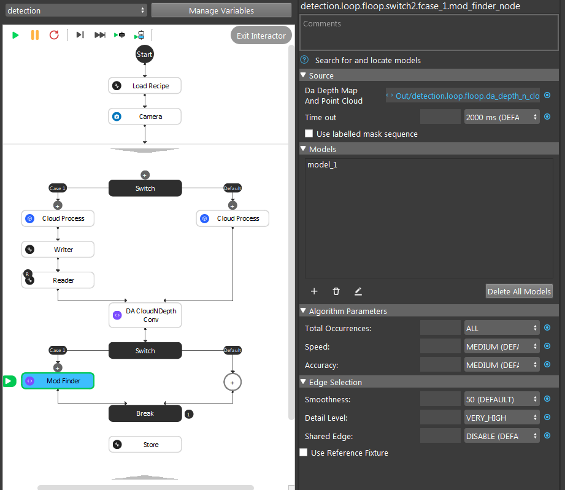
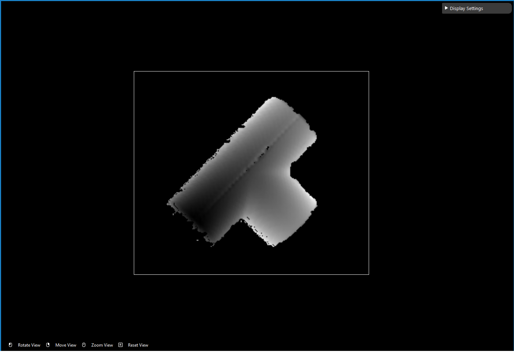

Depth Mod Finder 
===============

The Depth Mod Finder pipeline has 3 stages, one is to find the object on depth image, then map to 3D space, and finally use alignment to get accurate result.

Pipeline Overview
~~~~~~~~~

As the image above shows, the Gray Mod Finder contains 5 sections in the whole flow:

* Section 1: Used the camera to capture 3D data.
* Section 2: This section was used to crop the 3D model of the object, and use it for the alignment. And this section will only be executed once during the defining time.
* Section 3: Use cloud process (adjust bounding box feature) to set the working cell of the project. 
* Section 4: Mod Finder node is used in model define stage as well as detection stage.
* Section 5: The alignment in this section was used to align the 3D model from section 2 into the 3D space. It takes in the output from section 2 or section 3, where the Mod Finder node output the initial pose of the object.

During the runtime, the execution flow is section 1 -> 3 -> 2 -> 4 -> 3 -> 4 -> 5. When defining model, set ``detection.detection_status`` to ``0`` which would reset to setup working cell stage. 
Then it enters stage 2 defining model. Afterwards, it statys on stage 3 detection mode until you change the variable to reset the stage.

As the above image shows, the red, green and blue arrow is the data flow for the nodes. 
Green arrow is the detection flow of the flowchart; Red arrow is the flow for defining model in scene; Blue arrow is to define the working cell in image.
And more details can be found with this `workspace <https://drive.google.com/uc?export=download&id=171FzY6Br1Uv6vjGTCblTZD6l76cuyRWh>`_ 

.. tip:: You can also learn about the main ideas behind the depth mod finder engine by watching this video tutorial. (TODO, record a video)

Teach model from camera
~~~~~~~~~~~~

Teaching an object model is important step when setting up the DaoAI Mod Finder engine to detect objects. 
Mod Finder needs a good model to identify objects in scene. Mod Finder uses RGB or Depth image to detect objects, therefore anything captured in camera could be possibly the oobject. 
How can Vision recognizes these objects? By comparing from the model and the image. Hence, good model plays the essential role in this process.
  
The rest of this article is about how to define model. If you want to know what is good model, please see `How to define good models <https://daoai-robotics-inc-daoai-vision-user-manual.readthedocs-hosted.com/en/latest/complete-vision-guidance/detection/mod-finder/good_model.html>`_

Placing the object under the camera
~~~~~~~~~~~~~~

Place your object under the camera and try to put it as close as possible to the center of your working enviroment (center height of the working cell, and at the center of the image) to capture the sample image while making sure that the object is lying fully in the field of view of the camera. It’s useful to run the camera node continously, and turn on the point cloud view to see the image quality of the object. 

|

Isolating the object 
~~~~~~~~~~~~~~
Usually the camera field of view will be larger than the region of interest, thus the first step usually is to setup the boundary for the useful information. 
You could run to the **Section 3** Cloud Process node, and make sure the **Adjust Bounding Box** options was on in the cloud process display setting. 
Then execute the Cloud Process node. Then you could adjust the bounding box. 

.. tip:: When adjust the bounding box, you could press **R** to reset to the original view, and blabla for the operation trick

Define the Model with the Image
~~~~~~~~~~~~~~~
.. note:: 
    Defening a model from scene requires the flowchart in defining mode. Constant node should be set to ``true`` in order to switch to defining mode. ``false`` represents flowchart is in detection mode.

We use the depth output from the DA CloudNDepth Conv node, and now we run the Mod Finder node once to load in the image. 
Then click **add model**, then select a bounding box on the image. 
To define a model, click the ``+`` sign. 

|

Then defining the model in scene.

|

Masks
~~~~~~~~~~~~~~~
TODO: How does mod finder calculate the depth? Please wait for new updates!