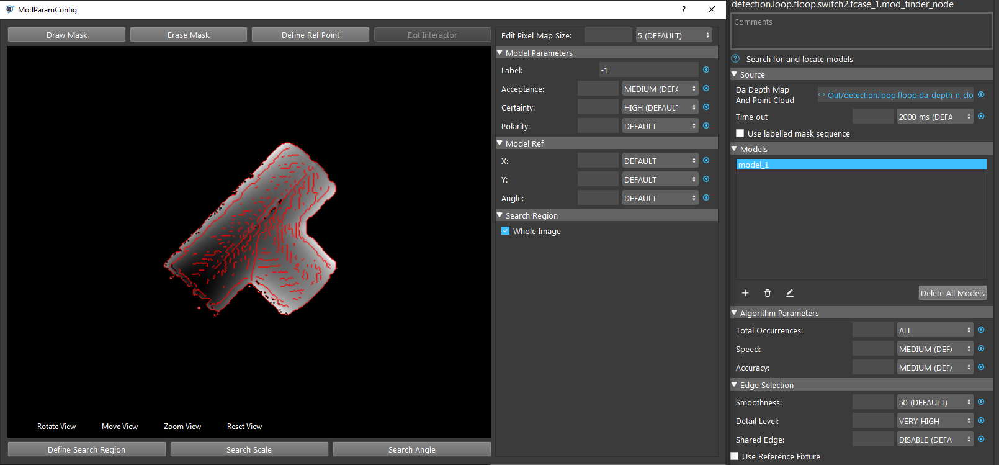
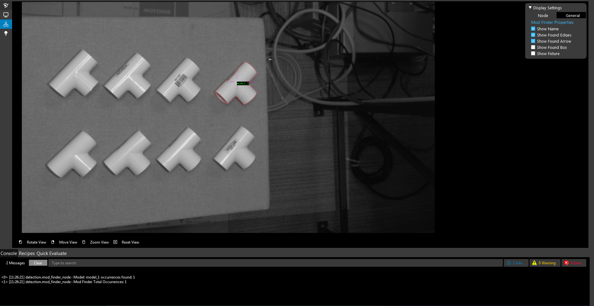
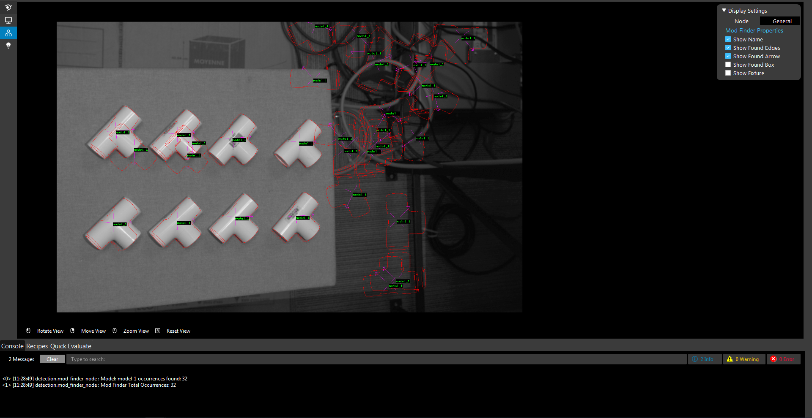
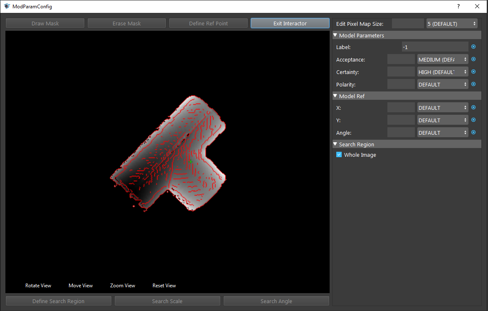
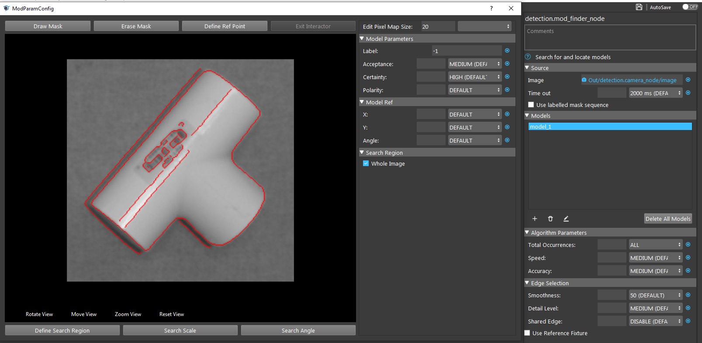
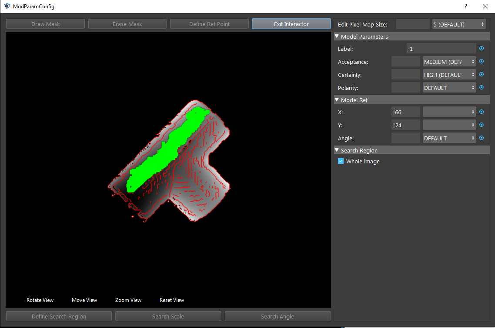
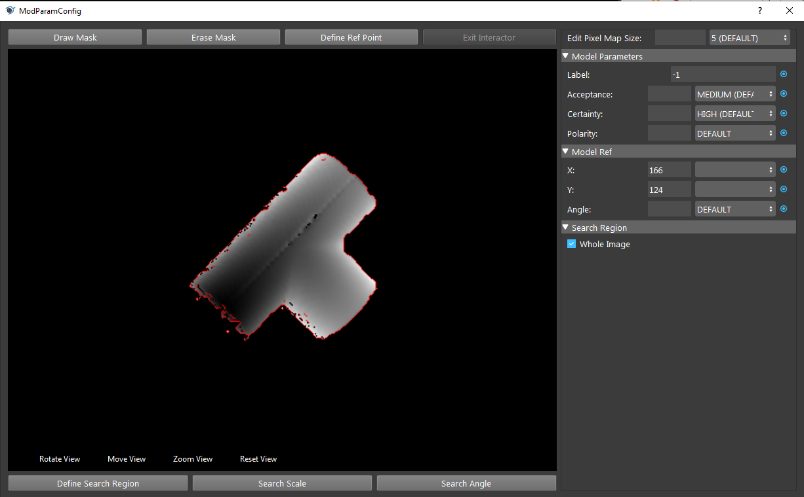
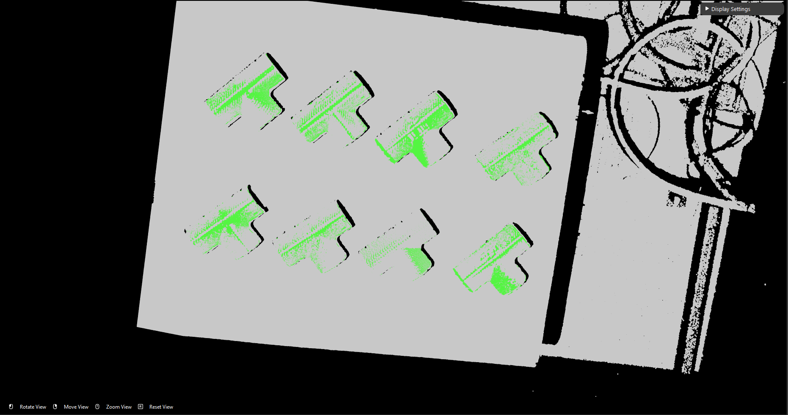
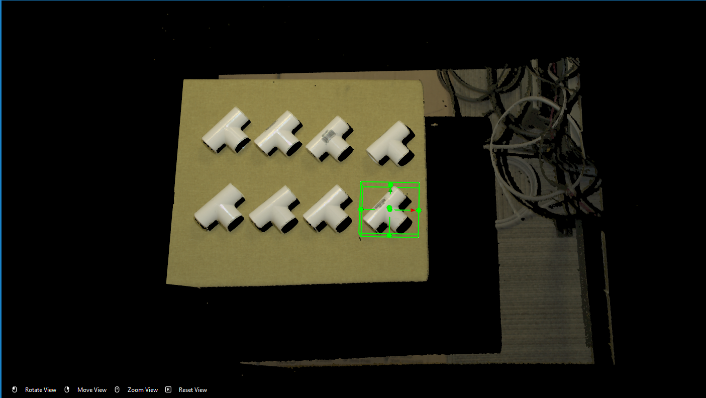
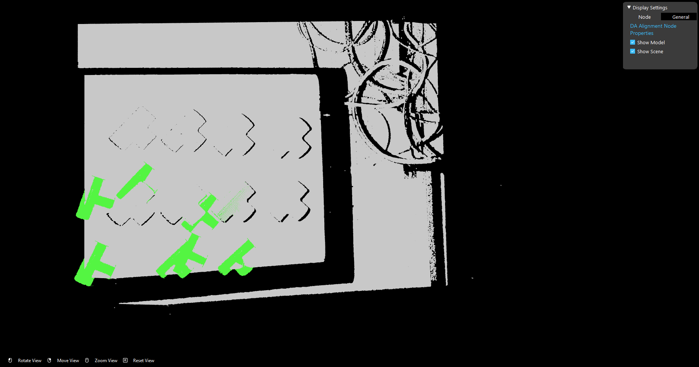

Define Models
===============

How to set good model matching parameters
~~~~~~~~~~~~~~~~~~~~

Double clicking on the model brings up the model parameter configuration.

These parameters are important for detection such that:

* **Acceptance** is the object acceptance in scene. Since Gray Mod Finder uses gray image to detect objects, some pixels of same color in image might form a similar shape as model. Hence, increasing the acceptance higher to ensure it detects the objects and objects only. But if the acceptance is too high, Vision would try to look for objects which has identical pixels with model. This is not so true in real life enviornment since objects might be in different place, when camera captures, the shape of object would slightly change due to angle changes or lighting changes.

When setting acceptance too high, detected 1 occurence of objects but there are 8

When setting acceptance too low, detected 32 occurence of objects but there are 8

* **Reference Point** is the point which Vision detects and perform picking. Reconstruct node generates the object coordinates based on this reference point. Hence, this point would affect the height of object when picking(you do NOT want the gripper to penetrate though the object). This green cross is the reference point:

* **Mask** can cover the area which we do not want to include in model. As we opens up the model parameter configuration, we can see the red lines on the object. These red lines are the shape which is the shape Vision uses for detecting objects. 

As the image shown, the label in the middle is included as the shape of object now. We do not want this label since the other side of this object does not have label!
We can click ``Draw Mask`` to apply mask on the model:

So that we can erase all the non-interested details of the model.

|

After define the model, head to the DA Alignment node, and run it. You will see model cloud aligns with the object positions. 

.. tip:: * To define the model more clearly, you could first enlarge the image view in the display.

After that, executing flowchart to **Section 2**, Cloud Process node crops the defined model and Writer saves the model cloud to local directory. 

.. warning:: 
    The object we crop in Cloud Process node **MUST** be the same object we defined eariler in Mod Finder node. 
    In this case, we used bottom right corner object to define model in Mod Finder; then we have to crop the same object for moel cloud.
    If model is not the same object as the cloud, DA Alignment node would not be able to align the model cloud with objects.

This is the result of alignment when using different object cloud.

The reason behind this result is that DA Alignment takes the model cloud as well as the initial pose of this object from Mod Finder. Reconstruct node process the objects from Mod Finder, 
it generates the pose(coordinates) for the objects. Then Pose Operation node inverse the pose, since the output from Reconstruct is Object-in-Cloud relation, DA Alignment needs Cloud-in-Object relation to align model cloud with object pose. Hence, if the cloud is not the same with model, alignment result is not the correct relations.

How to teach a good model
~~~~~~~~~~

As mentioned earlier, teaching a good model would have great benefitial to detection result. What is good model? 

Good model should be:
    * Model has clear object outline and good object point cloud. A good point cloud should only have tiny area of overexposed pixels or even better that does not have any overexpsed pixels. 
    * Model contains the object and object itself only. The surface should not be included in the model when cropping for Cloud Process.
    * Model Acceptance should be low enough to detect all the occurences of objects **AND** as high as possible to detect all the occurences of the object.

.. tip:: How to adjust this Acceptance level? Set this acceptance level to able to detect all occurences of object; then slowly increases the acceptance level until detected occurences less than what it suppose to be(For example, 8 objects in scene, and we keep increasing the acceptance level until detected occurences is 7 or less). Then decreasing it back to the highest accetpance level which is able to detect all ocurences.

