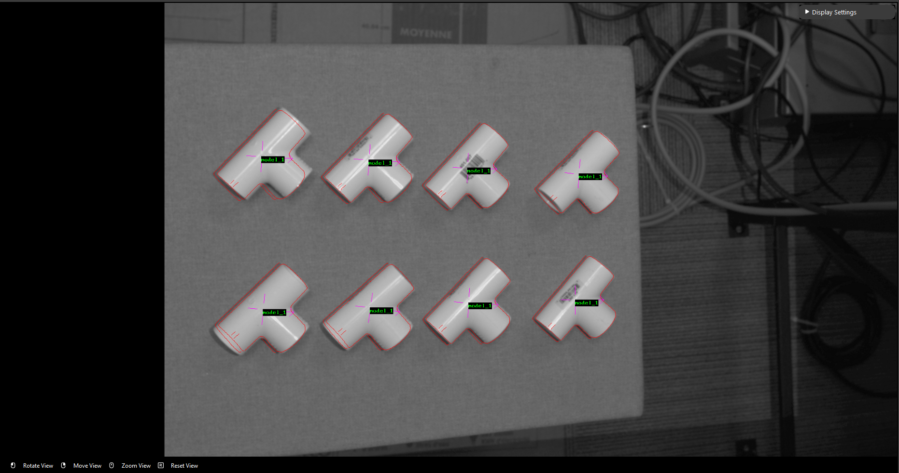
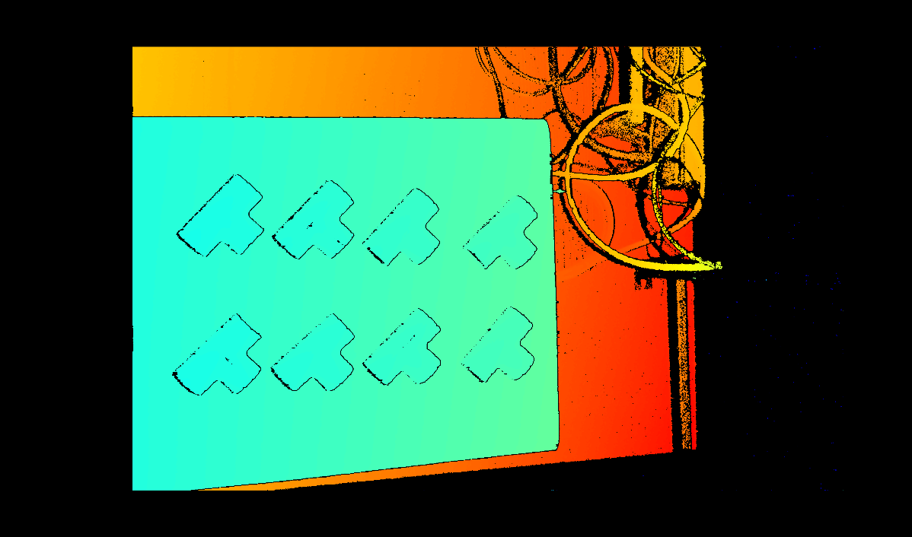

Mod Finder
============

The DaoAI Mod Finder engine used images pattern feature to find the object in 2D space, then used 3D space conversion to map it to 3D space. Usually at the end, it will go through point cloud alignment node to improve the 3D position accuracy. 

There are 2 modes of mod finder:

.. toctree::
    :titlesonly:

    gray-mod-finder

* **Mod Finder Gray**, it finds the defined object on the rgb(gray) image, then use reconstruct feature map the coordinate into 3D space. Finally use the alignment feature to get accurate position. It is suitable to find object has good feature on 2D image, or concatenate it with deep learning feature. 

    
|

.. toctree::
    :titlesonly:

    depth-mod-finder

* **Mod Finder Depth**, it find the defined object on the depth image (paralle projected), then use the alignment feature to get accurate 3D space position. 

    