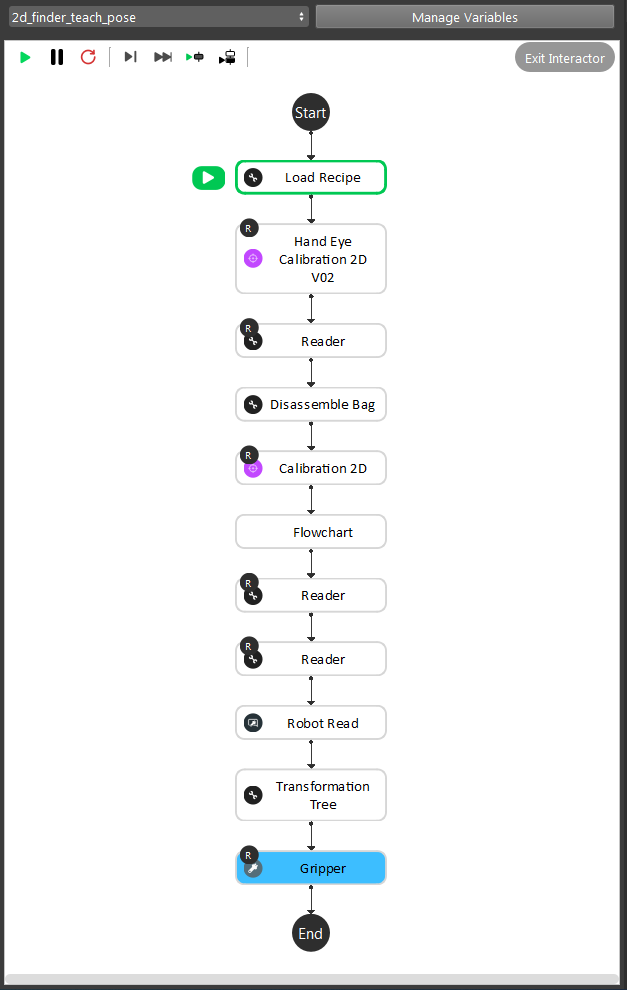
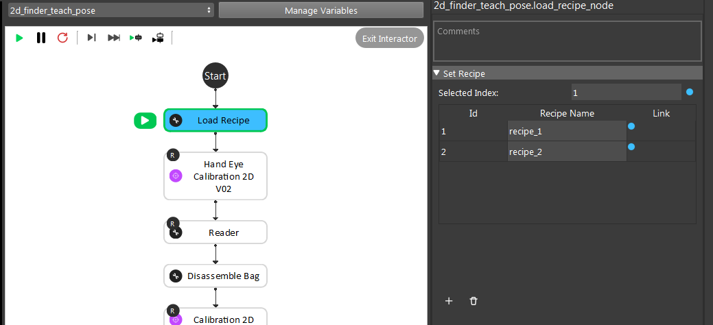
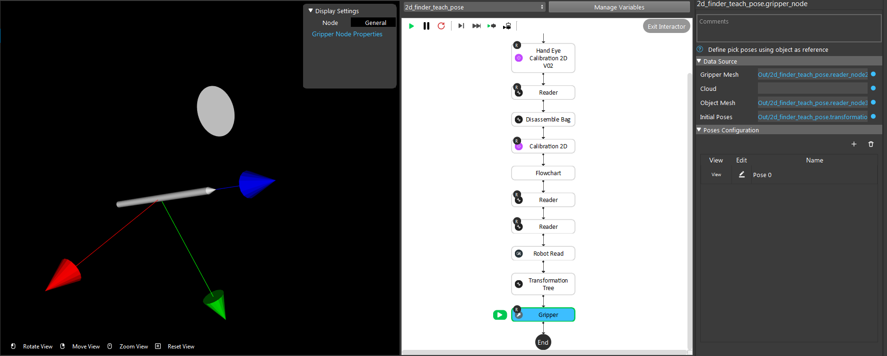
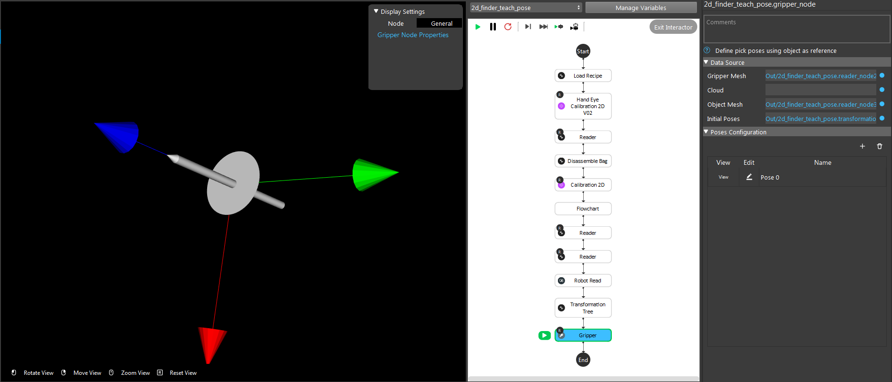
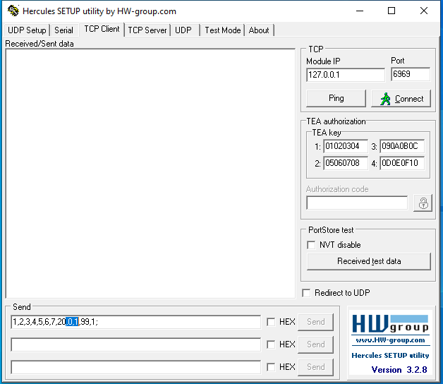
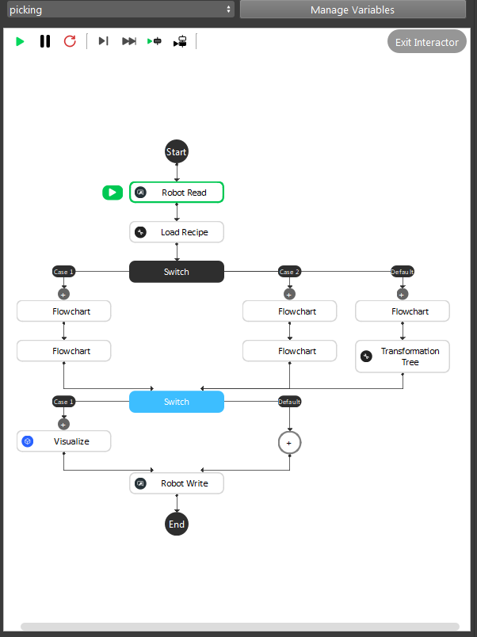
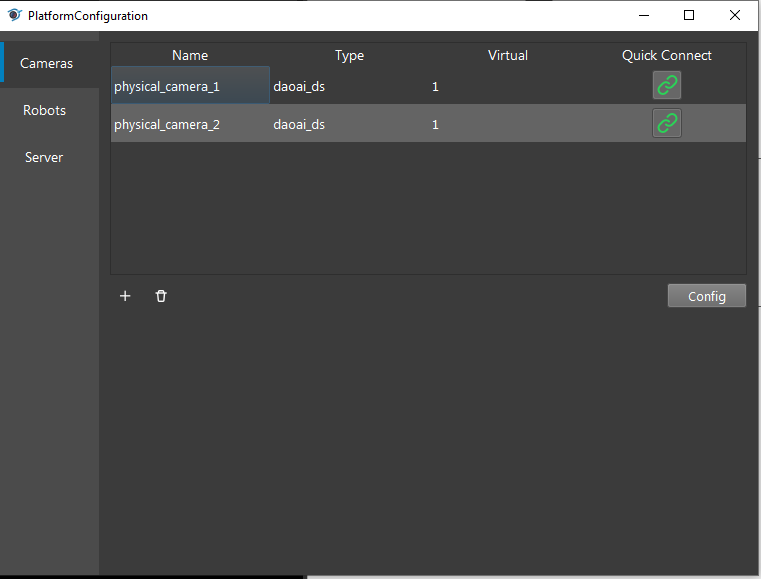
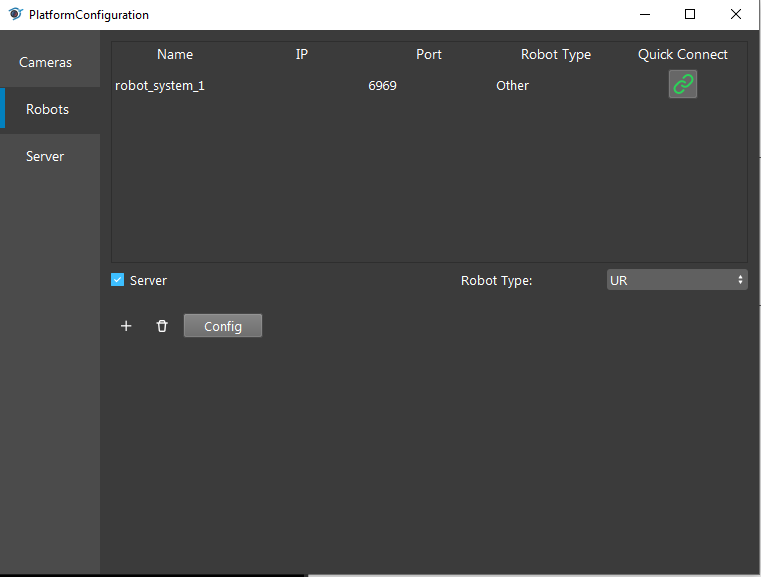

2D Picking
=============

2D Picking Teach Pose
-------------

    
|

``2d_finder_teach_pose`` flowchart is used before ``Picking`` since we need to teach the system what pose to pick the object. Firstly, the system loads a recipe depending on which kind of object you want to pick. In this template, both recipe_1 and recipe_2 are looking for the same object.

    
|

Then this flowchart loads the 2D Calibration result from ``Hand Eye Calibration 2D V02`` Node and chessboard ``bag`` file, calibrate again from the bag files. Loading the mesh from local directory, outputting the picking pose in ``Gripper`` Node. 
Using the visualization to check if object(the plane in this case) and gripper(the pencil in this case) if they were aligned.

    
|

The example shown above is transformed with virtual robot therefore the ``Robot Read`` input is not accurate. Then, you should adjust the pose for ``Gripper`` Node output, adjusting it as they should align. 

Note: ONLY adjust this pose when using virtual robot! If using real robot and gripper not aligned with object, should check the real robot pose. 

This is how it looks like the image below.

    
|

Order Picking Setting
-------------

If you want to pick using 2D Picking, the Picking flowchart needs to take in specific payloads from the robot. 
``Payload_1`` is the variable which control what type of detections to choose. In this case, 2D Picking is anything other than ``1`` and ``2`` .
``Payload_2`` is the variable which control what kind of objects to pick in the recipe(switching recipes). ``Load Recipe`` Node takes ``Payload_2`` as input to determine which recipe to load. 
In our example, there are only 2 recipes in this project. Hence carefully set this ``Payload_2`` , if this payload does not match corresponding recipe number, the system would output ``ERROR`` .

For virtual robot, we use ``Hercules`` . 

    
|

In Hercules, the ``Payload_1`` and ``Payload_2`` is the highlight indexes in the image. In this case, we choose ``0`` in ``Pyload_1`` to use 2D Picking; ``1`` in ``Payload_2`` to load recipe_1.

Run Picking
-------------

    
|

Before running the Picking flowchart:

1. Should run through the ``2d_finder_teach_pose`` flowchart, otherwise some of the inputs might be ``NULL`` .

2. You should double check the ``Platform Configuration`` , make sure the camera and robot is connected. 

In this case, camera_1 is for Recipe_1 object detection; camera_2 is for Recipe_2 object detection.

    
|

    
|

Loading the recipe from ``Robot Read`` Node ``Payload_2`` to determine which object we want to pick. Then the first ``Switch`` Node checks the ``Robot Read`` Node ``Payload_2`` to ensure which detection is used for this picking. 
``Transformation Tree`` Node processes the result from ``2d_finder_detection`` and ``2d_finder_teach_pose`` flowcharts. 
For 2D Picking, there is no ``Visualize`` involved, therefore ``Robot Write`` Node sends the pose to robot, robot will move to this pose and perform picking.