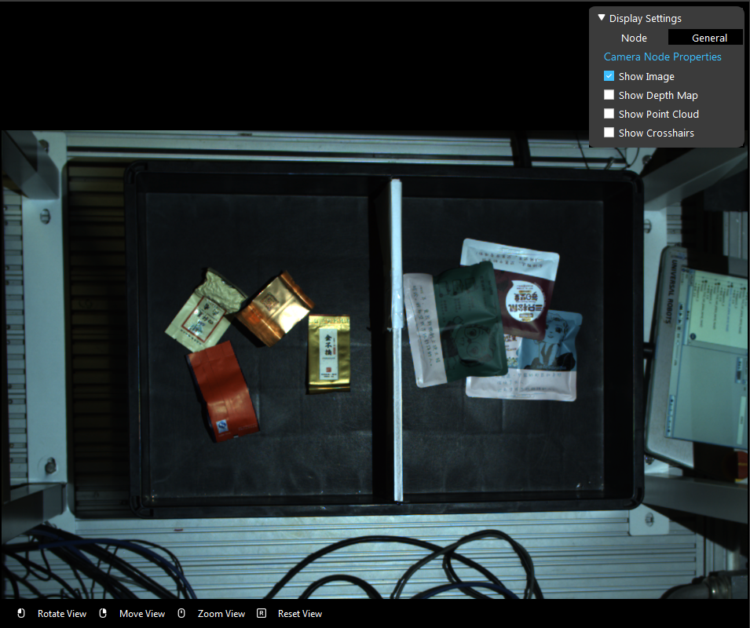
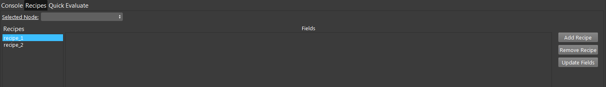
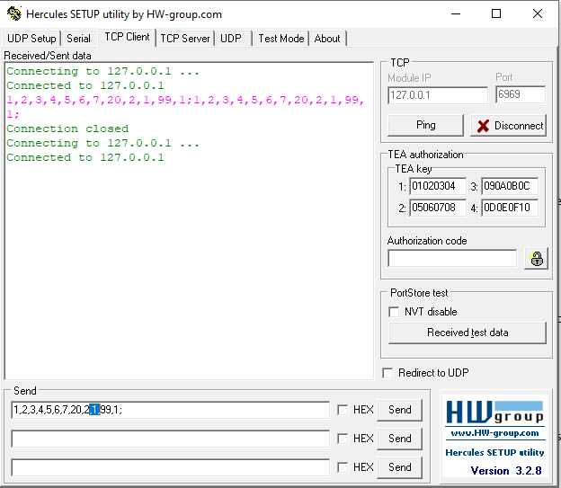
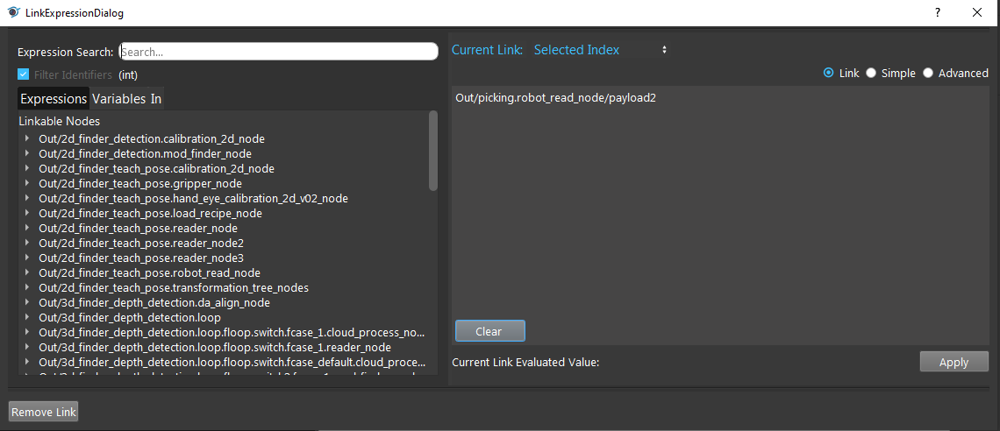
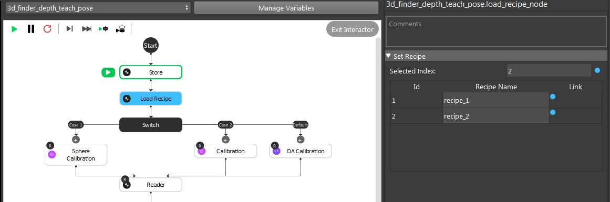
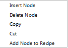
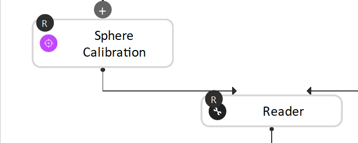

Picking Multiple Objects
==============

In the following image example, there are many different kinds of object; if requirement asks to pick different specific type of object at each different iteration, you are able to alter the system to archive this.

    
|

Recipe & Payload
------------

In the bottom console window, there is a tab ``Recipes`` . In this tab, we can ``Add Recipe`` and matches the number of different objects we want. For example, if we have 14 different objects to choose, then we need 14 recipes to switch between these objects.

    
|

``Payload_2`` is the variable to control which object to pick. In Picking flowchart, ``Load Recipe`` Node would take the robot payload_2 as input, determine which recipe to load.

    
|

Adding ``Payload_2`` as the input for ``Load Recipe`` , opens up the link dialog from ``Selected Index`` , choose the corresponding link for ``Load Recipe`` Node.

    
|

Note: When running the Teach_Pose flowcharts, you needs to teach all the different recipes: for example, if we have 14 different recipes, we need to teach all the recipes ``Gripper`` to produce all the different poses for different objects.

    
|

Even though different recipes are for different objects, but basically all the them running with common procedures. Only some of the nodes would process different values, these nodes are added to the recipe.

    
|

And only these nodes, switching recipes would switch their inputs or configuration. These nodes have a small ``R`` logo on it like the image shown below.

    
|

