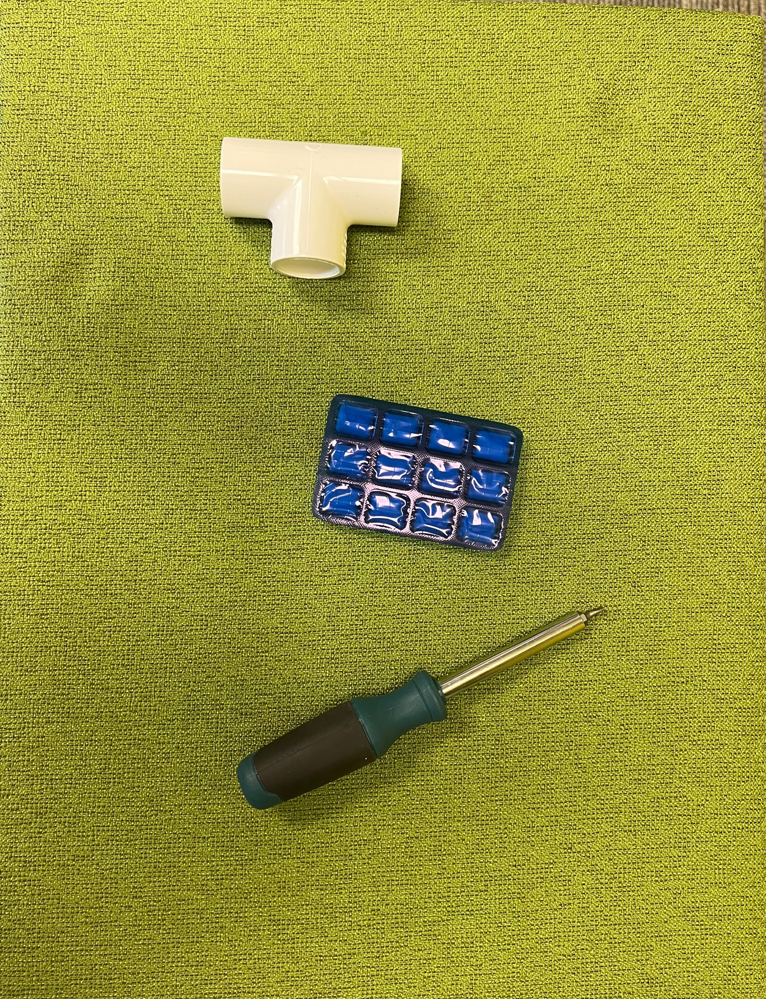
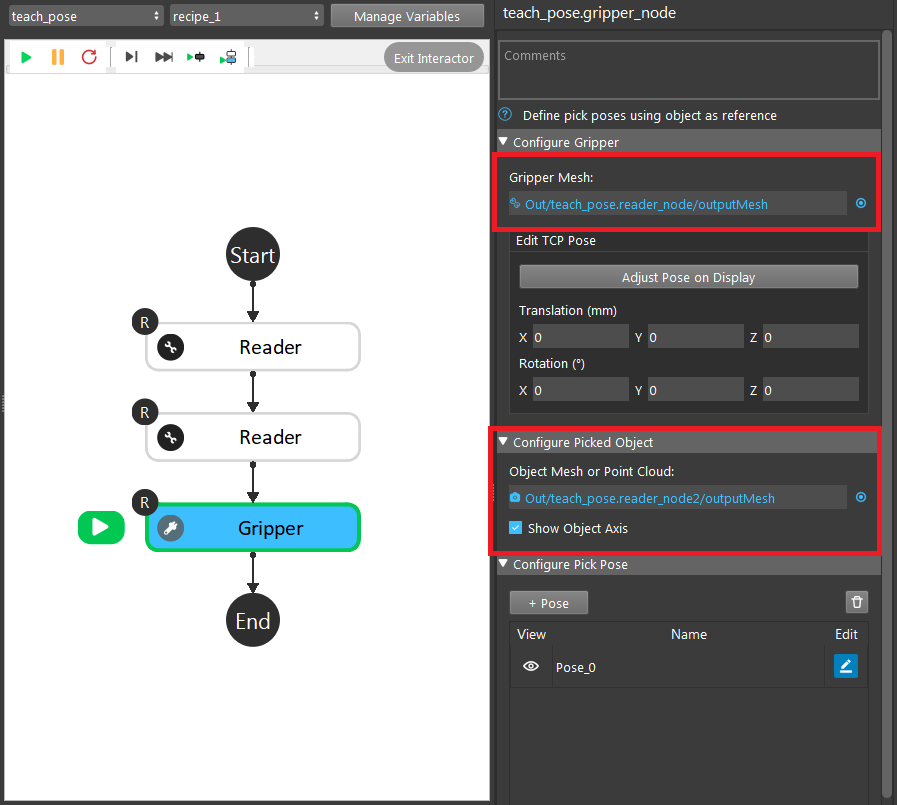
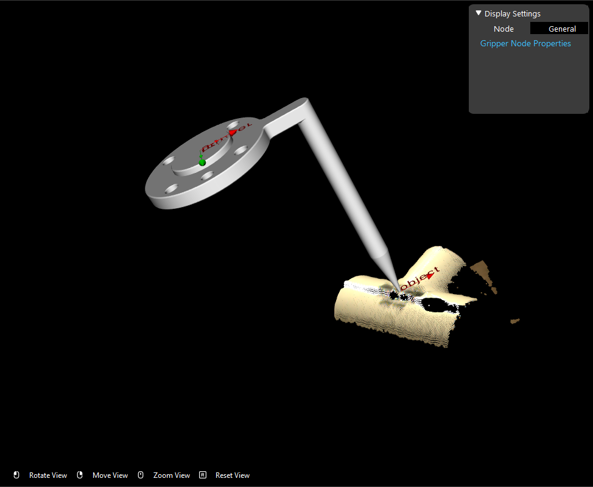
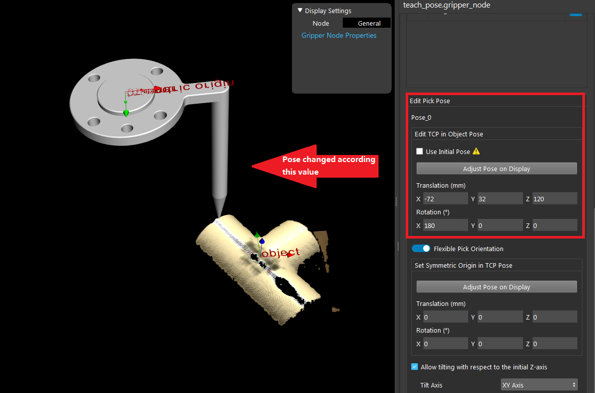
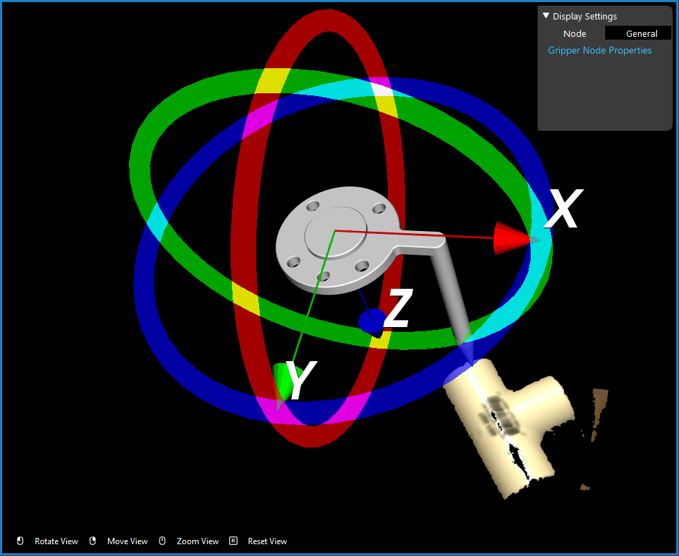

Pick points
====================

A **pick point** is the picking central point of the object. 
Different tools have different mesh and picking mechanism. Objects need different picking mechanism too. 
The central pick points of objects are also different. Therefore, you need to be aware what tool you are using and what objects you will be picking. 

In the image above we have 3 different objects. Since the Tee tube and gum is light and weight distribution is fairly even. 
You can grab on the central of the object. But for the screwdriver, most of the weight is concentrated on the bottom part of the screwdriver. 
Therefore, the pick point should ideally at the black area of the screwdriver. 

Hence, you need to find out where is the pick point for your objects, then define the pick point on **Vision Studio** for these objects.

There are a few ways to setup the pick point(reference point):
    #. **Mod Finder** models define reference point;
    #. Key-point model with key-point annotated;
    #. **Gripper** node adjust the pick point on the model cloud;

If you are using RGB/Depth Mod Finder, you can define the reference point on models. You can checkout this article `How to define reference point <https://daoai-robotics-inc-daoai-vision-user-manual.readthedocs-hosted.com/en/latest/complete-vision-guidance/detection/mod-finder/good_model.html#how-to-set-good-model-matching-parameters>`_.

If you planned to use key-point models to detect your objects, you can define the reference point(the key-point) on the pick point. 
First you need to `collect your dataset <https://daoai-robotics-inc-daoai-vision-user-manual.readthedocs-hosted.com/en/latest/deep-learning/dataset.html>`_ and `annotate your dataset <https://daoai-robotics-inc-daoai-vision-user-manual.readthedocs-hosted.com/en/latest/deep-learning/annotation/index.html>`_. 
The pick point will be your key-point on the object by default. 

If you are not using the detection engines above, you can use the **Gripper** node to adjust your pick point. 

**Gripper** node requires tool mesh and model mesh/point cloud in order to work. 

In here, we can see the original pick point is at the middle of the Tee tube(we used the long point tool in order check the pick point easier). 
In this example, we will need to change the pick point at the edge of the Tee tube. So we can change the x, y, z offsets or adjust the pose in display to change the pick point. 

Another way to change this pick point on object is like we mentioned above: adjust the pose on display.

You can drag the tool model in display to adjust the pick point. 