Pick Strategy 
=========================

In this section, we will be talking about how to apply some other nodes/functionalities to alter the picking strategies. 
There are 3 strategies can be applied to our picking pose:

    #. Picking objects with designated orders;
    #. Altering the picking rotations for objects;
    #. Limiting the tilt of picking poses;

Object Orders
--------------------

We will be using our **RGB Mod Finder** template as our example. This section we will skip the details of **Detection** flowchart, you can check out `this article <https://daoai-robotics-inc-daoai-vision-user-manual.readthedocs-hosted.com/en/latest/complete-vision-guidance/detection/mod-finder/mod-finder-overview.html>`_ for knowledge about **Detection**. 

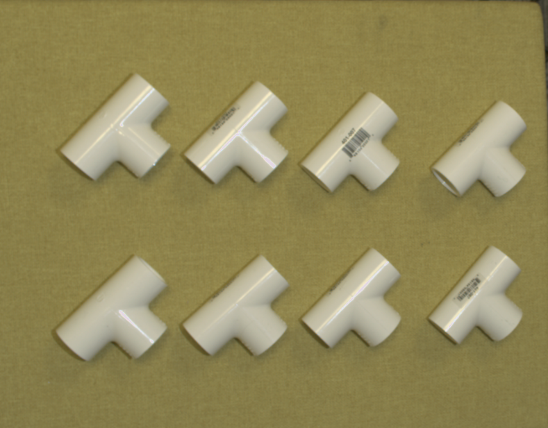

|

In the image above, you can see there are 8 objects in scene. For industrial productivity, 
time is valuable for factories. Therefore, picking multiple objects within **one image capture** is usually required. 
When thinking about more complex industrial environment and requirements, objects might stack on one and another. 
Solution to such problems is to sort the pickable objects then picking them one by one(if using one robot). 
Increasing the amount of robots can be also helpful, but note that robots might have potential collision when 2 or more robots are working in the same area. 
We will discuss about this in the later section of this article **Collision Prevention**. 

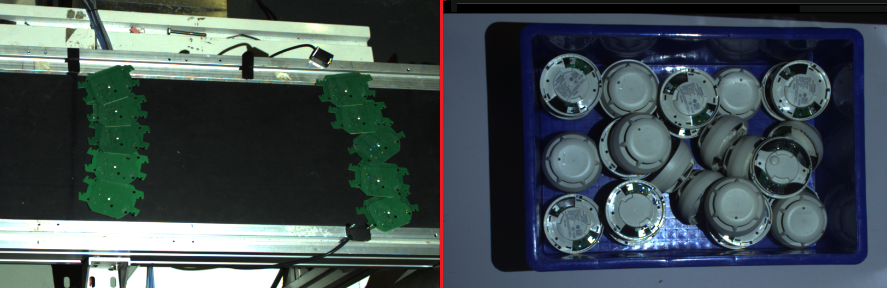

|

**Pick Sort** is the node which sorts the pick poses.

Linking all the inputs for **Pick Sort** node, then you can use the the pick sort setting to sort the poses. 

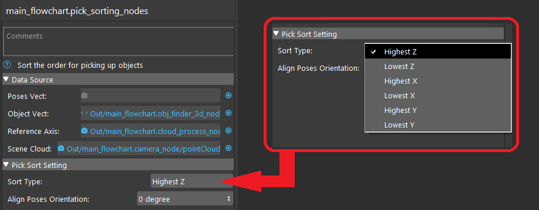

You choose the orders which sorts the poses. **Highest Z** represents the poses will be sorted in decreasing order of Z value. The output of **Pick Sort** node 
is a vector of poses which ordered from highest Z to lowest Z. 

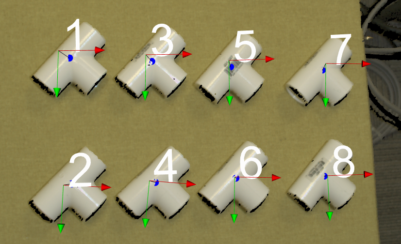

Now the poses have sorted and you can see the label of these objects. **1** will be the first object to be picked, then 
**2** and so on. This feature is 
useful especially when encountering the stacking and overlapping objects like image shown below. 

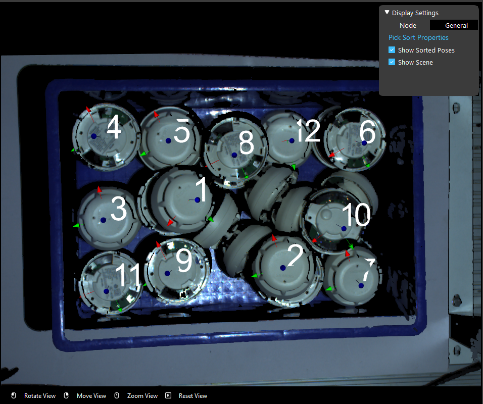

|

Pick Pose Rotations
------------------------

Continue from **Object Orders**, you can see that the smoke detector is circle shape object, the any pick pose rotates from Z-axis will the providing the 
same pick pose in real life. But note that, robot is not human, they don't know if the pose can be rotates in any directions or angles. The robot will 
perform picking with the pose's x, y, z, rx, ry, rz values. 

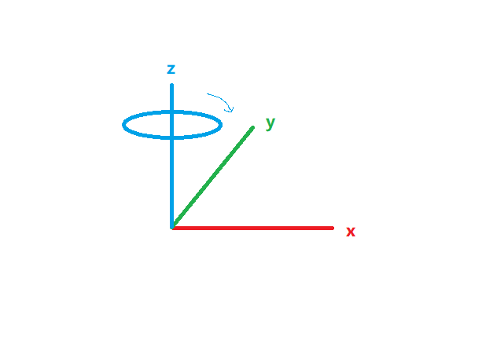

Therefore, in concern of efficiency, we should ask the robot to ignore the rz rotation and pick all the objects no matter which rz values they have.

You can see that the **Pick Sort** node has a setting called **Align Poses Orientation**. 
This setting is able to change the sorted poses with same rotations. It can help you to align all the sorted poses with same x, y direction.

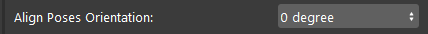
|

There are several degrees you can align these poses to: 0, 90, 180, 270 and towards reference frame:

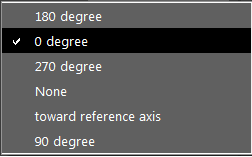

|

As it states from the options, the poses will rotate to such a degree. 

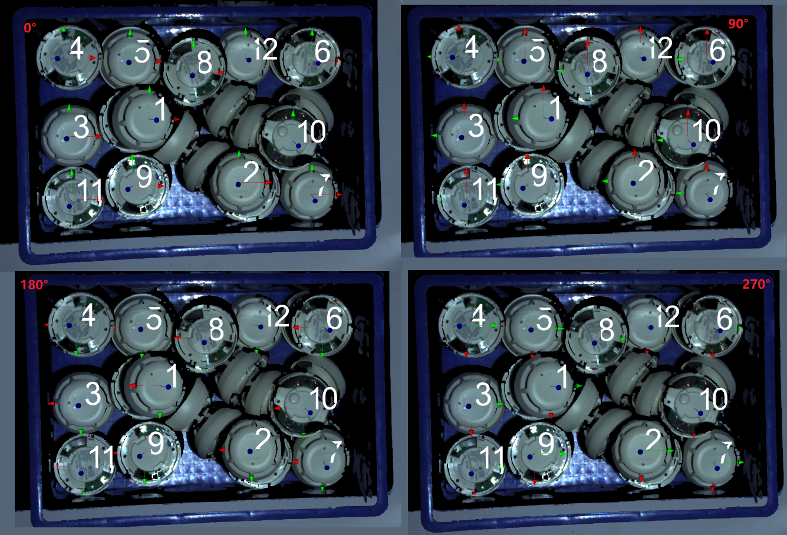

|

Another way to alter the pick pose rotation is the  **Gripper** node. You can change the relation of **Object -> Tool** (or **Tool -> Object**, depending on how you build your 
**Transformation Tree** node). This relation has flexibility between gripper and object. By default, the relation is defined from your teach pose(**Robot Read**) or the value you input for virtual Pose Define process(like the image shown below). 

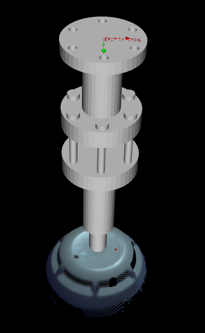

You can use this flexibility to enable pick pose rotation on Z-axis: 

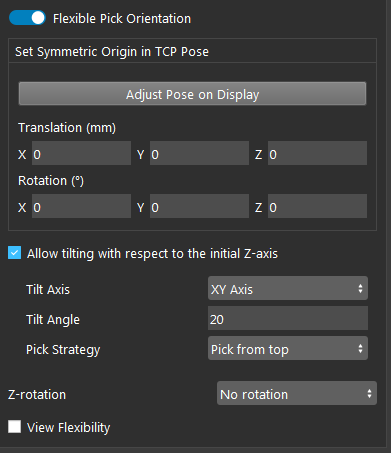

You can use this setting to allow the Tool picking with rotation at Z-axis no more than  180 degree or even full circle. This can achieve the same purpose like above using **Pick Sort** node rotation. 

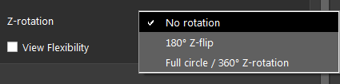

|

Pick Pose Tilting
------------------------

In real world environment, objects tilt will always happen. If the objects are within an area with potential collision, sometime you might need to apply the tilting on 
poses in order to perform picking. 

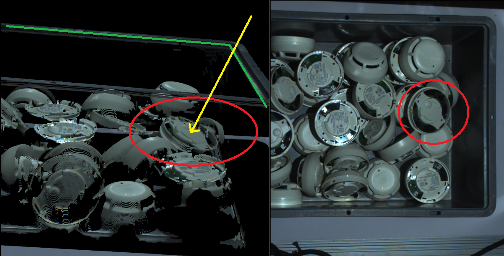
|

For example, the smoke detector with **red circle** is located closely to the edge of the basket. When **Vision** calculates the pick pose for this object, 
it is usually perpendicular to the object surface(it can be changed to perpendicular to the reference frame's axises as well, let's pretend the pick pose is 
perpendicular to object surface now). And if the robot is trying to pick this detector with this pick pose(indicated with **yellow line**), the robot arm is possibly 
going to collide with the edge of the basket. 

In this case, applying 20-30 degree of tilt to the pick pose is still able to pick up the detector, and the robot is collision-free. Therefore, allowing 
proper amount of tilting is helpful. 

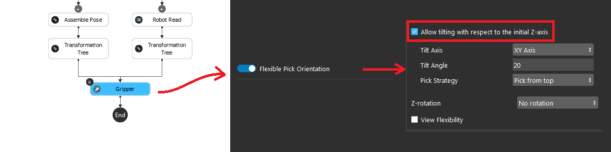

|

    * Tile Axis is the setting of which axis/axises you allow this pose to tilt. You can tilt it with x & y axises, x-axis or y-axis.
    * The Tilt Angle is maximum angle you allow the pose to rotate.
    * Pick Strategy is the preference of this picking pose: **Pick from Top** or **Pick with Less Tilt**

