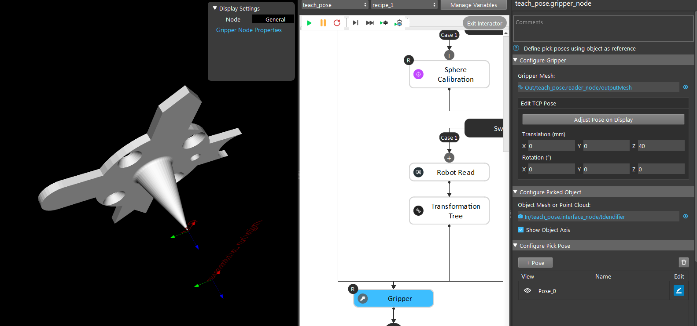
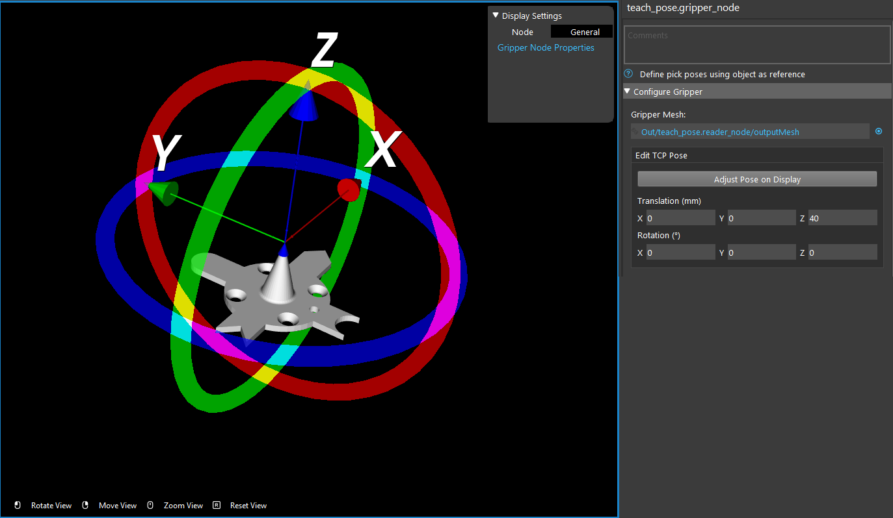
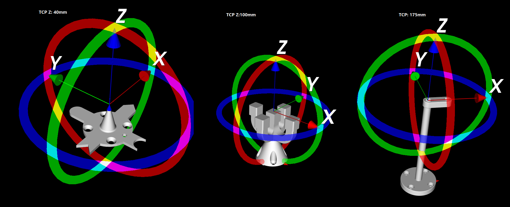

Robot tool model
==================

Robot arm has compatibility to many different tool to achieve different purposes. 
Since there are thousands of tools can be installed on the robot arm, you will need to specify what tool you installed. 

Here is where the **Gripper** node comes in play. **Gripper** node requires the gripper model and object model in order to work properly. 

Tool Model is usually **.ply** format(CAD model). This tool mesh will be used in **GRipper** node for visualization and calculation. 

You can adjust the Tool Center Point(TCP) on the display like image shown above. You will also see the corresponding values on your adjusted TCP. 
Of course, you can do it on the other way around: by changing the coordinate to adjust TCP. 

This setting is important because **Vision** is meant to control the robot arm and flange. 
Even if you give **Vision** the tool model(**.ply** file), **Vision** does not know the potential collision and relations. 
This TCP pose setting will produce the **TCP in flange** relation for **Vision** to manage the robot arm. In another word, 
after setting up the TCP pose, **Vision** will now treat the TCP as robot flange(with relation process underneath) in order to avoid collision as well as 
generate the correct picking pose for different tools. 

|

.. tip::
    When defining the TCP pose on a tool, set it at around **1 mm** away from the actual TCP tip. Since the **Vision** and the robot possibly having 0.1-0.2 mm of error tolerance. It is better to set the TCP slightly larger to keep everything safe. Most of the tools are able to manage the 1mm Z-axis direction tolerance. Therefore, **DO NOT** use every mm of the TCP!

