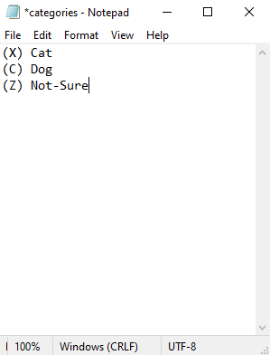
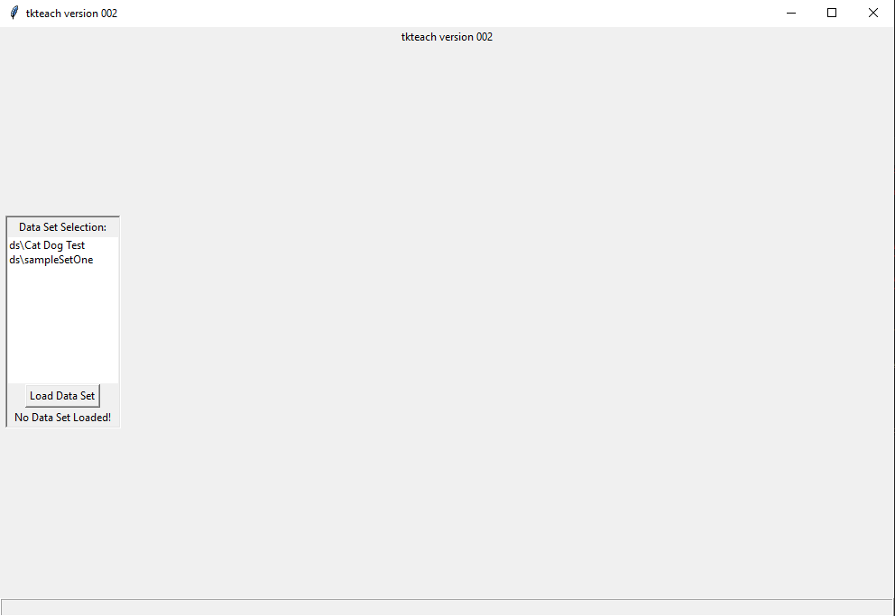
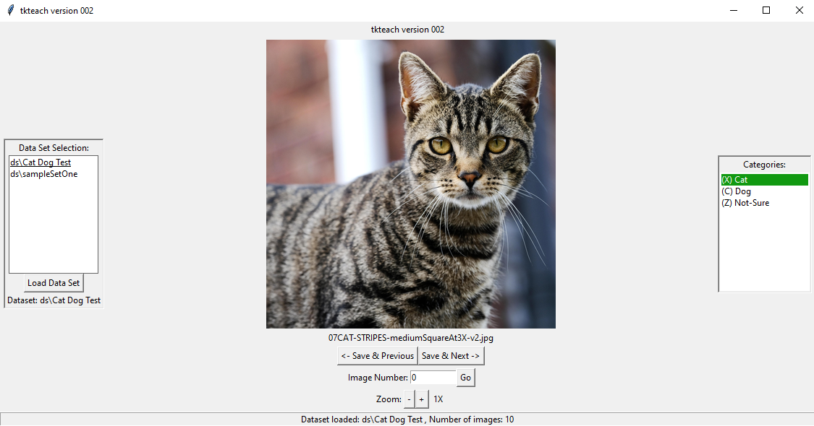

Annotating Classification Data
===================================

For our classification annotation, we use a simple annotater called tkteach.

Installing tkteach
------------------
Prior to installing tkteach, you must have an environment set up with Python, PIL, and tkiner.
Once you have that environment set up, go to `this link <https://daoairoboticsinc-my.sharepoint.com/:u:/g/personal/xchen_daoai_com/EbnJb56ga5VGmjSjkV2279wB3andyLOdtg-xfdDzBLe2Tg?e=UOp96H>`_ and download the .zip file, OR go to https://github.com/rmones/tkteach and clone the repository somewhere accessible.

Using tkteach
-------------

Using your file explorer, navigate to the folder you previously cloned.
Place the images you wish to annotate in a folder inside of 'ds'

Navigate to the file called 'categories.txt' inside tkteach
Replace the lines in this file with the labels you wish to apply, as well as hot keys to make annotation faster.
For example, for my dataset containing images of Dogs and Cats, my categories.txt would look like:

Once your dataset and labels are set up, you are ready to start annotating!

To run tkteach, go to the command line where your environment is set up (Type in 'cmd' in your search bar).
Navigate to the folder you just cloned and run the following::

    python tkteach.py

After running the previous command, you should see the homescreen:

Select the Dataset you'd like to use (On the left toolbar) and load it.
Your first image should load in the middle, and you should see your labels on the right sidebar.

Assign the desired label to each image by either using the hotkeys you assigned earlier, or clicking on the label on the sidebar.
Continue to the next image using the arrow keys, and repeat for your whole dataset.