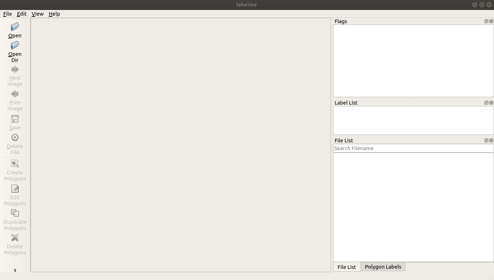
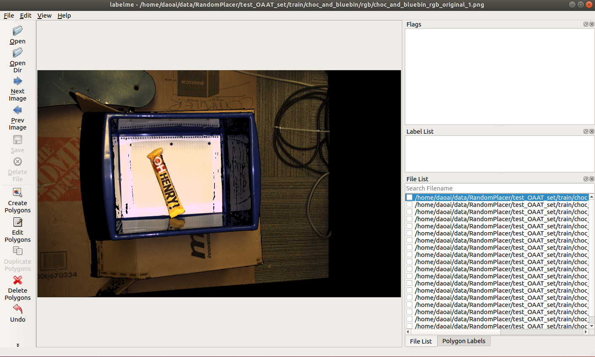
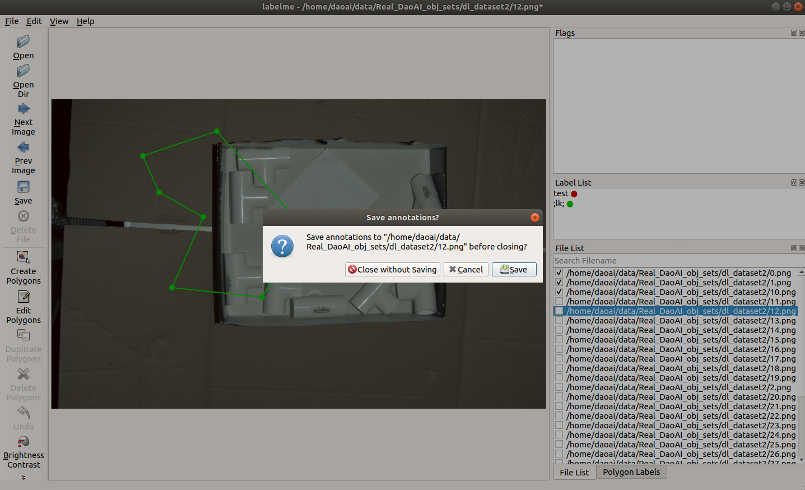
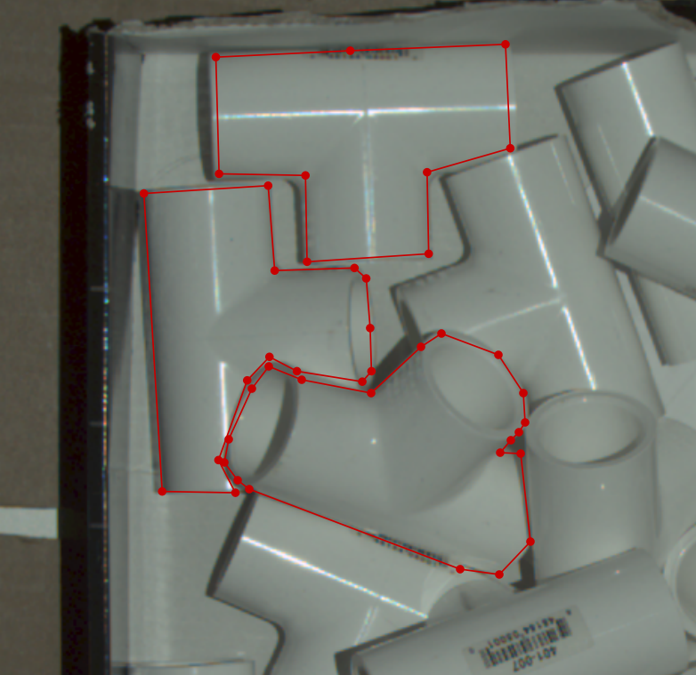

Annotating Segmentation Data
=================================

For our segmentation annotation, we use a simple annotater called LabelMe.  
It is commonly used for computer vision tasks and also provides some command line functionality to speed up tasks.

Installing LabelMe
------------------
Use the downloadable executable `found here <https://daoairoboticsinc-my.sharepoint.com/:u:/g/personal/xchen_daoai_com/Ecmqz3JU-WVCv_Po7uuE-lABNDx6zXs44VY-tE8OP9ZkqQ?e=VPzNwI>`_ or see installation instructions at https://github.com/wkentaro/labelme#installation in order to set up LabelMe

Using LabelMe
-------------
After opening LabelMe you should see the home screen:

Before annotating choose an output directory for the JSON files by clicking “File > Change Output Dir”. 
Please keep the JSON files and PNGs in the same place, as you will need to upload them together later on, and it renders model training far easier.

To get started, open an image or a directory of images by clicking “Open” or “Open Dir” on the left-side toolbar. 
The files to annotate will be shown in the “File List” section (bottom-right) and some options will become visible:

When you're ready to annotate your segments, select the 'Create Polygon' tool on the left toolbar.
Proceed to your image and draw your shape following the :ref:`guidelines-label`.
Once your polygon has been drawn, a pop-up will appear asking for the class label.  
If no label list is loaded, then type in a class label and select "OK".
This will be the active label until another one is chosen.

.. tip:: The previously used class will stay selected when the pop-up re-appears. Press Enter to quickly accept the selected label.

To edit any of your annotations, click on 'Edit Polygons'.
Clicking on an annotation will now select it and allow you to delete or edit it.
When editing, you can move the vertices or the entire annotation around.

When finished, click 'Save' (On the left toolbar) and choose the directory to save in.
If you set the directory at the start, press Enter to quickly accept the directory

.. attention:: Although going to the next image prompts a saving pop-up, there is a bug in LabelMe that makes the path in this pop-up incorrect.  As such, it is recommended to use the 'Save' button instead.

.. note:: LabelMe is not a DaoAI application.  For troubleshooting help, please refer to the `LabelMe github <https://daoairoboticsinc-my.sharepoint.com/:u:/g/personal/xchen_daoai_com/Ecmqz3JU-WVCv_Po7uuE-lABNDx6zXs44VY-tE8OP9ZkqQ?e=VPzNwI>`_

.. _guidelines-label:

Annotation Guidelines
---------------------

When annotating segmentation masks the only requirements are that the polygons extend to the boundary, and there is no overlap in the masks. 
Shown below is an example. Try to minimize these gaps and extend to the boundary as much as possible.

