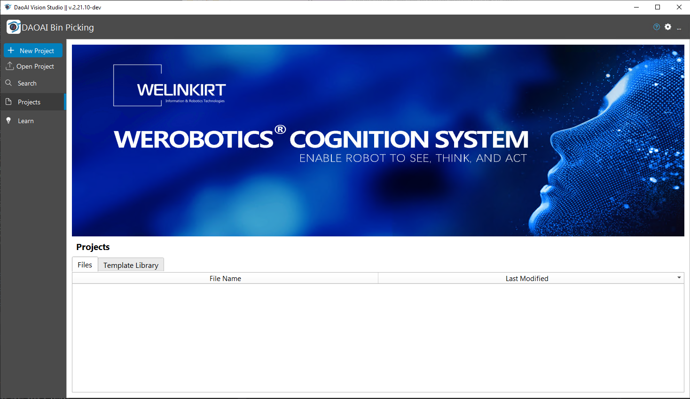
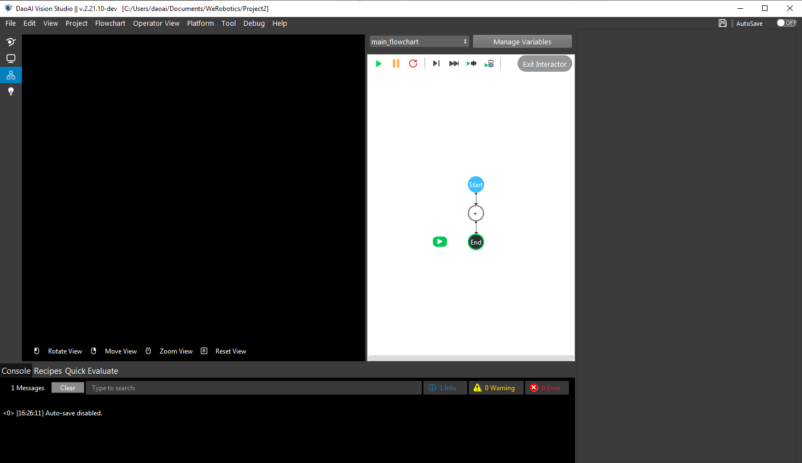
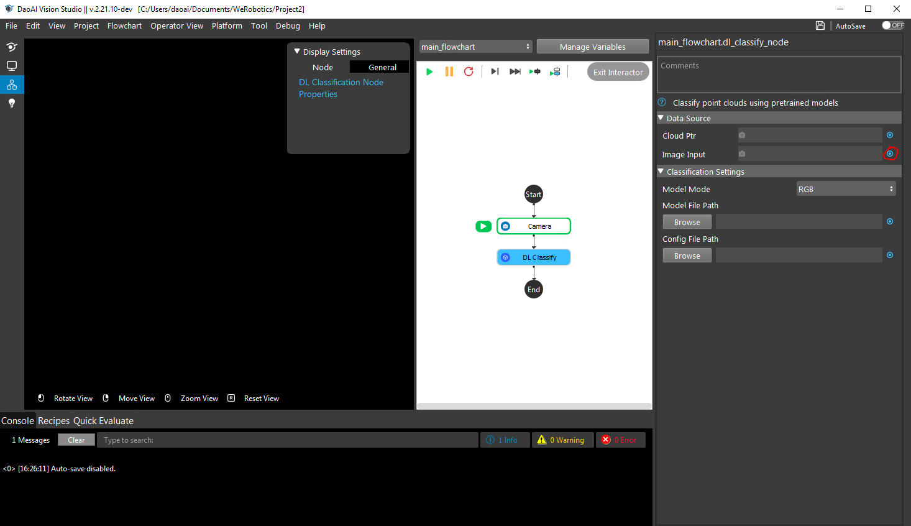
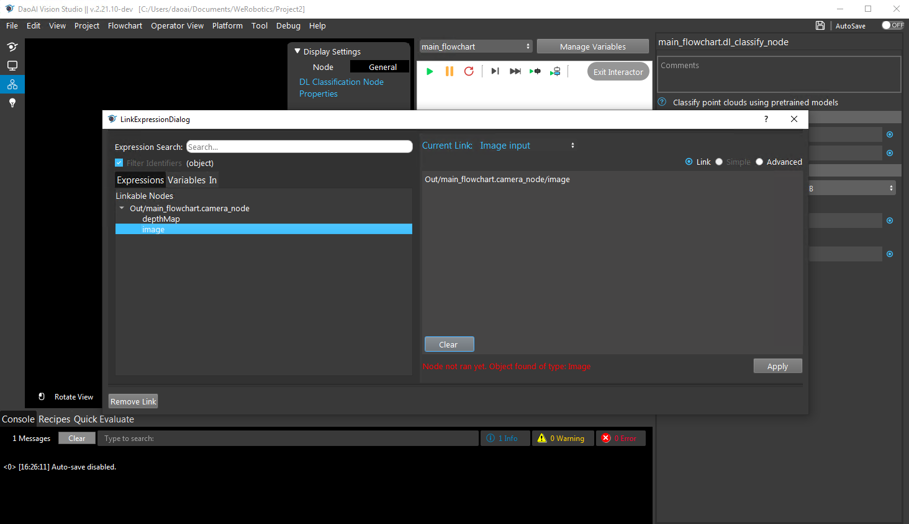

Test Your Model in the Bin Picking System
==========================================
Testing your model in the DaoAI Bin Picking system is quite easy to do, and only requires some very basic knowledge of the system.

Setting up your Workspace
-------------------------
The first thing you'll want to do is to set up your system to be able to test the model.
First, launch WeRobotics Cognition Systems.exe.  It should look similar to this:

From here, click on 'New Project' in the top left, and give your project a name.
Click 'OK' when you're ready.

Now your screen should look like this:

Next, right click on the Plus ('+') in the middle of the screen, and select 'Insert Node'.

If you'd like to test your model using a Camera, select the 'Camera' Node
To learn how to use a Camera, please reference the 'Cameras' section.

Once your camera is set up, right click on the Camera node, and select 'Insert Node' again.
This time, your choice of node depends on the type of model you'd like to test.

If you'd like to test a classification model, select the DL Classify Node.
If you'd like to test a segmentation model, select the DL Segment Node.

Connecting the camera is the same for each node.
Next, select the DL Node and click the blue circle to the right of 'Image Input'

From there, click on the arrow to bring out the camera_node dropdown, and double click 'image'.

Click 'Apply' in the bottom right and close the menu.

Next, proceed to the 'Model File Path', click Browse, and select the path to the model you wish to test.
Once that is set, do the same for the 'Config File Path', this time loading in the 'DaoAI_BP_Config.txt' that was exported with your model.

Once you've done all this, you should now be ready to test your model.  
Hit the 'Run' button, and keep an eye on the output of the DL Node, to be able to tell how well your model is working.

For classification models, there should be a text output specifying the detected class.
For segmentation models, it should look similar to this

.. image:: images/bp-testing-gif1.gif
    :align: center