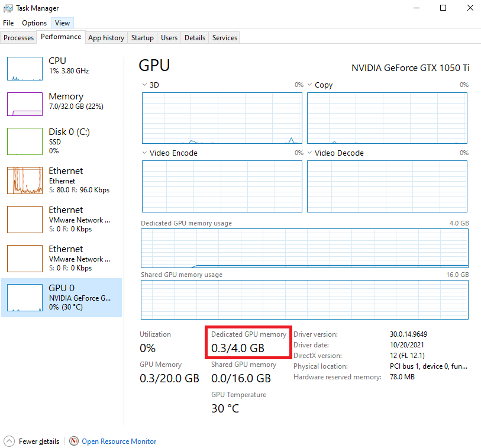

Common Issues in the Bin Picking System
============================================
There are some common issues that people have come across while trying to use the bin picking system.  
Here is how to solve the most common ones before you feel the need to reach out for support
Please review them **in order** as some have similar symptoms, but they appear in order of how common they are

Models trained with the bottom layer removed
--------------------------------------------

Memory Consumption issues
-------------------------
If the system console is printing "Failed to load model, Check model path", it is possible that you are using more GPU memory than you have.
To check, open "Task Manager" and check your GPU memory limit.  Your GPU memory limit must be 4.0 GB or more to run properly

To solve this problem, you must switch to a PC that has more than 4.0 GPU.  
If you need an immediate fix, you can temporarily switch to the CPU model, however this will run substantially slower than the GPU version.

Deep Learning Node not able to run a second time
------------------------------------------------
.. important:: Only proceed here if you have checked your Memory Consumption **first** as they have similar symptoms

If you are unable to run the model a second time (The console prints "Failed to load model, Check model path"), 
but your GPU memory isn't an issue, then it is possible you are missing some dll files.  Please check this bin folder.

If you are missing nvrtc64_102_0.dll or nvrtc-builtins64_102.dll, please go download them from `HERE <https://daoairoboticsinc-my.sharepoint.com/personal/xchen_daoai_com/_layouts/15/onedrive.aspx?ct=1646938410830&or=Teams%2DHL&id=%2Fpersonal%2Fxchen%5Fdaoai%5Fcom%2FDocuments%2FREAD%5FTHE%5FDOC%2F2%2E22%2E1%2Fdeep%5Flearning>`_