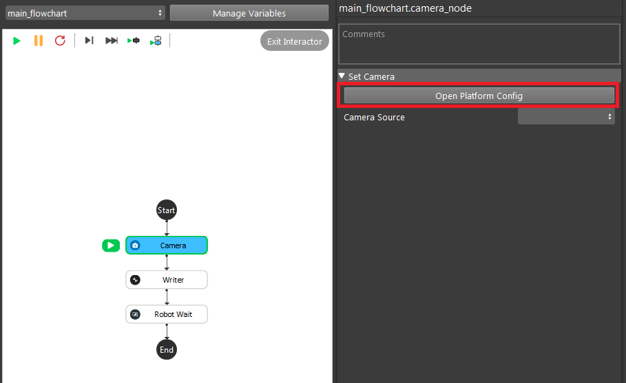
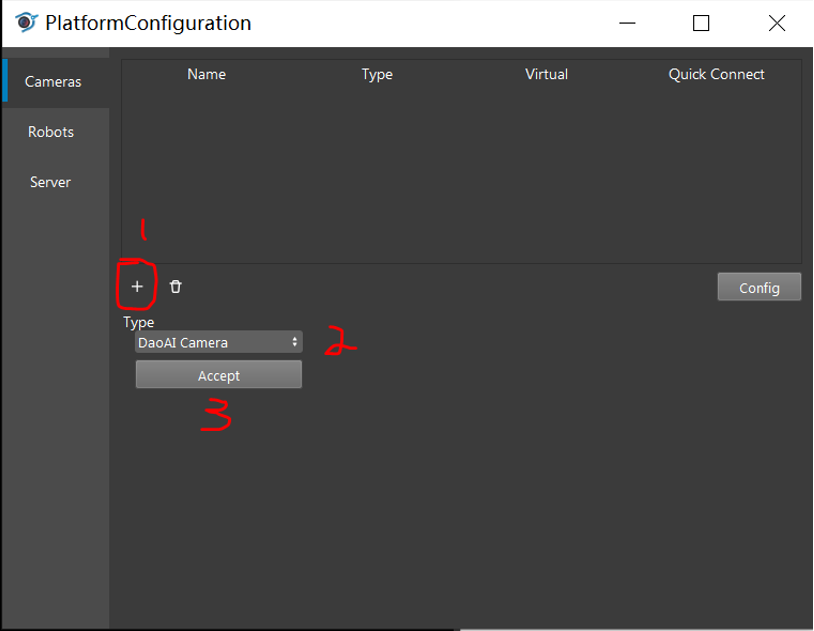
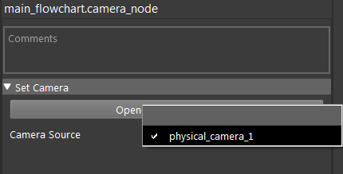
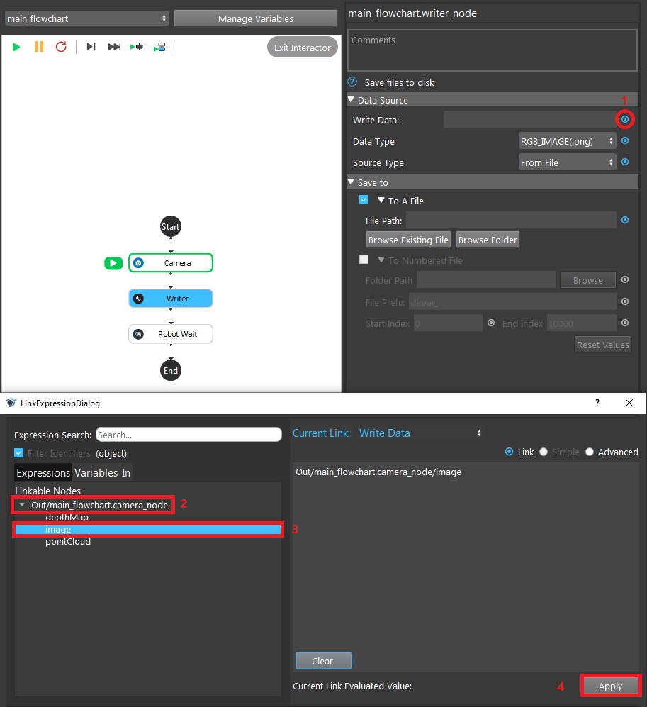
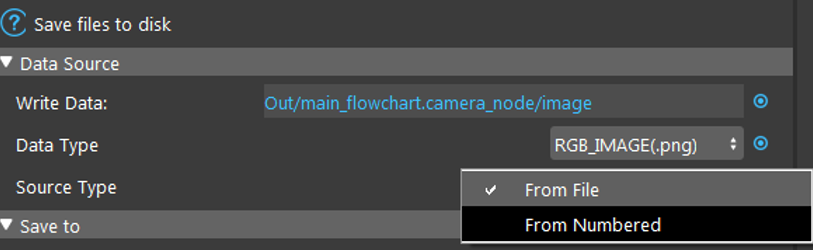
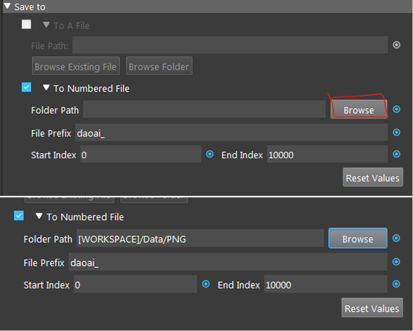
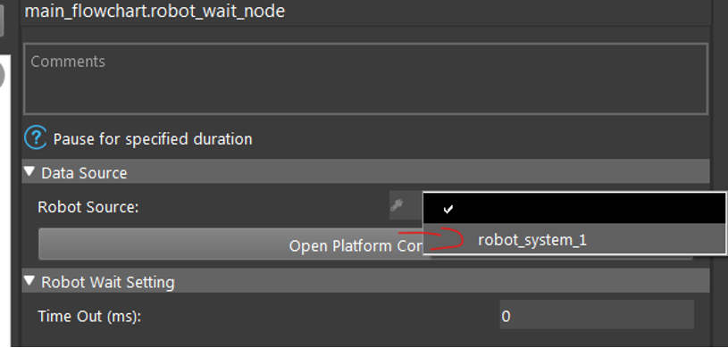
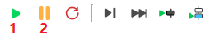

How to Collect a Dataset
========================
This section demonstrates collecting and saving a training dataset with the correct layout and format using a flowchart.

1. Create a new project from scratch
2. Right click the **[+]** button and click **Insert**
3. Insert a **Camera** node, a **Writer** node, and a **Robot Wait** node
4. Left click the **Camera** node. In the configuration window click the **Open Platform Config** button

5. Click the **[+]** button and select your camera type, then click the **Accept** button

6. Configure the camera so that it will produce the same images as will be seen during the detecting and picking process after your model has been trained. 
   Load necessary camera setting file (.cfg), then click on the **Save Image Data** checkbox, and select **From Numbered Files** and click on the **Browse** button. 
   In the folder you want to save your output, create a new folder called "DCF" then click **Connect**
7. Switch **Camera Source** to the camera you just added

8. In the first **Writer** node, click on the link button (the blue circle) and select the **Image** output from the **Camera** node.  Click the **Apply button**

9. Keep the **Data Type** to be PNG and change the **Source Type** to "From Numbered"

10. Click **Browse** and select a folder where the PNG data will be saved.  Preferably, in the same level as the DCF folder create a folder named PNG and store every image into the same folder.
    Leave the rest of the settings unchanged.
.. important:: Training will depend on these PNG images

11. In the **Robot Wait** node click **Open Platform Config**. Click the **[+] button.  It doesn't matter what robot you're using here, select one and click **Connect**
12. In the **Robot Wait** node configuration window, change the **Robot Source** to the one you just added.  
    In the **Time Out** option, enter the time you want flowchart to pause while you are changing the object layout.
    Usually ~5000ms will be enough

13. Once you've completed all the above setup, click the **Run** button. Click **Pause** when you want to stop the flowchart

.. caution:: Clicking the **Reset** button will reset the **Writer** node index count.  **Do not click it**

Guidelines for collecting a dataset
-----------------------------------