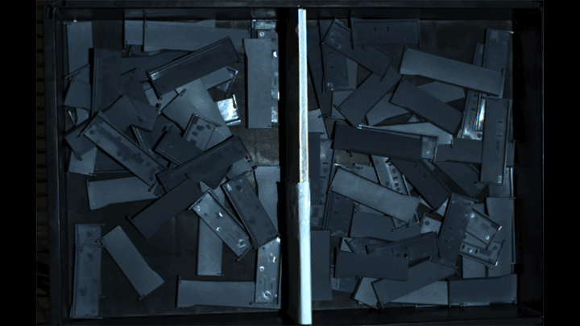
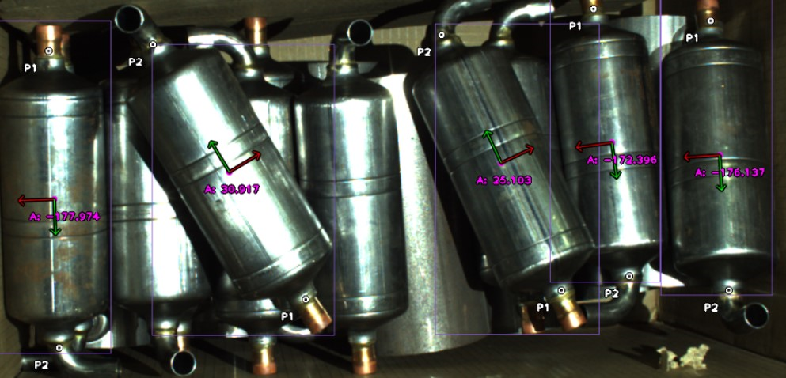
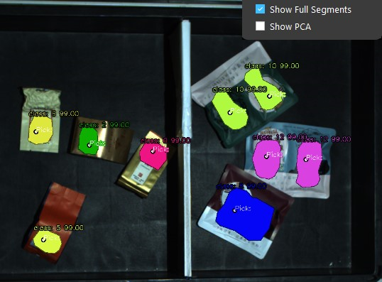

Deep Learning Examples
============================================
Here are some examples of some past projects we've used the deep learning nodes for, to give you an idea of what can be accomplished in our systems

Classification Model
--------------------
This is an example from our classification model.
Here, the model is being used to identify which row of objects is on top, using their orientation.
This allows for much easier picking further along the flowchart, as there won't be objects stuck under others.

.. image:: images/examples-classification.png
    :width: 80%
    :align: center

Instance Segmentation Model
---------------------------
This is an example from our instance segmentation model.
This model is designed to detect objects within the bin.
The model provides the area that it detects each object, which makes picking possible further down the flowchart.

Keypoint Detection Model
------------------------
This is an example of our keypoint detection model.
Here, the model is identifying the orientation of each object, as well as the center-point.
The top and bottom of each object are slightly different, so the two different keypoints (P1 and P2) are used to identify which side is which.

Suction Model
-------------
This is an example from our suction model.  
This model is designed to provide an area that is adequate for suction picking, and also provide a **best** location for suction picking

