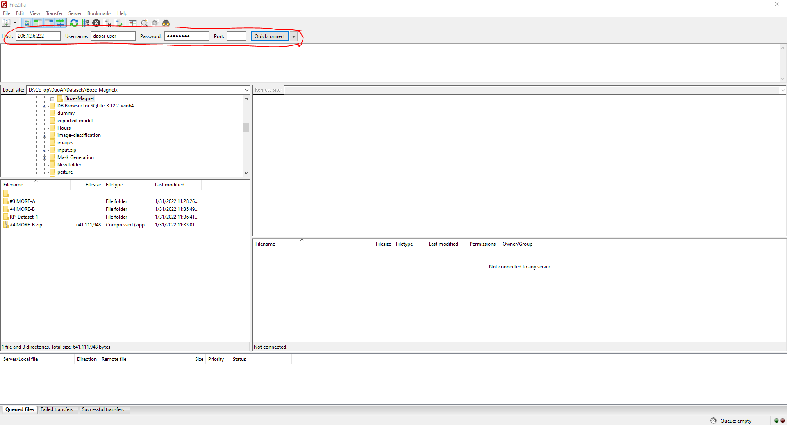

Setup Jenkins and FTP
============================

Account Setup
-------------
At this time, Customers must contact the DaoAI team in order to set up their account for both Jenkins and FTP.
You will be provided with a username and password, and they will be identical for both platforms for simplicity.

Once you have your sign-in info, continue to the next sections to get started

Connecting to FTP
-----------------
In order to connect to DaoAI's FTP server, you will need an FTP Navigator.
DaoAI's recommended software for this is Filezilla, `which you can find here <https://filezilla-project.org/download.php?type=client>`_.
You are welcome to use a different software, however we may not be able to provide you with support for it.

Once you have installed Filezilla, launch it.
You can now input the information in the top toolbar to connect to the FTP server.

Please use the following info::

    Host : 206.12.6.164
    Username : <YOUR PROVIDED USERNAME>
    Password : <YOUR PROVIDED PASSWORD>

Once you have entered the information, press the 'Quickconnect' button.

You are now connected to the DaoAI FTP Server.

Logging in to Jenkins
---------------------
Navigate to the `DaoAI Jenkins Server <http://206.12.6.164:8080/login?from=%2F>`_ in your preferred web browser.
Use your provided login info to sign in.

You are now connected to the DaoAI Jenkins Server