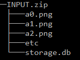
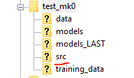
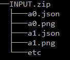
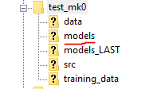

Train and Export a Model with Jenkins
============================================

Creating a New Project
----------------------
Creating a new project is very simple, and only consists of running one pipeline.
Navigate to the 'Create New Project' pipeline, and press 'Build with Parameters' on the left toolbar.
Enter the name of your new project (write it down somewhere, you'll need this later), and the class labels you used while annotating your dataset.
Press Build.

After this build is successful, you should see a new folder show up on your Filezilla with the same name.
This is the folder where you will be uploading all data, and receiving the model for everything you do with this project.

Training a Model
----------------
No matter the type of model you wish to train, two pipelines are used.
For each, you must use the Annotation-Check pipeline first, as you will not be able to run the Training pipeline until the check is successful.
This is to ensure that data formatting is accurate.

Classification Models
~~~~~~~~~~~~~~~~~~~~~~
First, run the Annotation-Check with the following steps:

1. Navigate to your tkteach folder you used to annotate your dataset in your file explorer
2. Navigate to the project folder on Filezilla that you wish to use
3. Add all the images in your dataset and the 'storage.db' file to an archive (.zip)

4. Upload the .zip file to the 'src' folder on Filezilla

5. Navigate to the Classification-Annotation-Check pipeline on Jenkins
6. Click 'Build with Parameters' and enter the name of your project (**case sensitive**)
7. Click 'Build'

Please ensure the previous build is successful before carrying on to the next step.

Next, run the Training with the following steps:

1. Navigate to the Classification-Training pipeline on Jenkins
2. Click 'Build with Parameters' and enter the details for your project
3. If you wish to train from a previous build, continue below to :ref:`checkpoint-label` to learn how
4. Click 'Build'

Now the model is training and you can continue to the :ref:`export-label` section.

Segmentation Models
~~~~~~~~~~~~~~~~~~~~
First, run the Annotation-Check with the following steps:

1. Navigate to your dataset that you annotated containing the PNGs and the JSONs
2. Navigate to the project folder on Filezilla that you wish to use
3. Add all the images and JSONs to an archive (.zip)

4. Upload the .zip file to the 'src' folder on Filezilla

5. Navigate to the Segmentation-Annotation-Check pipeline on Jenkins
6. Click 'Build with Parameters' and enter the name of your project (**case sensitive**)
7. Click 'Build'

Please ensure the previous build is successful before carrying on to the next step.

Next, run the Training with the following steps:

1. Navigate to the Segmentation-Training pipeline on Jenkins
2. Click 'Build with Parameters' and enter the details for your project
3. If you wish to train from a previous build, continue below to :ref:`checkpoint-label` to learn how
4. Click 'Build'

Now the model is training and you can continue to the :ref:`export-label` section.

.. _checkpoint-label:

Training from a Previous checkpoint
-----------------------------------
If you wish to continue training with new data, using a model you had previously trained to save time, you can do so.
All of your exported models should come named with a build number
To improve an old model, simply input the build number as a parameter for the training pipeline.

For example, if I wanted to continue training from a model I was using called 'projectName-build-5-2022-01-01-cpu.pt',
I would input the following as the CHECKPOINT_BUILD_NUMBER in the jenkins pipeline::

    build-5-2022-01-01

As we have limited storage, only a certain number of past builds are stored for each project, usually the last 10 builds, or any builds in the last week
(whichever number is higher)

.. _export-label:

Exporting a Model
-----------------
If a model training reaches a certain training level (dependent on the accuracy and loss), it will automatically complete the training and export the model.
Otherwise, if you are satisfied with the training of your model and wish to stop it early, simply cancel the build of the Training pipeline.
When the build is cancelled, it will automatically export the model.

Once your model has been exported, you will be able to find the CPU version, the GPU version, and the input config file for your model in the 'models' folder of your FTP project.

If you accidentally run the build again before getting your models, **don't worry**!  The previous model export is also saved in the 'models_LAST' folder for your convenience.