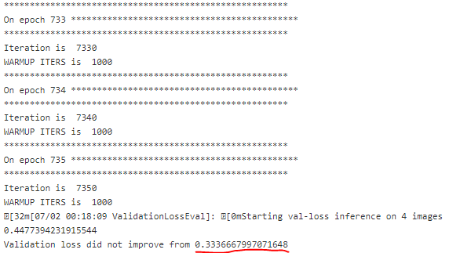

What to Look for While Training a Model
============================================
When training a model, it's hard to know what to look for without prior experience.  Thus, this page is provided as a **beginner's** guide to know when you should consider stopping training.

In general, it is usually sufficient to look at just one metric, the Validation Loss.  
Although this provides an incredibly incomplete picture of how good the model actually is, it usually provides enough information for our usage.
The main thing to look for, is if the validation loss is **very low** (~0.05 or less)

If the answer to that question is yes, then you could consider stopping the training early.

Another condition which you will likely see is 'Early Stopping'.  This occurs when the validation loss has not improved for 10 training cycles (epochs), and thus the training automatically ends so as not to waste time.
There is currently a small issue with exiting due to early stopping, which is covered in the 'Known Issues in the Jenkins System' section.  Please read it for more information.
Generally, if one of these conditions is met, the model is close to its limit for the currently provided data, and it will likely be ready for actual use.

What the validation loss looks like in Jenkins
----------------------------------------------
In classification models:

.. image:: images/training-info-im1.png
    :align: center
    :width: 70%

In segmentation & keypoint models:

Please note, that there are certain requirements that cause Jenkins to automatically exit when met.  Jenkins automatically exits when either the validation loss is less than 0.009, or when the model has not improved for 5 evaluation periods