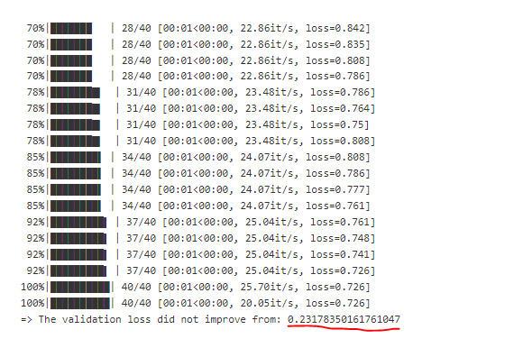

What to Look for While Training a Model
============================================
When training a model, it's hard to know what to look for without prior experience.  Thus, this page is provided as a **beginner's** guide to know when you should consider stopping training.

In general, it is usually sufficient to look at just one metric, the Validation Loss.  
Although this provides an incredibly incomplete picture of how good the model actually is, it usually provides enough information for our usage.
There are two things to look for with the Validation Loss:

1. Is the validation loss **very low** (0.05 or less)?
2. Is the validation loss finished improving (has the val-loss decreased over the last 10 outputs) ?

If the answer to either of these questions is yes, then you could consider stopping the training early.
Generally, if one of these conditions is met, the model is close to its limit for the currently provided data, and it will likely be ready for actual use.

What the validation loss looks like in Jenkins
----------------------------------------------
In classification models:

In segmentation & keypoint models:

.. image:: images/training-info-im2.png
    :align: center
    :width: 70%