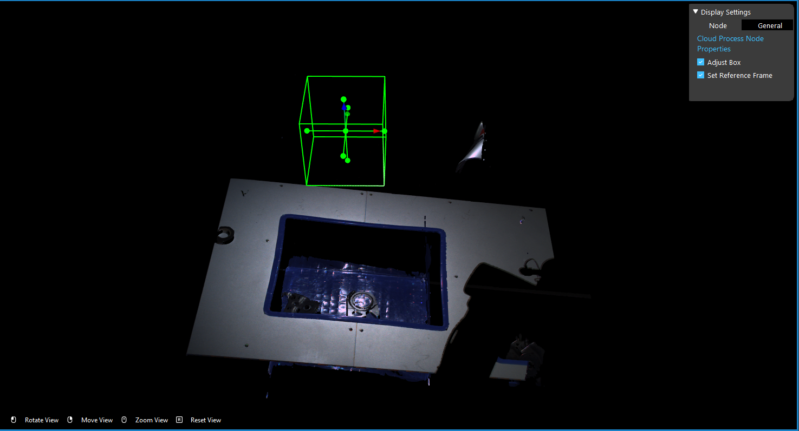
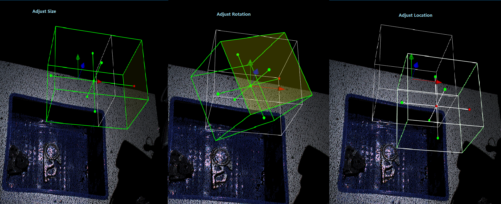
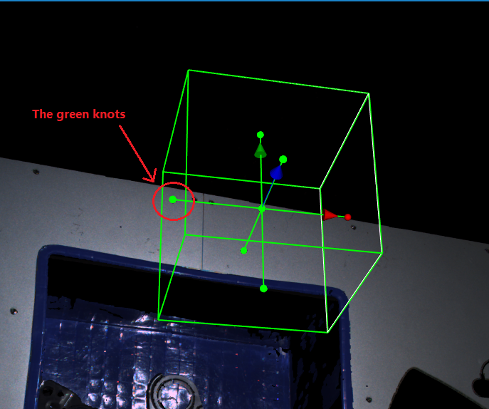
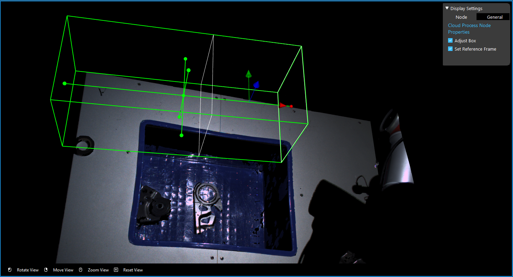
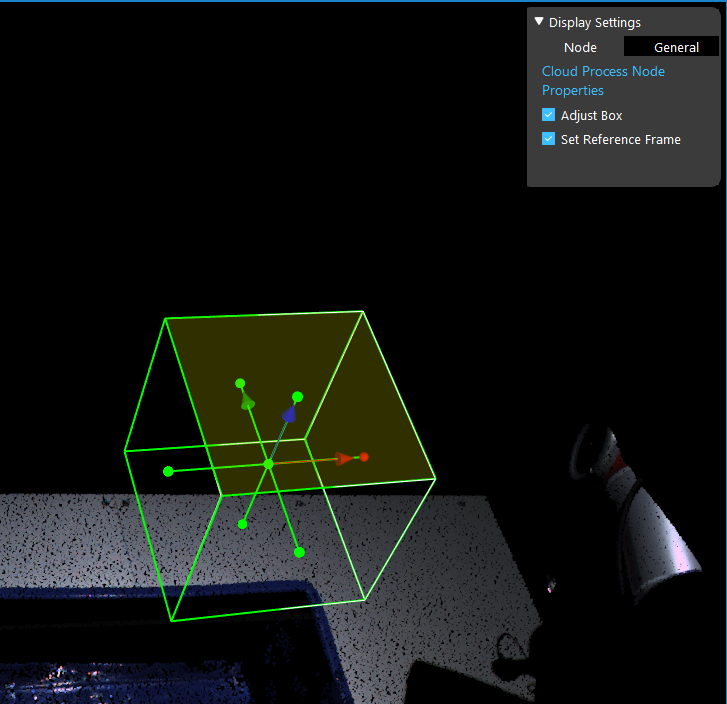
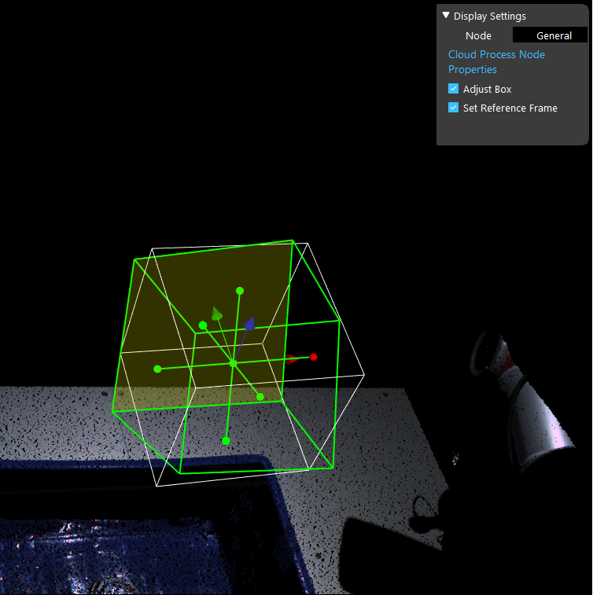
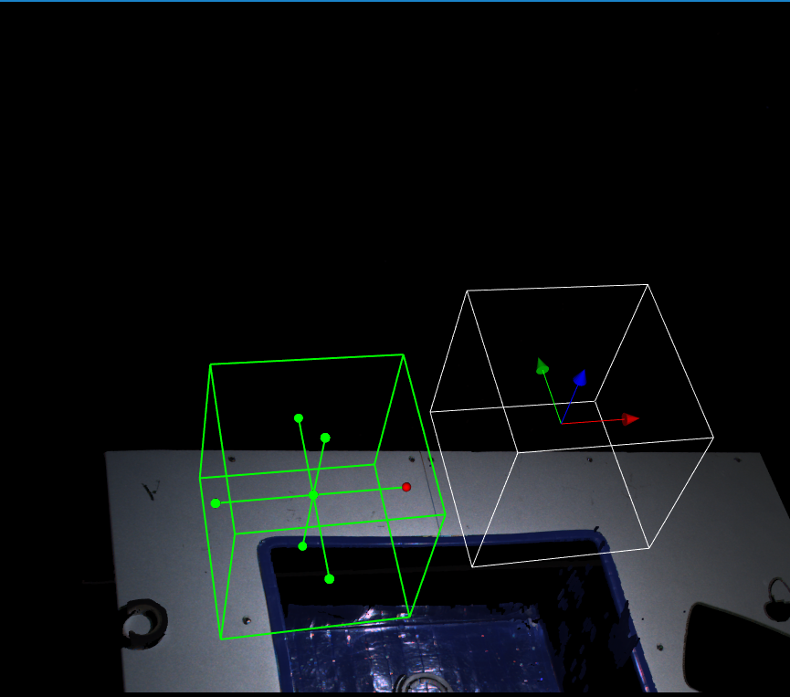

Instruction for Adjusting Box
===========================

|

Adjusting Box feature in Cloud Process node is a feature which allows you to adjust the region of interest. 
The green box will be the region of interest when it is set. 
The box also has x, y, z directions, hence when adjusting this box should be aware which direction you want to set(if you setup the reference frame in Cloud Process node, these directions would be changed to the ones from reference frame). 
Therefore, pay attention to the directions especially when using Collision Avoidance.

.. note::
    After moving the box, Exit Interactor and re-adjust the box, the original box(white box) would be the box from last change.

There are 3 ways of adjusting the box: 1. adjusting the size; 2. adjusting the rotation of the box and 3. adjusting the location of the box.

Adjusting Size
------------------------

This operation would change the size of the region. Based on the expected result, you can **left-click** and drag to enlarge or shrink the area. By dragging on the green knots, you will be able to change the size of this direction.

After dragging the box, you can see the original box(white) and the modified box(green). 

After you exit the Interactor, the original box would be changed when the next time you open the adjusting box feature.

Adjusting Rotation
------------------------

This operation would change the rotation of the region, and will **NOT** change the size of the area. 
Based on the expected result, you can **left-click** and drag on the box surface to rotate the box. When you click on the surface, the selected surface would become yellow.

.. note::
    If you click on the green knots will resulting in changing the box sizes, so be careful which operations you want to perform.

The box will rotate followed with your mouse dragging direction. If you want the box to tilt 90 degrees to the left, you can **left-click** and drag the top sureface of the box then drag it to the left slowly. 
Try to **left-click** and drag closer to the central of the top box surface which would easier to finish this tilt.

After dragging the box, you can see the original box(white) and the modified box(green). 

After you exit the Interactor, the original box would be changed when the next time you open the adjusting box feature.

Adjusting Location
------------------------

This operation would change the location of the region, this operation will not changes the size or rotation of the box region. 
Based on the expected result, you can **right-click** and drag on anywhere on the box. 

|

After dragging the box, you can see the original box(white) and the modified box(green). 

After you exit the Interactor, the original box would be changed when the next time you open the adjusting box feature.
