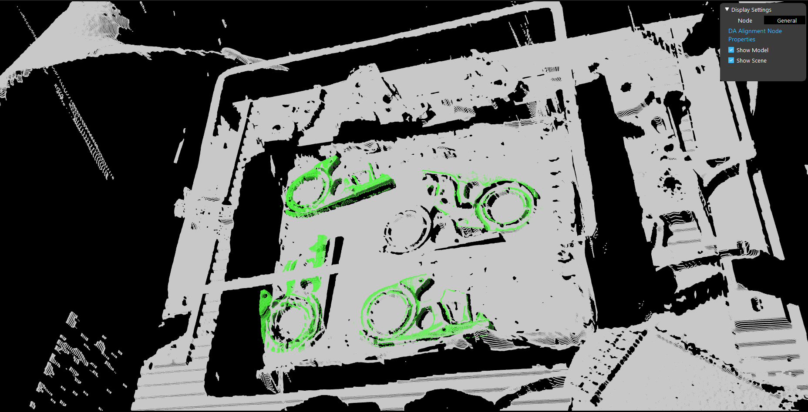
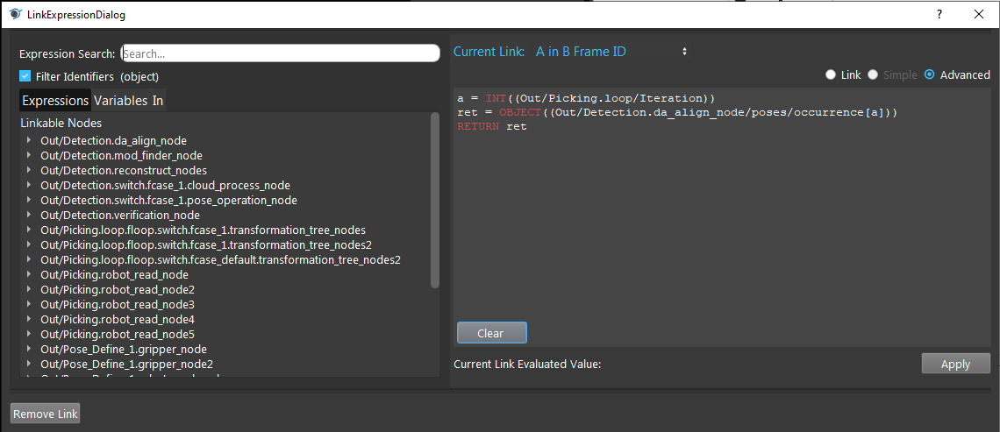
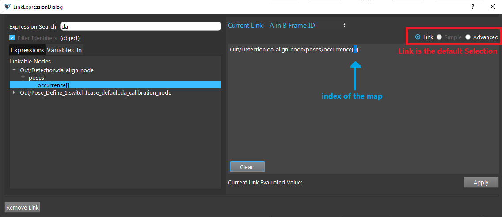
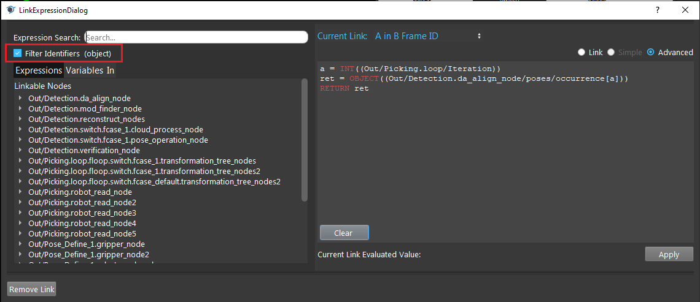
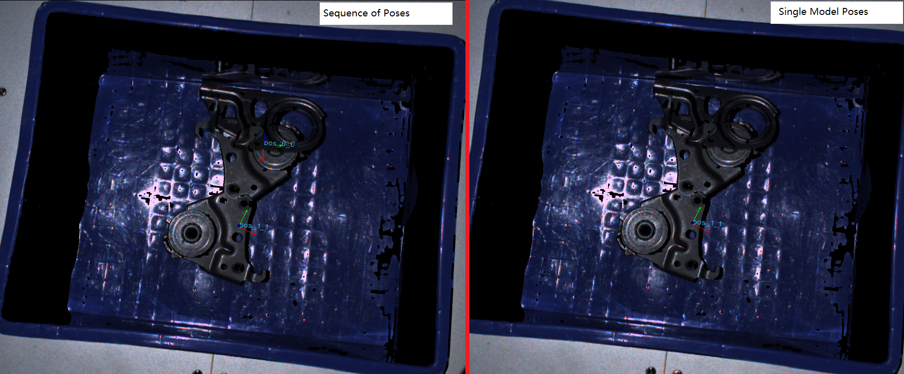
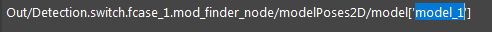
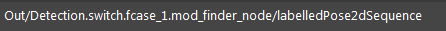

Access Map Values
=====================

When project requirements getting complex, we need **Vision** nodes to process multiplt items or multiple inputs to accomplish our goal. 
Therefore, you would need to access different indecies within the map. 
Such as **Picking Sort**, **Reconstruct**, **DA Alignment** nodes outputs, they produces a sequence of results and you can use variables or ``loop_iteration`` to access differnt elements in sequence.

|

.. note::
    Reading the following article requires some knowledge of `Link Expression <>`_. Make sure you have understanding of Link Expression in advance.

Sequence of Elements
----------------

Similar to situations above, there are 4 objects in scene. For example, you want to pick all the occurences of objects in scene.

For **Robor Write** node, it loops through the detected objects in scene pick them one by one. 
**Robot Write** node takes the transformation results from **Transformation Tree** node, the **Link Expression** of **Transformation Tree** node needs to take the loop_iteration to determine which object should be picked next.

The link expression above is showing the Object in Cloud relation in **Transformation Tree** node. This relation is essential to produce the picking pose for robot. 
Here is more detail about `Transformation Tree Node <https://daoai-robotics-inc-daoai-vision-user-manual.readthedocs-hosted.com/en/latest/nodes/Utility/transformation_tree.html>`_.

By default, the link expression is looking for output of certain nodes. 
If you want to use the different elements in map, you can change the index of selected elements. 
However, if you are using a loop or want to traverse different elements in the map, you would have to choose ``Advanced`` to enter your expected bahaviors. 

In advanced link expression, you would need to enter a small script of codes to control the link. 
The language of this dialog is a Python-based DaoAI syntax. 

For more details of this syntax, please see `Python Interpreter and Advanced Expressions <https://daoai-robotics-inc-daoai-vision-user-manual.readthedocs-hosted.com/en/latest/nodes/Data%20Control/Python%20Interpreter%20and%20Advanced%20Expressions.html#>`_.

|

.. code-block:: python

    a = INT((Out/Picking.loop/Iteration))
    ret = OBJECT((Out/Detection.da_align_node/poses/occurrence[a]))
    RETURN ret

Some of the outputs are not matching type of our link input, hence they will be filtered out from the **Filter Identifiers**. 
In order to see all the links, you can uncheck the **Filter Identifiers** box to see all the possible outputs from other nodes. 

In the link expression dialog, imagine it as a function. The function body is the advanced link expression you going to write.
Similar to Python syntax, you will need to assign value to a giving variable. In the example aobve, you need to loop through the elements in map ``Out/Detection.da_align_node/poses/occurrence``. 
Therefore, you need to know which iteration currently at. Variable ``a`` is assigned with value of ``Loop/Iteration``. Each iteratioin of the loop, ``a`` would be assigned with new value. 
And the ``a``-th element would be the input for this link, dynamically change followed the loop iteration. 

Models
----------------

There is a sequence/map of 2D object poses in **Mod Finder** node. You can use the sequence of poses as input. 
You could also uses a certain model poses as input. For example, **Reconstruct** node requires object location input: it requires the 2D/3D object poses to generate picking poses. 
Like image shown above, on the left is applying sequence of poses(all models) as input for **Reconstruct** node; 
on the right is applying **ONE** model of poses(model_1) as input for **Reconstruct** node. 

How to modify the Link Expression in order to do this?

.. code-block:: python

    """
    Apply 1 model, 'model_1' -> should be the model you want to detect, in the code below 
    is detecting all occurences of model_1 objects
    """
    a=OBJECT((Out/Detection.switch.fcase_1.mod_finder_node/modelPoses2D/model['model_1']))
    RETURN a

    #Apply all models
    a=OBJECT((Out/Detection.switch.fcase_1.mod_finder_node/labelledPose2dSequence))
    RETURN a

You can use Advanced Link Expression to modify the input like above to switch between single model and all models.

For single model, you can select the link below, and type in the model name in ``[ ]`` bracket.

For all models, you can select the link below, it is the sequence of 2D poses output from **Mod Finder** node.

|

.. warning::
    #. For single model in regular link expression, name of the model should be wrapped by ``' '`` quotation make;
    #. The model should exist in Mod Finder, otherwise **Reconstruct** node is not able to find the corresponding model;
    #. If the selected model/models has no occurences from **Mod Finder** node, **Reconstruct** cannot be able to produce any poses(model has no occurences);