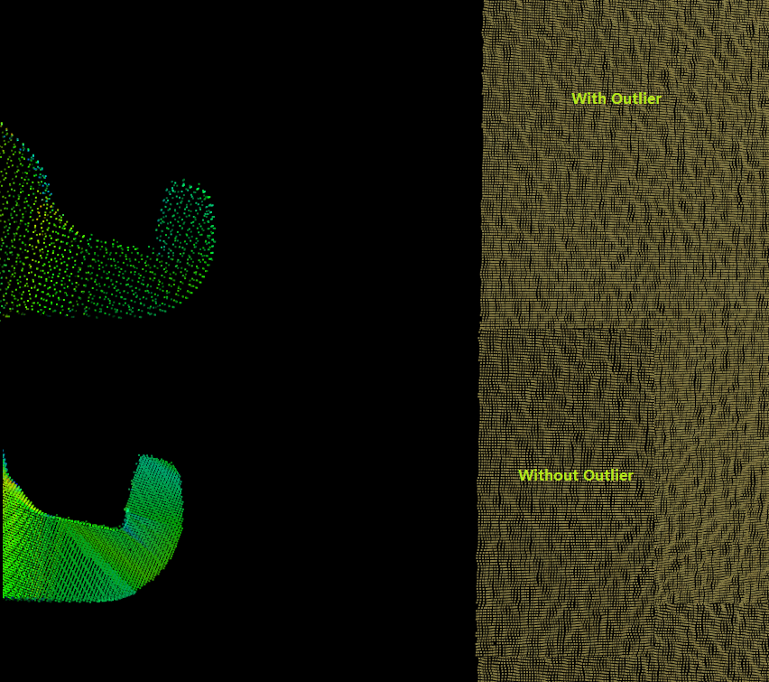
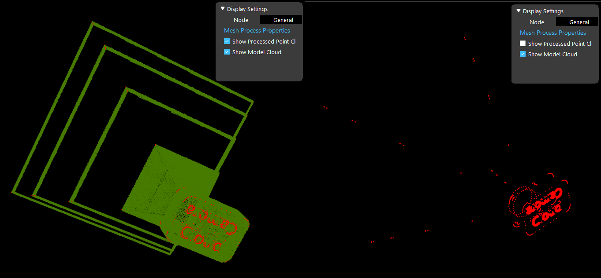
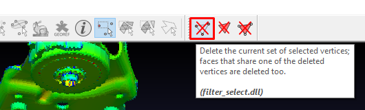
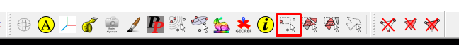

Outliers in .ply mesh
=========================

Mesh outliers can cause issues in the mesh process node. Namely, resulting clouds will be very sparse and contain holes.

|

How to check for Outliers
----------------------

You can insert Reader node to load a ply model into **Vision**, then uses **Mesh Process** node to generate point cloud from the ply model. 
Enable the **Show Model Cloud** flag, and you will be able to spot outliers if they exist. 

|

Delete Outliers with MeshLab
-----------------------

Click on the select vertices tool

Select the outlier vertices then click the delete selected vertices button

|

Test Data: `Left.ply with outlier <https://daoairobotics-my.sharepoint.com/:u:/g/personal/contact_daoairobotics_onmicrosoft_com/EWPDebNFGUROs-2HG2EDGswBYSfJPYHSf_pSNwtEFjDT0g?e=vlH5My>`_ `Cropped version <https://daoairobotics-my.sharepoint.com/:u:/g/personal/contact_daoairobotics_onmicrosoft_com/EWPDebNFGUROs-2HG2EDGswBYSfJPYHSf_pSNwtEFjDT0g?e=vlH5My>`_