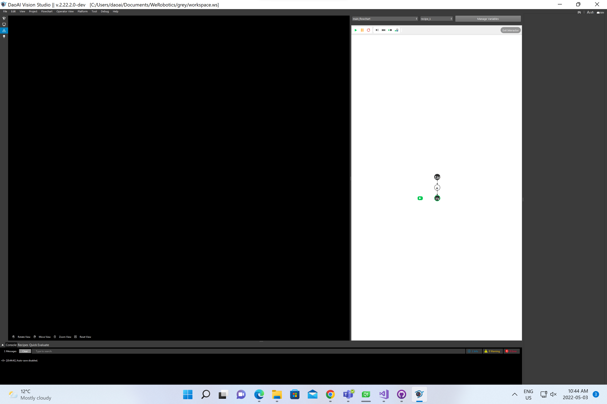
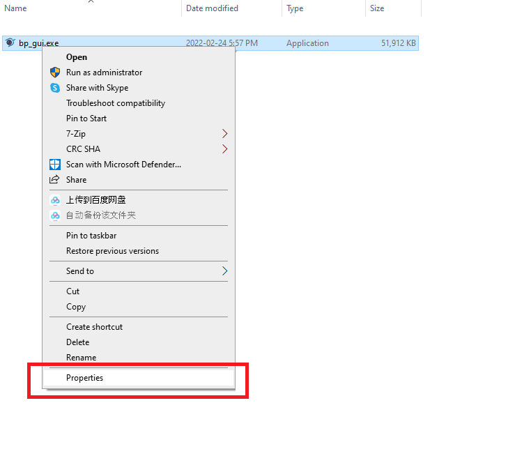
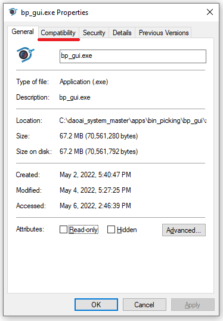
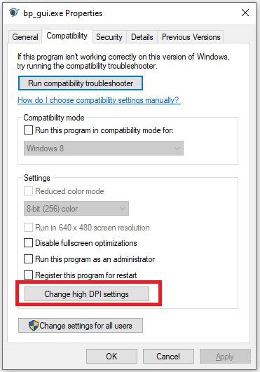
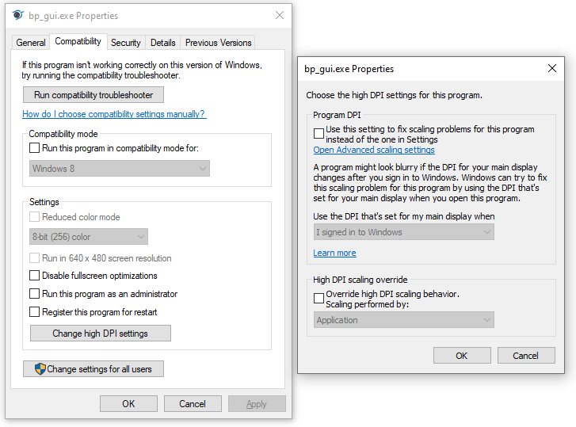

Resolution Related Issue
===========================

DaoAI System has default resolution for screen output which should fit most of the workstation. 
However, there might be some workstations using high resolution monitor to use DaoAI Vision Studio. 
You might see something like this:

Words, icons and windows are smaller, which is difficult to operate with such User Interface. 

You can change it back to the default layout by doing the following: 

Open the File Explorer and navigate to the **Vision** directory. The default directory is: ``C:\Program Files (x86)\WeRobotics``;

Right click the application ``bp_gui.exe``; 

Click ``Compatibility``;

Click in ``Change high DPI settings``;

Check the ``Override high DPI scaling behavior. Scaling performed by:`` check box;

Choose ``System``;

.. image:: Images/System.png
    :align: center 

Now the User Interface would work normally. 