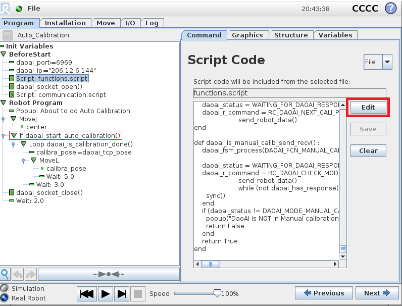
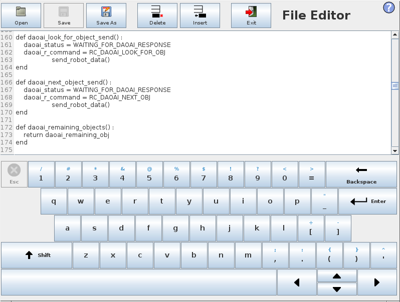
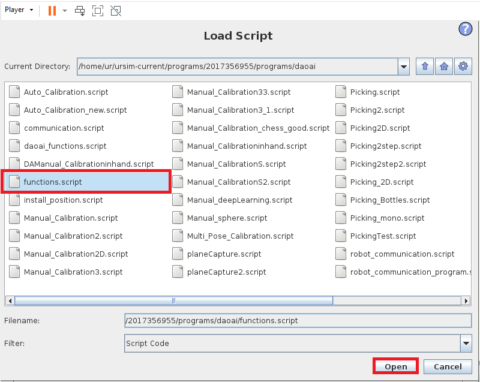
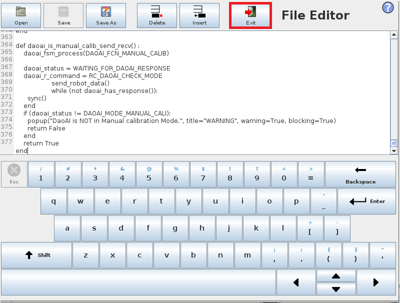
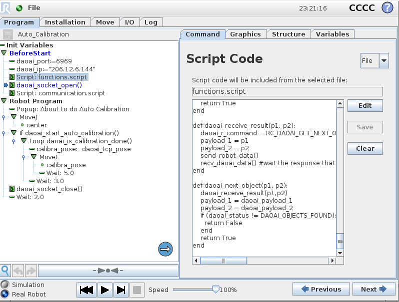

Robot Script Changes Related Issue
===========================

While changing the robot script, there will be some issue for **installation** file and script connection issue. 

.. image:: Images/problem.png
    :align: center 

Like the image shown above, this issue ocurred when the script does not have the correct functions.

Therefore, you can check if the script is correct by clicking edit:

|

You can check and if there is no such function in current script, you can try to load the correct script OR modify the script.

.. warning::
    Before you modify the script, make sure you understand and follow the syntax. Detail for robot communication please see `Robot Independent <https://daoai-robotics-inc-daoai-vision-user-manual.readthedocs-hosted.com/en/latest/hardware/robot/indep.html>`_.

If you loaded an incorrect script, you should browse the directory and find the correct script. 

Find the correct script and open it.

Exit the editor view, then it will update to the script you select.

.. note::
    You should do the same for "**communication.script**". These 2 files are usually come in pair, updating one requires to update the other one.

|

Now, the UR program is good to go again.
