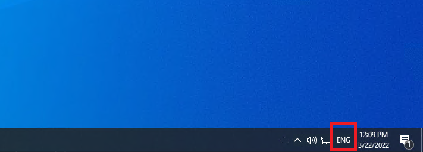
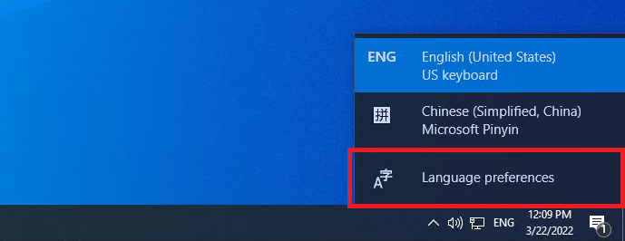
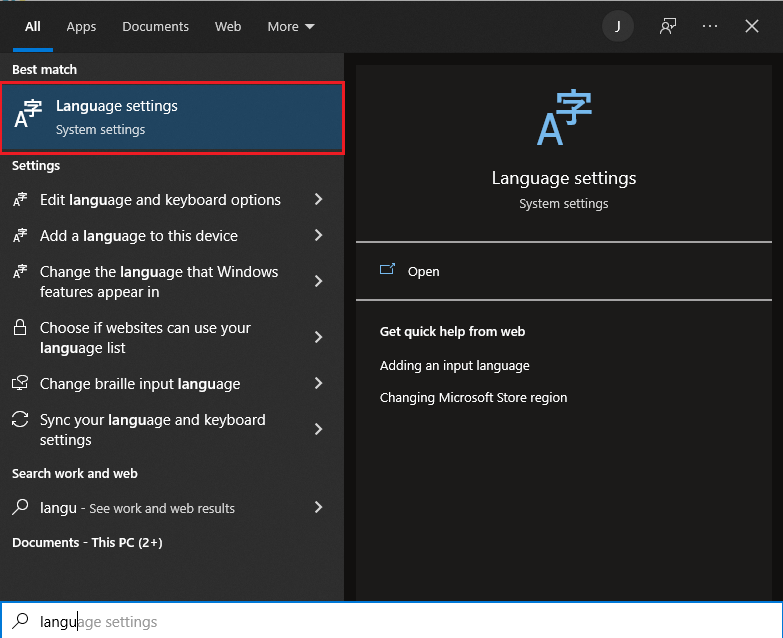
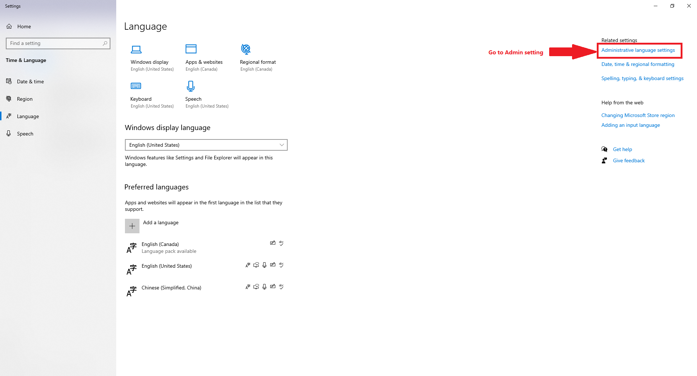
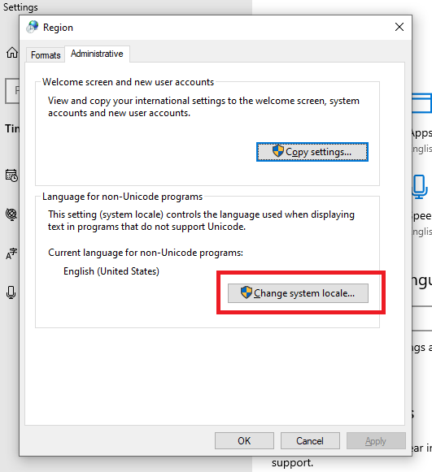

Language Issue(Possible Workspace Corruption)
================

Since ``Vision`` has not only English version, we would have issue if the workstation does not support other languages.

On the right botton corner(usually there), click on the ``ENG`` logo to bring up the languages selections.

|

Select the ``Language Settings`` .

|

Note: if there is no such logo, you can click ``Window`` key, search Language, and select ``Language Settings`` .

|

Go to ``Administratve Language Settings``

|

Opens up ``Change system locale...`` 

|

Select the UTF-8 option

.. image:: Images/utf-8.PNG
    :width: 90%
    :align: center 

|

Now the UTF-8 setting on this PC is enable, which can be able to avoid some possible workspace corruption issues.