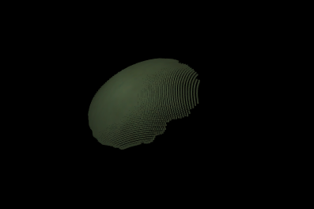
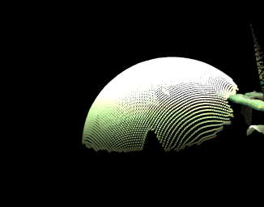
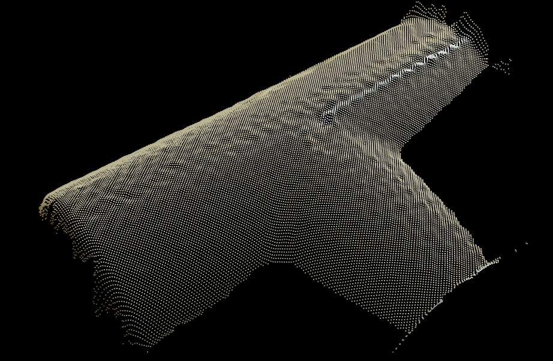
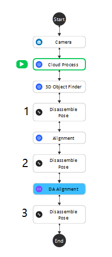
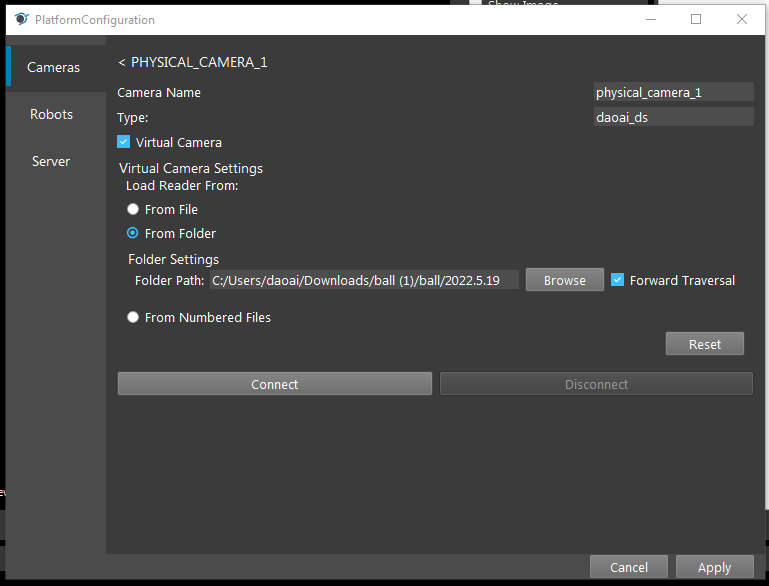

Validate Camera Accuracy
=========================
Deviation occurs while using the camera. And it may cause inaccurate picking. Validating camera accuracy to know the deviation level. Adjust accordingly if the deviation is larger than the tolerance.

In the case of inaccurate picking, there are some reasons: 
    * the calibration file is not good (wrong input .yml file, calibration error is too high)
    * the robot base is moved 
    * or the calibration error of the camera is higher than acceptable

This section introduces how to verify the accuracy of the camera. 

The preparation work for this case:
        1. image files (.dcf)
        2. model mesh (.ply)
   
First, make sure the saved data of dcf files are valid.
Compare these two pictures below:

This point cloud is not good. The brightness of the image is low.

|

This point cloud is slightly better than the first one, but the exposure is higher than ideal.

|

You can change the advanced setting of the camera in DaoAi Camera Studio (:ref:`daoai camera`) 
to obtain a good quality image.

This is an example of a good quiality point cloud.

|

------------------------------

Create a new workspace, in this workspace, there should be 6 nodes, which are: Camera, Cloud process, 3D object Finder, Disassemble pose, Alignment, and DA alignment. 
The detailed description and purpose of each node can be found here :ref:`nodes detail explanation`

Using alignment nodes to obtain multiple poses of the same object with the same physical pose. Comparing the result gives the deviation of the camera since the data should be identical.

The two different alignment nodes are used because using different algorithms gives a more comprehensive result.

The flowchart should look like this :

|

In this flowchart: 
    1.  Using Camera node to load the dcf file data.
   

|

    2.  Using :ref:`cloud process node` to create a :ref:`adjust bounding box` to define the search region.

 .. image:: Images/cloud.png
    :align: center 

|
 
    3.  Using :ref:`3d object finder node` to load a model mesh to verify if the model mesh and the point cloud of the founded objects match.

 .. image:: Images/3dfinder.png
    :align: center 

|
 
    4. :ref:`alignment node` & :ref:`da alignment node` is getting the result of the 3D object finder with the object point cloud output the pose. Some details information can see from the link to **Nodes Detail Explanation**.

    5. There are three Disassemble pose: 1. output the result of 3D object finder; 2. output the result of Alignment; 3. output the result of DA alignment.

After running the flowchart, there are three pose results from three Disassemble pose nodes. Copy and paste the results into an Excel file. 
Running the flowchart multiple times to obtain a set of data.
In Excel, after processing the data it can be used to check the accuracy of the camera.

The standard deviation is a measure of the amount of variation or dispersion of a set of values. 
A low standard deviation indicates that the values tend to be close to the mean of the set, while a high standard deviation indicates that the values are spread out over a wider range.

The sample variance is a measure of how far a set of numbers is spread out from their average value.

A change interval can be obtained by subtracting the minimum value from the maximum value.

 .. image:: Images/data_1.png
    :align: center 
    :scale: 70%

 .. image:: Images/data_2.png
    :align: center 
    :scale: 70%

The sum of variance and the square root of the sum of variance can be calculated to evaluate the overall deviation of the camera.

 .. image:: Images/data_3.png
    :align: center 
    :scale: 70%

|

