Virtual Testing
=============

Virtual testing is essential before testing the project workspace in real robot. This step could help to ensure ``Vision`` does not send the wrong (dangerous) poses to robot.
It is to verified the workspace correctness as well as to ensure the safety of user and hardware.
The following virtual robots are good  for virtual testing:

Hercules
------------

Hercules is effective for functionality testing of the workspace. 
Hercules is easy to use, faster responsive for communication between ``Vision`` and Hercules. 

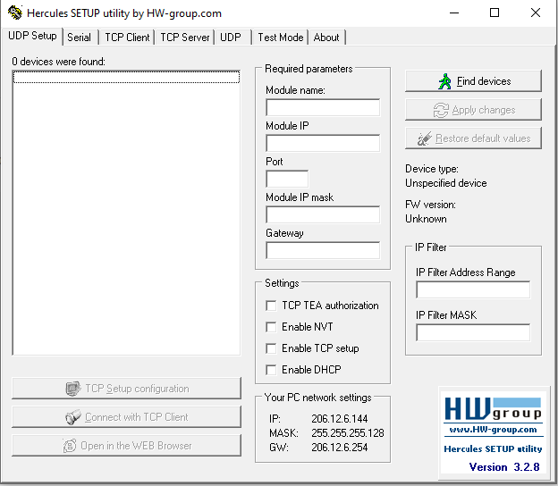

Connection
~~~~~~~~~~~~

First of all, we need to connect ``Vision`` and Hercules.

On ``Vision`` side, open ``Platform Configuration`` , choose ``Robot`` option. Following the image below, select ``Other`` as Robot type, then click ``+`` .

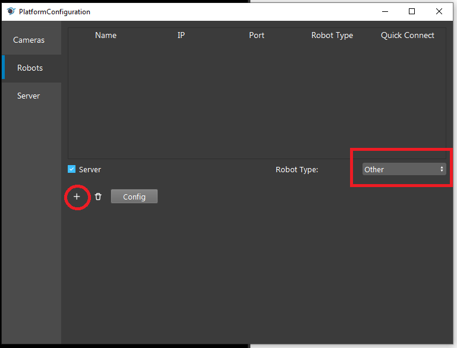

Then, you should see the config page like below:

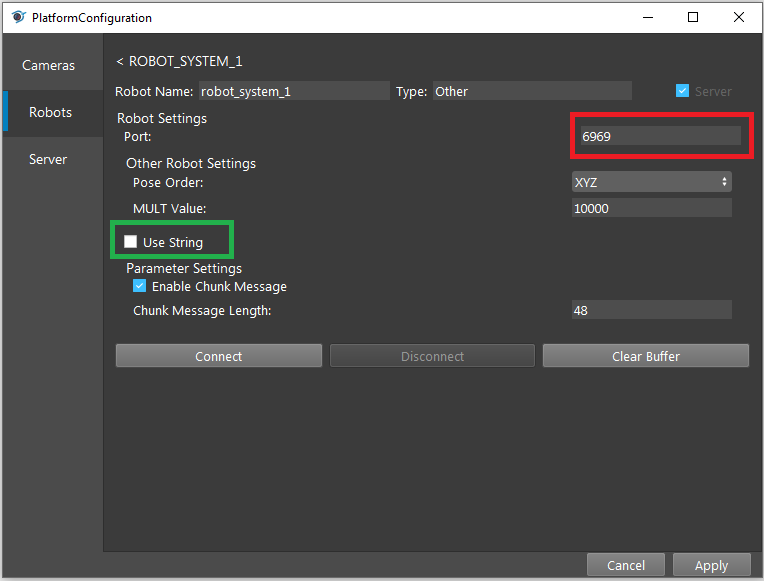
	
Port number can be modified to any number, this would be useful when connecting multiple robots. 
You can leave it as ``6969`` when only connecting to 1 robot. 

Select the option ``Use String`` for Hercules, since Hercules is sending a String to ``Vision``  to simulate the real robot communication. 

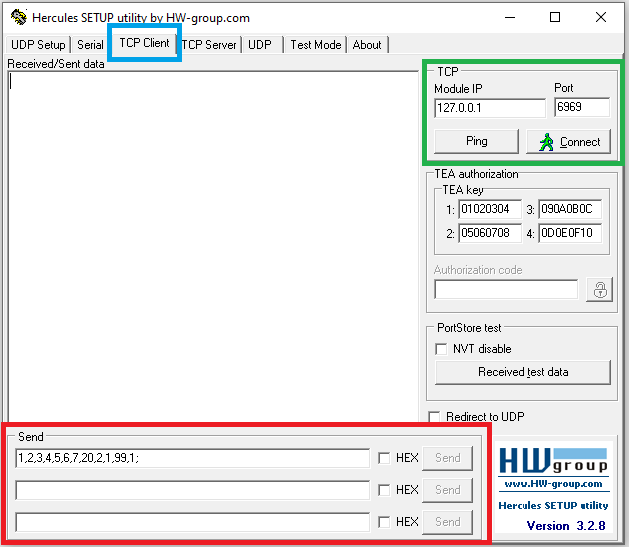

On Hercules side, select ``TCP Client`` , make sure the Module IP and Port is correct: ``127.0.0.1`` represents self, the current pc which the same as Hercules; Port is defined from ``Vision`` side, connecting with correct Port number.
Then click ``Connect`` .

The red box is the messages templates which would be sent to ``Vision`` while connection is established.

Communication
~~~~~~~~~~~~

Communications require requests and reponses. ``Vision`` is the communication ``Server`` and Hercules is ``Client`` in this communication. 
Hence, ``Vision`` would always wait for a ``Robot Read`` before ``Robot Write`` , withour requests from client, server would not send anything to client side. 

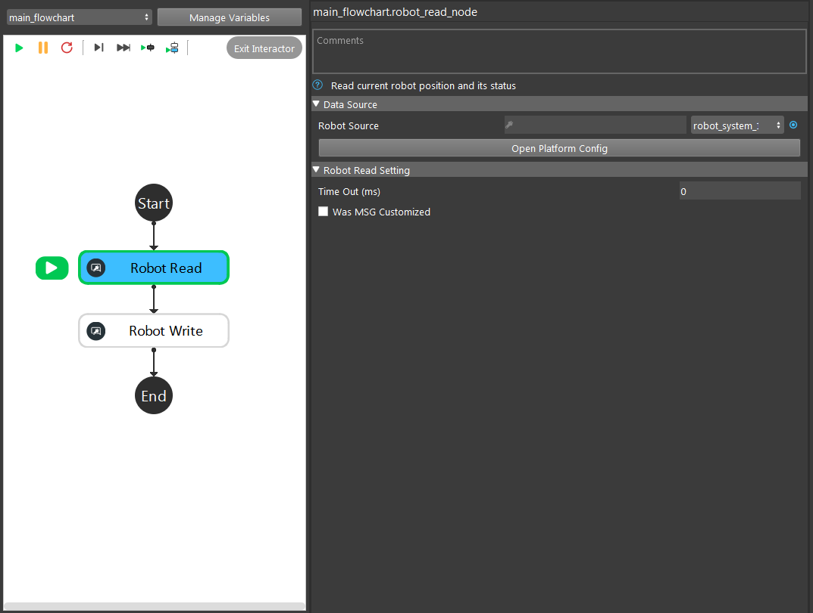

These 2 nodes are the main communication nodes between ``Vision`` and Hercules. ``Robot Read`` would always wait for requests from Hercules, without any requests, the flowchart would be waiting at ``Robot Read`` until requests come in.
User also able to set a Time Out for this node, it could be helpful when there is connection issue between ``Vision`` and Hercules.

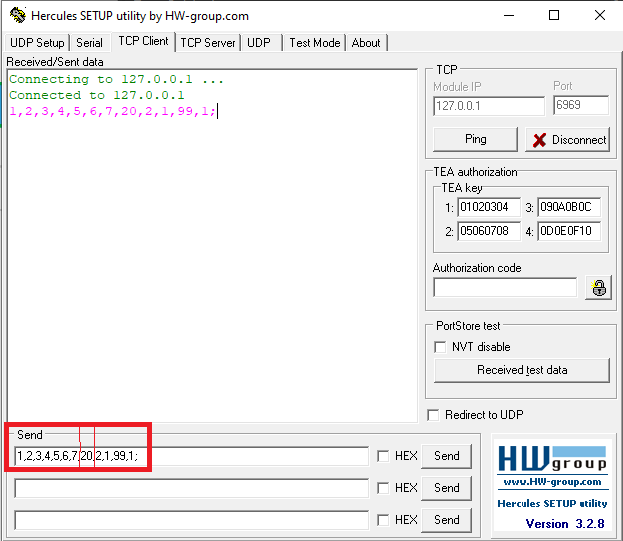

Hercules sends a string to ``Vision`` . Console would shows the details of this request. 
The fifth index of this message is the ``command`` of this request. 
Different ``command`` has different meanings to ``Vision`` , it tells ``Vision`` what kind of operations robot is working on, as well as the status of previous reponse. The next indexes after ``command`` is ``playload_1`` and ``payload_2`` .

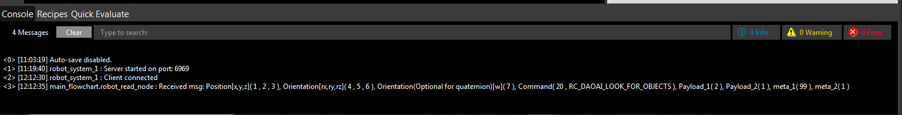
	
``Vision`` would reponse to Hercules with ``Robot Write`` . 

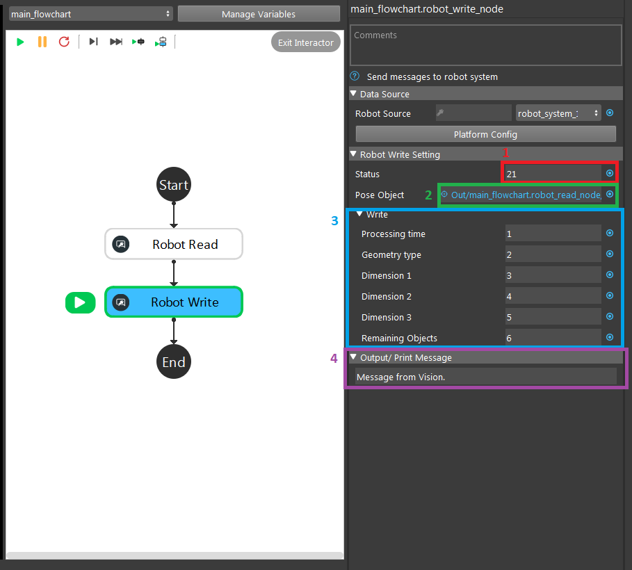

The setting details are below:

1. Status is important, it is the reponse command to robot, which tells robot what is the next operation. 

2. Pose Object is the pose which robot should perform. During Picking process, ``Vision`` would combine the object coordiantes and picking pose in to this object, sending it to robot in order to perform picking.
If we want the robot holds still, only transmitting command and payloads: we could send back the pose which is read from ``Robot Read`` , the robot will statys still.

3. Processing time is the ``payload_1`` for robot, Geometry type is ``payload_2`` .

4. This is optional if user wants to print message on the console window, put down the message here.

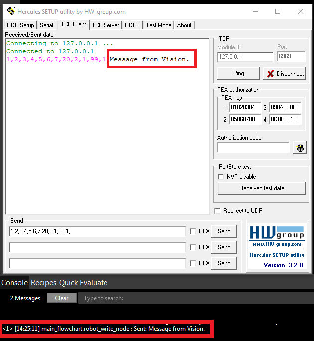

	
VMware UR Robot
------------

Using virtual machine to simulate UR robot with ``Vision`` is another way to test the workspace virtually. 
This test can be able to run the workspace closer to real world condition, which is essential before delivering. 

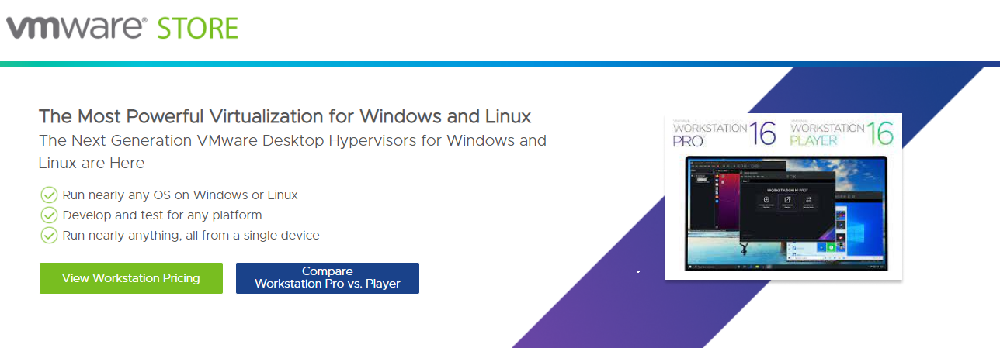

VMware is free to download online, we use ``VMware Workstation 16 player`` in this document. Download and install it. It might require to change the BIOS setting in order to have it working. 

`DaoAI UR Simulation Pack <https://daoairoboticsinc-my.sharepoint.com/:f:/g/personal/jwu_daoai_com/En0MYNHWVdpCopwbz8aSsYwBFROTh4Qqrd6Zrep9fh3f1A?e=JJWH3u>`_

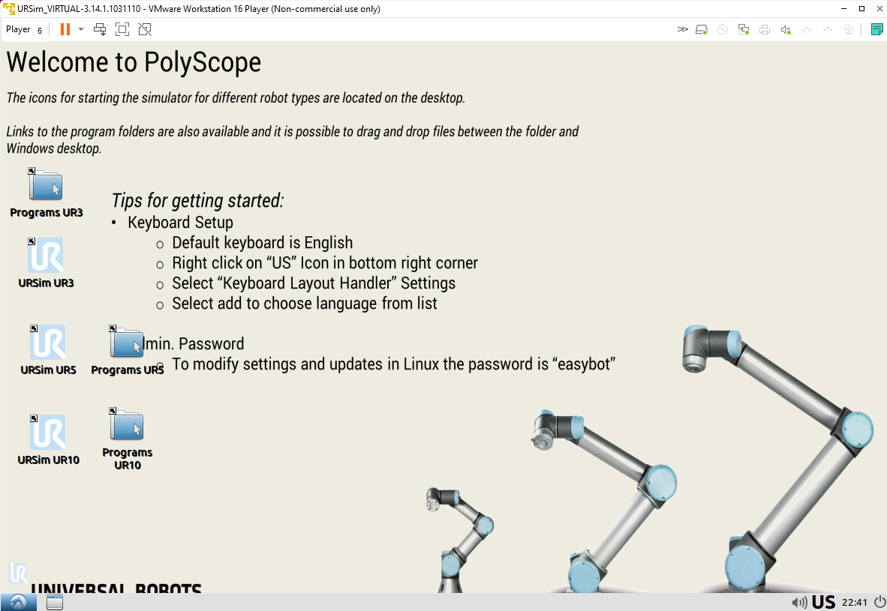

After setup should looks like this.

In our example, we use UR5 robot to perform the testing, for details of operation UR:  `UR-Robot <https://daoai-robotics-inc-daoai-vision-user-manual.readthedocs-hosted.com/en/latest/hardware/robot/UR.html>`_

.. image:: Images/ur_ui.png
    :width: 80%
    :align: center

Click on ``Program Robot`` , here user is able to run the robot simulation as well as change the program for different purpose. Then ``Load Program`` .

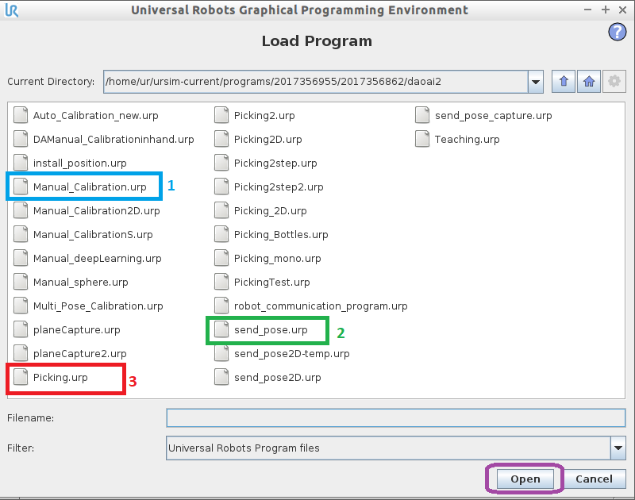
	, 
We can see there are many different urp files in this directory. We can use:

1. Manual_Calibration.urp for cheese borad manual calibration; 

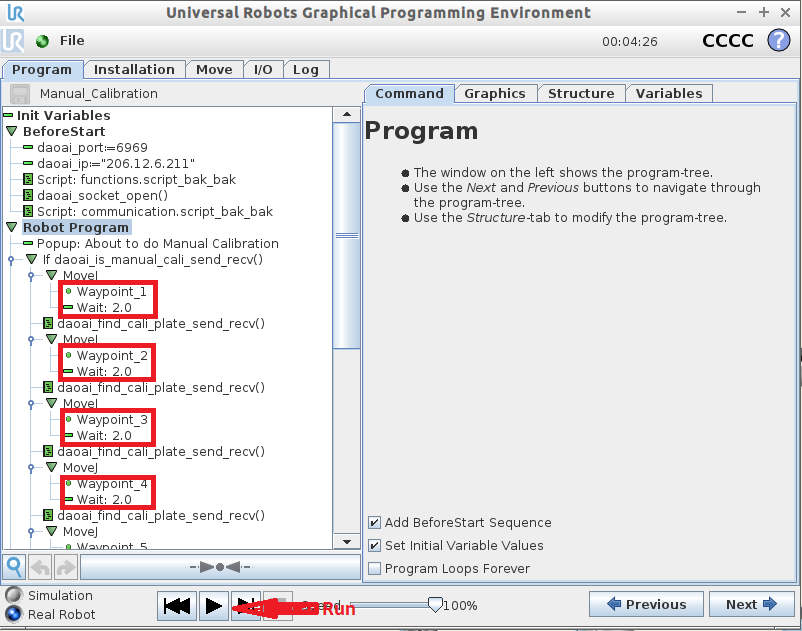

In real world robot, user needs to setup all the waypoints for calibration.

2. Picking.urp to perform pciking test; 

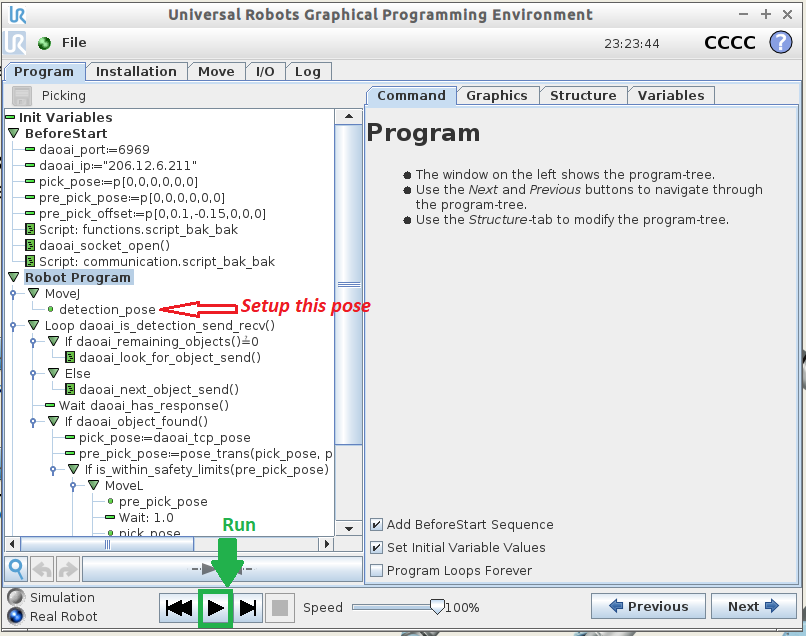

In the real world robot, user should change this detection_pose: this is the robot pose when ``Vision`` is performing detection process. 
This pose should be away from the camera(At lease not blocking the object in camera), so that camera is able to capture the scene cloud to detect the objects in scene.

3. send_pose.urp to perform pose define. 

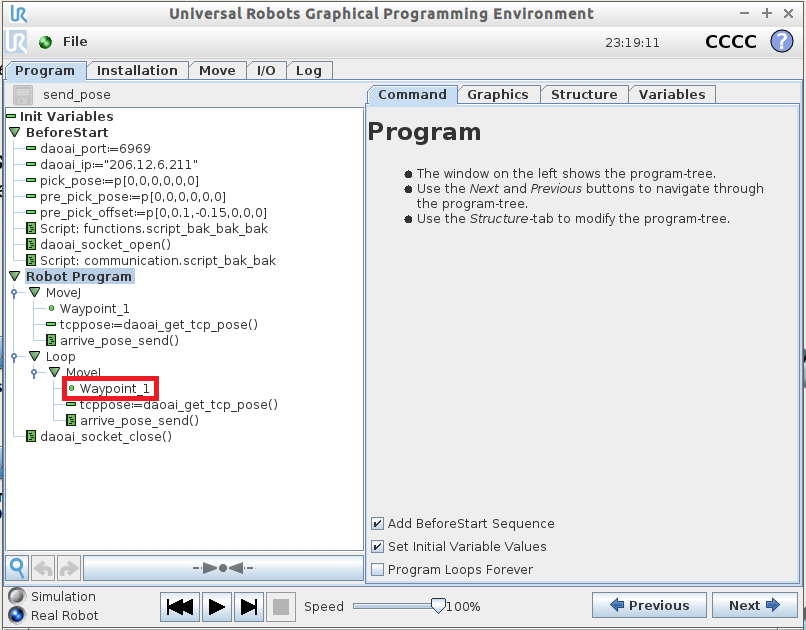

In real world robot, we need to change this waypoint to a correct picking pose for the object. However, in virtual robot test, this is not require.

Note: We will use Picking.urp as sample for the following demo.

Connection
~~~~~~~~~~~~

Connecting with VMware robot is similar with Hercules in ``Vision`` . 

On ``Vision`` side, open ``Platform Configuration`` , choose ``Robot`` option. Following the image below, select ``UR`` as Robot type, then click ``+`` .

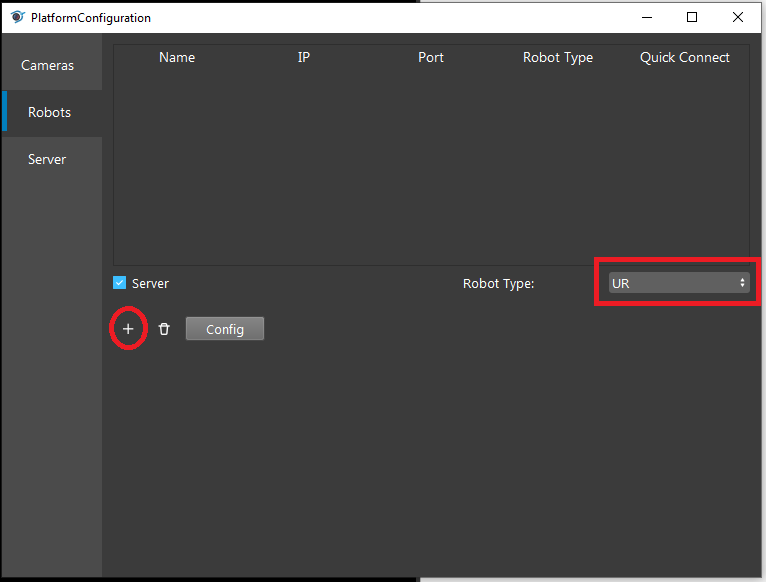

Then, you should see the config page like below:

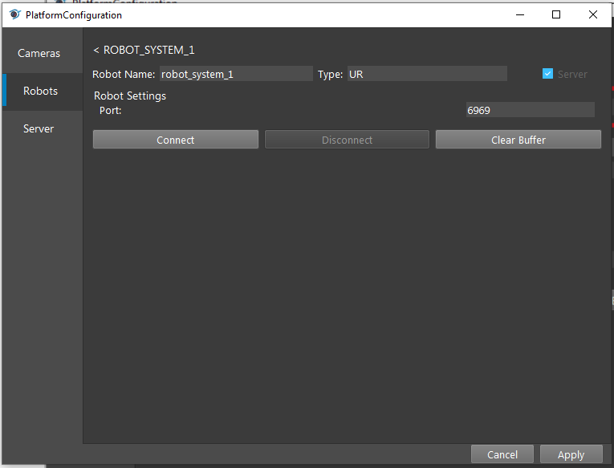

Click ``Connect`` to connect Virtual UR robot to ``Vision`` , ``Clear Buffer`` can clear the existing buffer for ``Vision`` and Virtual UR robot.

Port number can be modified to any number, this would be useful when connecting multiple robots. 
You can leave it as ``6969`` when only connecting to 1 robot. 

On UR side, click on ``Setup Robot`` then select ``Network`` .

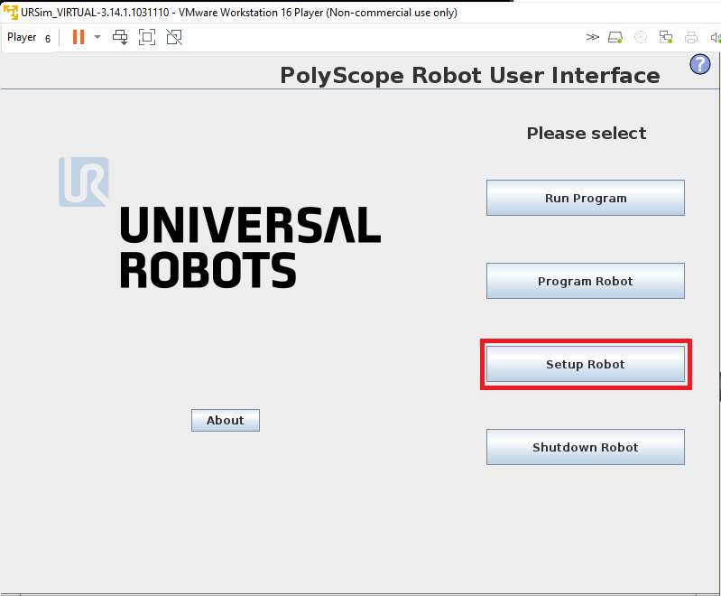

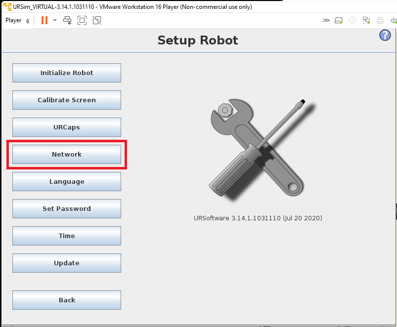

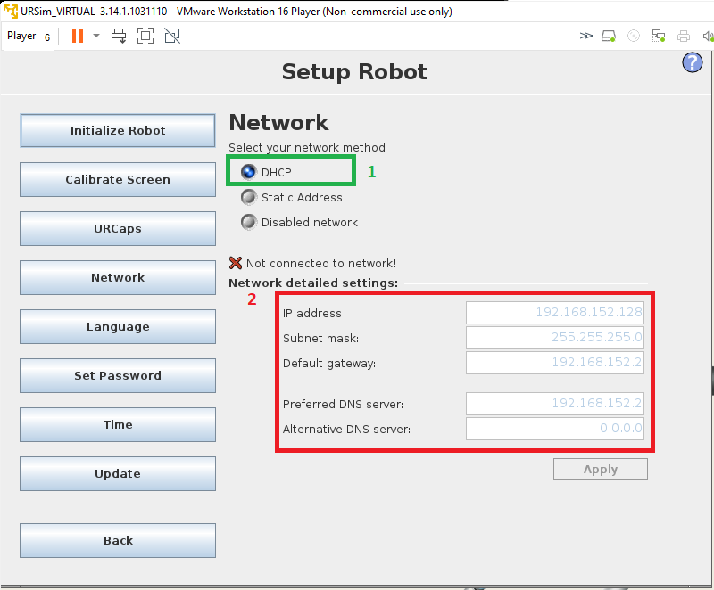
	
Network setting should be ``DHCP`` and use the above IPs. This will connect to ``Vision`` .

Then loading the urp file for Calibration, Send pose or Picking. In this example, we loaded Picking.urp:

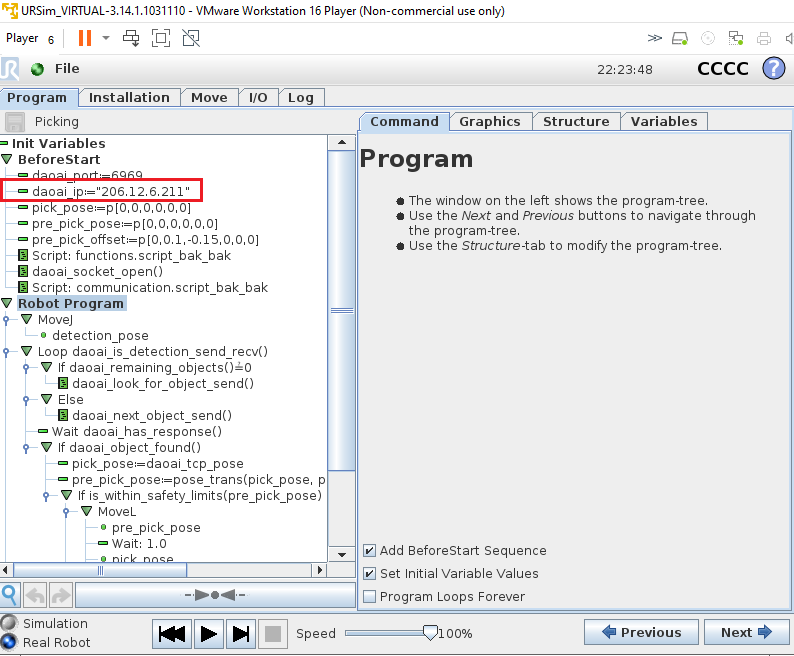

Inside of the urp file, we can see there is a field ``daoai_ip`` , select this field and click on the ``Expression`` .

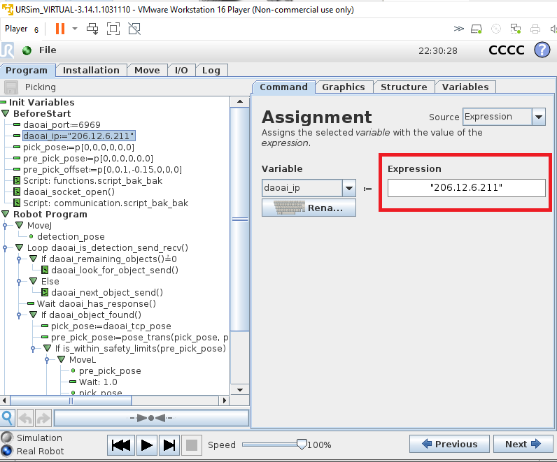

Change the IP to corresponding IP address. You can check the IP address in ``cmd`` then enter ``ipconfig`` to check IP address on the PC.

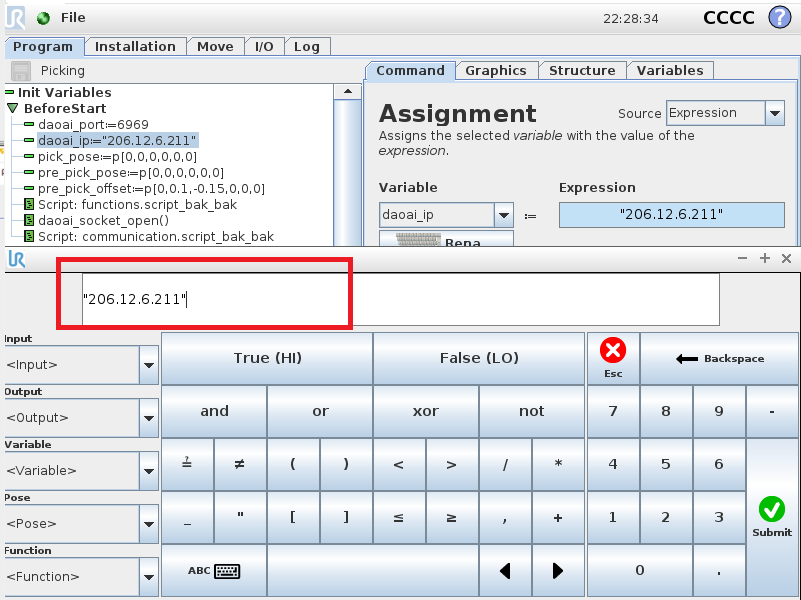

Communication
~~~~~~~~~~~~

Communications require requests and reponses. ``Vision`` is the communication ``Server`` and Virtual VM robot is ``Client`` in this communication. 
Hence, ``Vision`` would always wait for a ``Robot Read`` before ``Robot Write`` , withour requests from client, server would not send anything to client side. 

In this Picking.urp we have all the robot loop through the picking process and keeps receiving the pose from ``Vision`` as long as there are pickable poses. 

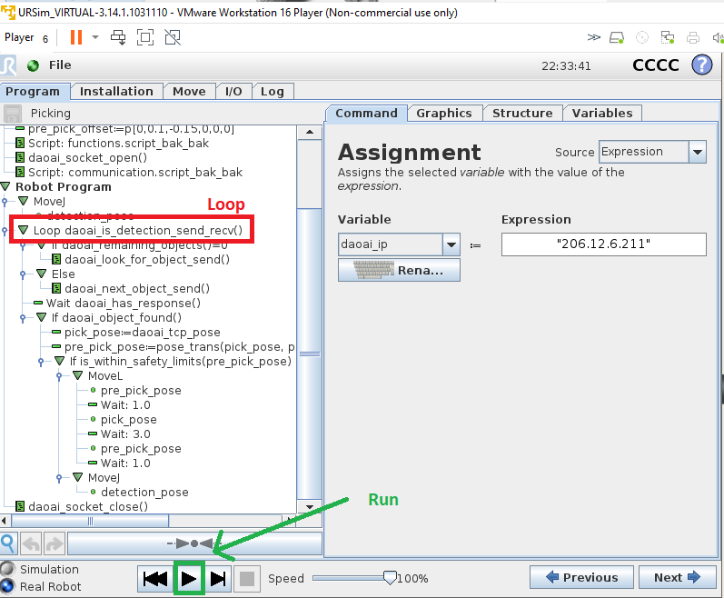

We click on the ``Run`` button on UR and ``Run`` on ``Vision`` , they will keep communicating and send/receive as long as the robot script matches the communications(``Robot Read`` and ``Robot Write`` ) on ``Vision`` .