DaoAI Camera (DS)
=================

Content
~~~~~~~
1. :ref:`Physical Camera Wire Connection`
2. :ref:`Connect the camera via DaoAI Camera Studio`
3. :ref:`Connect the camera via DaoAI Vision Studio`
4. :ref:`Connect the virtual camera via DaoAI Vision Studio`
5. :ref:`Use Camera with Camera Node`
6. :ref:`Common Issues`
7. :ref:`Physical Camera`
8. :ref:`Virtual Camera`

Physical Camera Wire Connection
~~~~~~~~~~~~~~~~~~~~~~~~~~~~~~~~

On the front side, the camera has one light projector (1) and one camera lens (2) shown in the picture down below. 

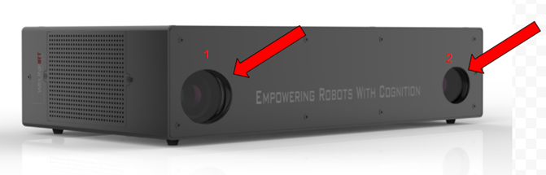
|
On the backside, the camera has one 3.0 USB port (1), one power source (2), and a fan (3). 

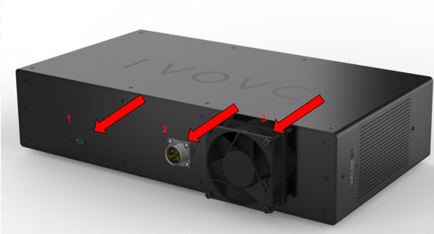
|

Connect the camera via DaoAI Camera Studio
~~~~~~~~~~~~~~~~~~~~~~~~~~~~~~~~~~~~~~~~~~

**Connection**

Clicking on the DaoAI Camera Studio icon to open the software, pressing the refresh button, searching, and updating the available cameras.  If there is an available camera in the list, by clicking on the list box on the left side, the serial number of that camera will pop up in the box. Then, the operator can click “Connect” button to connect the camera with the studio software. 

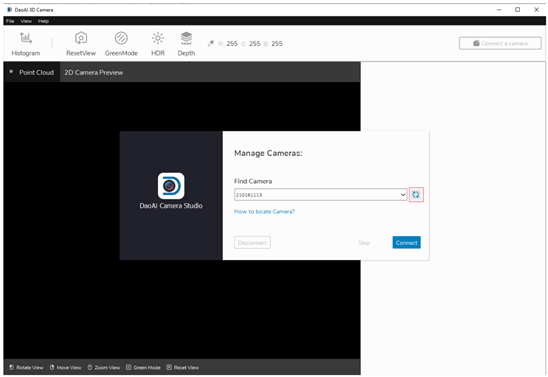
|

To disconnect the camera, the operator can either close the software or press the camera serial number printed on the top right corner. The “Manage Cameras” window will display, then the operator can press the “Disconnect”. 

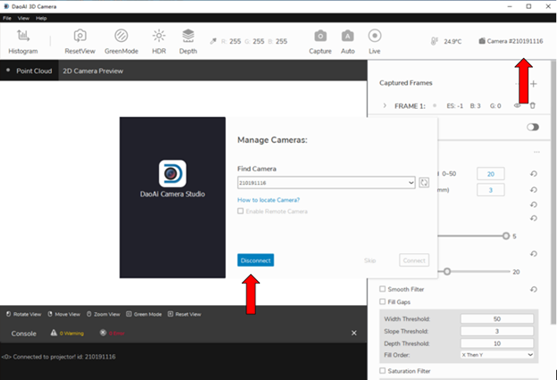
|

**Basic configuration for capturing**

The operator can click on the “+” button to add multiple frames when capturing the image.  To delete the frame, the operator can click on the trash bin button on the right. However, the minimum number of the frame that the operator can have is 1. 

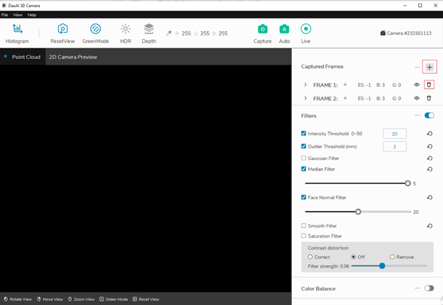
|

In the frame, the operator can adjust the 3 parameters, exposure, brightness, and gain respectively. Adding multiple frames will help the camera to capture more details and features in the image; however, the capturing time will get longer as well. 
By clicking on the “Capture” button to capture an image. The “Auto” button will allow the system automatically adjust the setting to capture the best shot image. The “Live” button will trigger the camera to constantly capture the images. To stop it, the operator just need to click on the “Live” button one more time. 

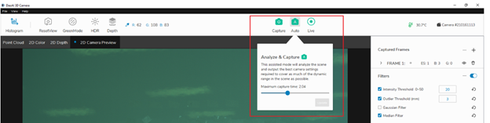
|
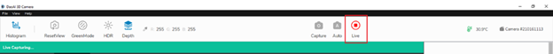
|

The operator can also use the manual bar highlighted in the image down below to check out the image quality in different modes. 

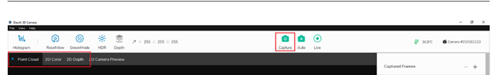
|

**ROI** (Optional)

If part of the image point cloud is unclear, the software allows the operator to switch the mode from “Point Cloud” to the “2D color” to readjust the area that has bad point cloud quality. 

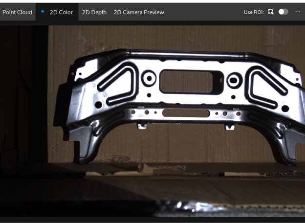
|

Once clicking the “Use ROI” button, the operator can select the specific area of an image to edit.

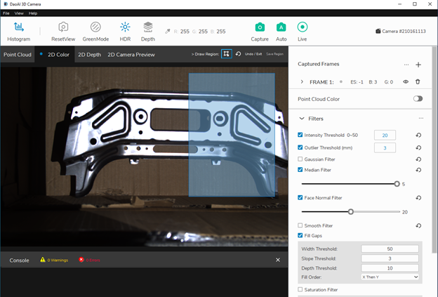
|

Then the operator can click the save button to confirm the area and perform the adjusting. Once finish adjusting the area, the operator can click the “…” on the top right to delete ROI. 

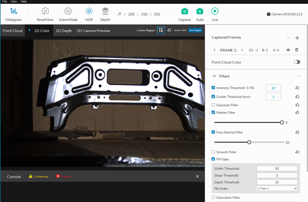
|

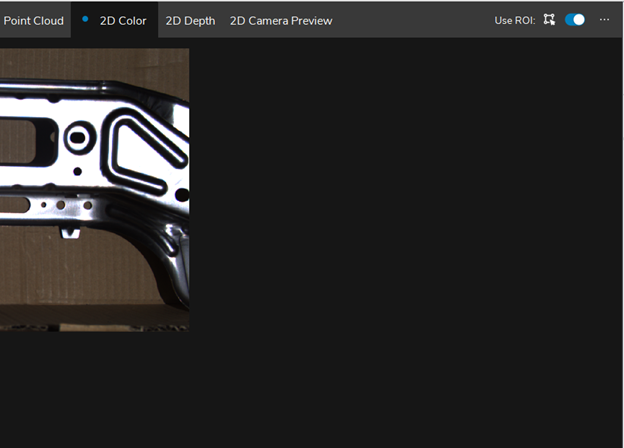
|

**Gap Fill** (Optional)

Another general function that has been used quite often is the “Gap Fill” function. The function can help the operator repair and optimize the point cloud image by automatically filling the point cloud captured from the Studio. 

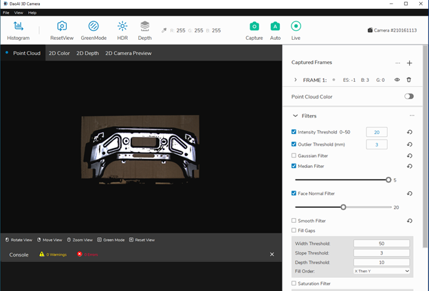
|

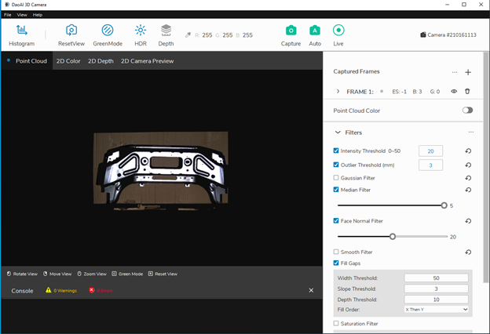
|

**Saving the studio file**

When finishing editing the settings, to save the image configuration and loaded into the Vision software for capturing the real image, the operator can click the “File” button and select the “Save Setting As” to save the setting as cfg.

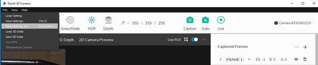
|

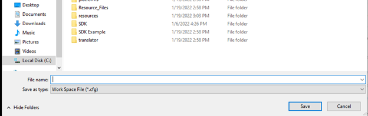
|

Connect the camera via DaoAI Vision Studio
~~~~~~~~~~~~~~~~~~~~~~~~~~~~~~~~~~~~~~~~~~~~

Open the Vision Software and click on the New Project button on the top left. 

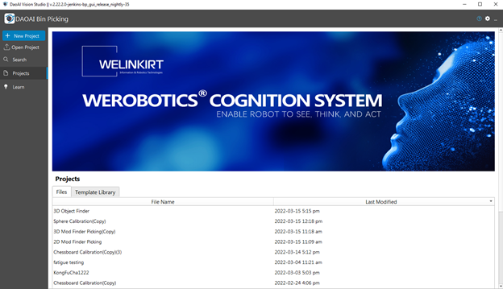
|

In the New Project dialog, the operator should name the project and select the file location, then press “ok”.

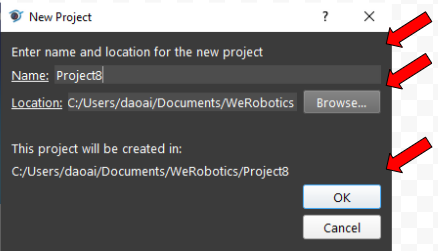
|

Once finishing creating the new project, the operator should click the Platform to config the camera, robot, and server settings.  

|

All three categories are listed on the left side of the dialog and highlighted by the blue bar. The operator can add cameras, robots, or servers by pressing the “+” button. 

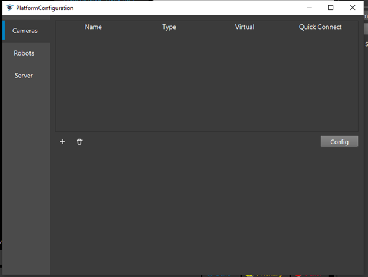
|

Under the Type, click the camera box to view the whole list of options and select the camera that is going to be used for the application by clicking the Accept button. Then, a new dialog will pop up for configuring the specific camera. The operator can load the cfg file saved from the studio into the “Load Settings Path” as the setting used for configuring the camera node in the Vision software. To delete the camera, the operator can select the camera and press the trash bin icon to delete it. 

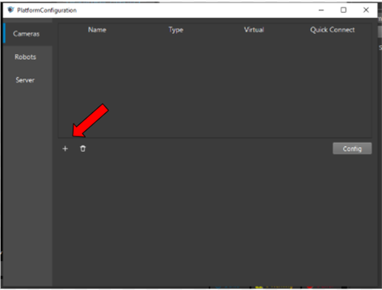
|

.. image:: camera-image/Picture22.png
   :width: 80%
|

To add the real camera, the operator should press the “Updated Camera List”, then press the blank box on the left to discover if the camera’s serial number has been updated. If the number pops up, the operator can select the number by pressing it. The load Setting Path function allows the operator to load the cfg file, which contains the setting the operator configured in the studio to enhance the quality of the image shot from the camera. Then, press the “Connect” button to connect the camera with other nodes. 

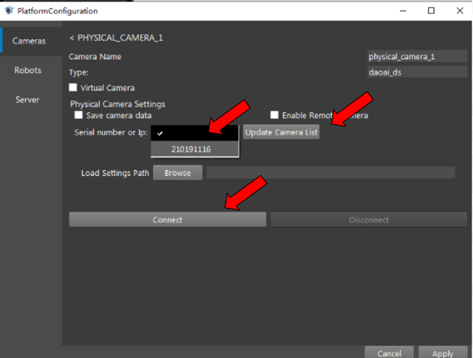
|

Once the camera has been connected with other nodes, the operator should select the correct physical camera number in the Camera Source box. 

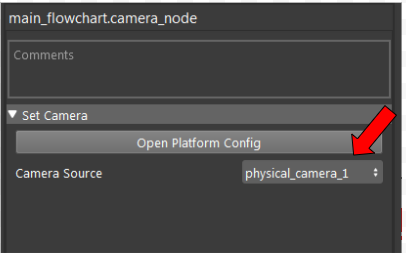
|

Connect the virtual camera via DaoAI Vision Studio
~~~~~~~~~~~~~~~~~~~~~~~~~~~~~~~~~~~~~~~~~~~~~~~~~~~

The operator can load dcf files that were generated in the past as the camera output. To do so, the operator should check the Virtual Camera box, and choose the option to load the dcf files. The operator can either load the entire dcf folders or just load a single dcf file. Then press the “Connect” button to connect the camera node with the other node.  

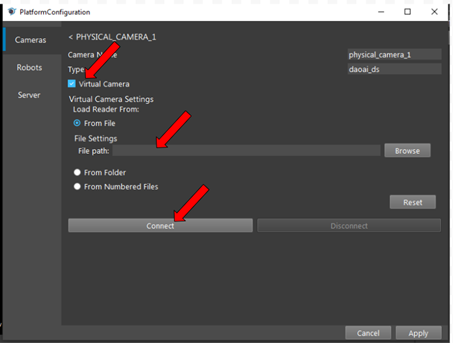
|

Use Camera with Camera Node
~~~~~~~~~~~~~~~~~~~~~~~~~~~

Once configuring the camera, switch back to the flowchar template and right click the "+" to add the camera node. 

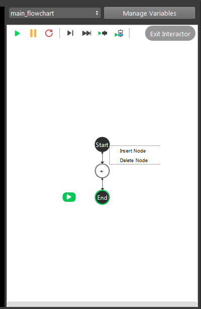
|

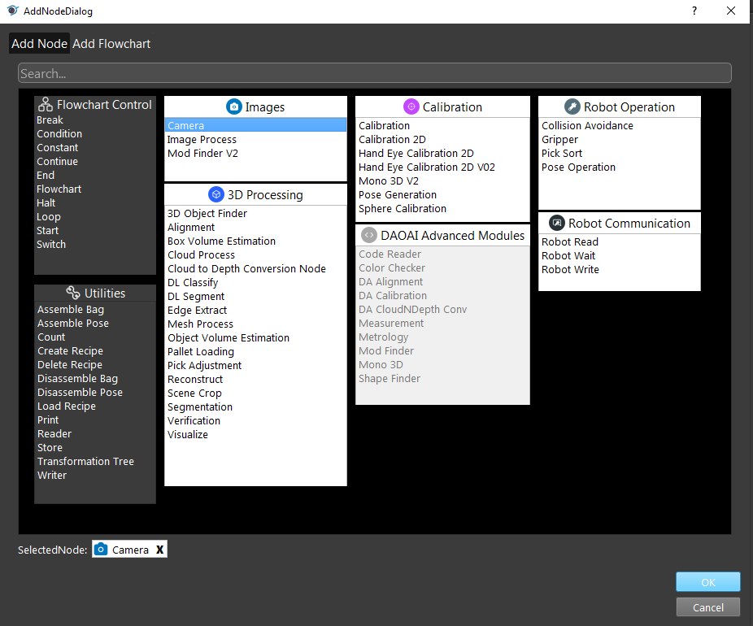
|

Then click on the camera node and select the correct physical camera configured inside the camera source.

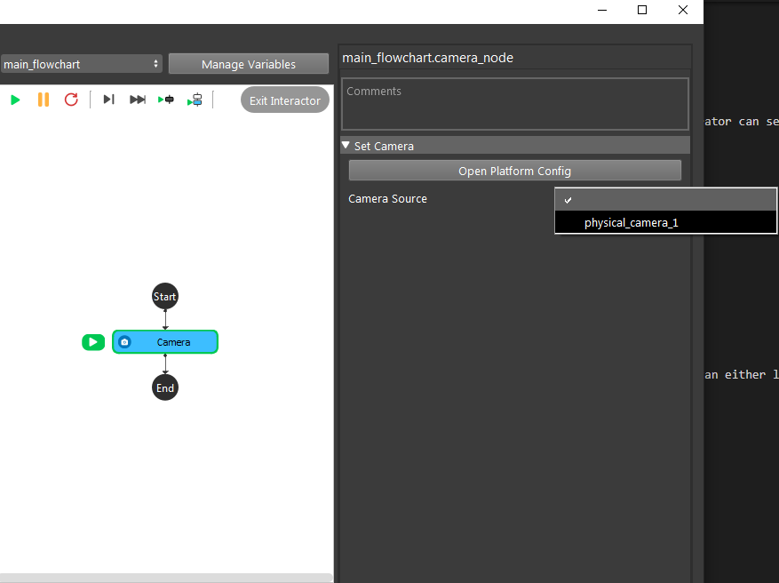
|

Common Issues
~~~~~~~~~~~~~~
* USB 3.0 cable issue
  
  The DS camera USB has to be pluged into the USB port 3.0 in order to be functional. 

* cfg file doesn't match 
  
  The cfg generated by the old version camera studio cannot be used in the later version. Be sure the version camera studio is udner the same version as in the third party's SLC.
  
* Not able to find the camera

  This issue normally caused by the version conflict. Making sure the camera studio is in the latest version. 

In addition to allowing the connection of Physical Daoai Camera, **DaoAI Vision Studio** offers the Virtual Camera function in order to allow user to load existing image files.

On the top menu bar, select ``Platform`` ->  ``Platform config page``. 

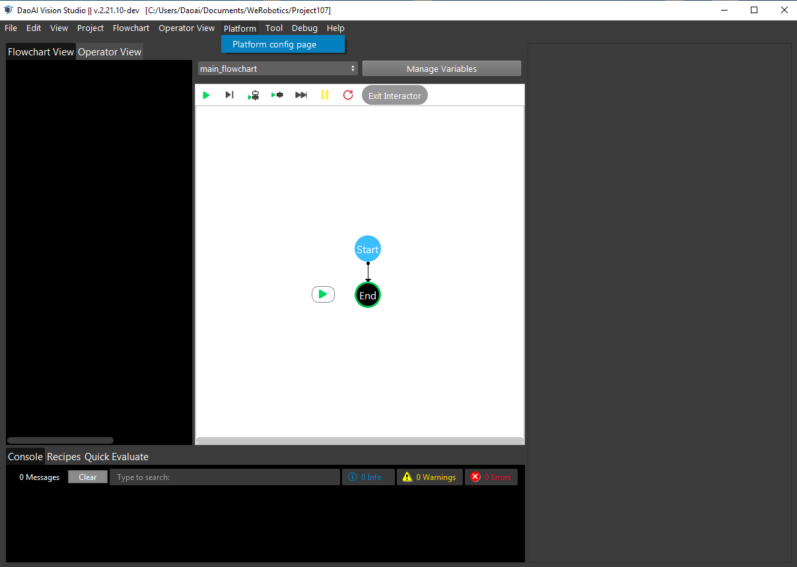
    
|

Select ``Cameras`` on left side menu bar and click ``+``, then choose **DaoAI Camera**, Then click ``Accept`` button below.

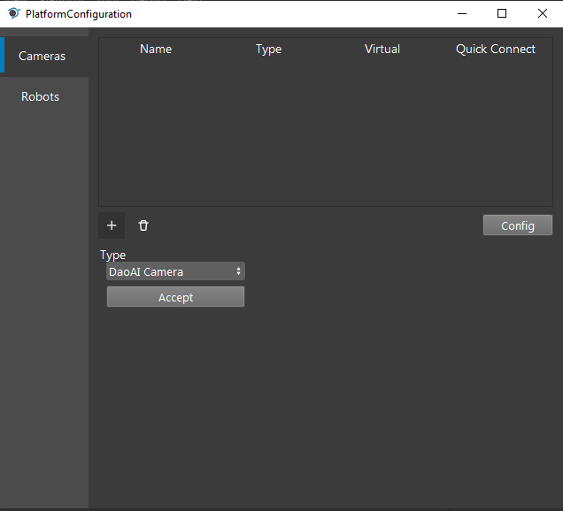
    
|

Now you have two options to proceed: **Vritual Camera** or **Physical Camera** (Default).

Physical Camera
~~~~~~~~~~~~~~~

Click ``update Camera list`` and select the Serial Number of the camera, then click ``Connect``.

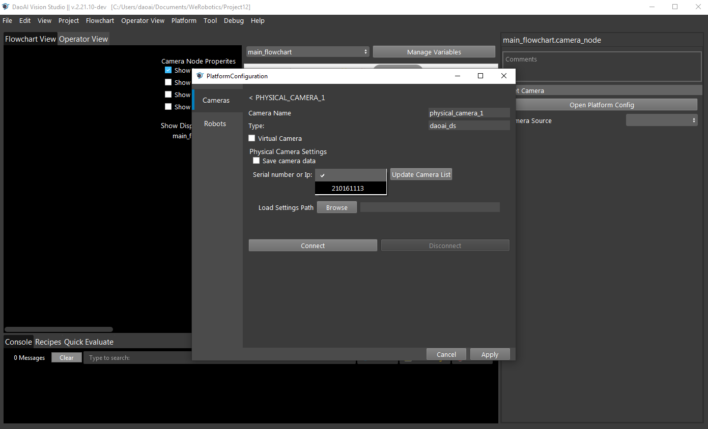
    
You can also load a camera setting file when connecting to a camera. The settings include projector/camera parameters when capturing 2d images and parameters used when generating the point cloud.
The camera config file (.cfg file) is created by DaoAI Camera Studio Program.
Refer to Camera Studio User Manual for details on how to adjust camera parameters and exporting config as a file.

Virtual Camera
~~~~~~~~~~~~~~

Select ``Virtual Camera``, Click ``Browse`` to Choose the image files you want to load, then click ``Connect``.

.. note:: 
    | There are three options to load the image file.
    | 1. From file: loading single image file
    | 2. From Folder: loading all image files in the folder one by one
    | 3. From Numbered Files: loading image files based on numbered file name one by one.

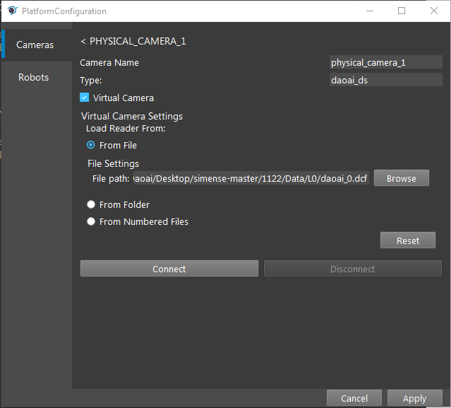
    
|

Select the camera name you just created in the ``Camera Source`` and run the camera node in the flowchart.

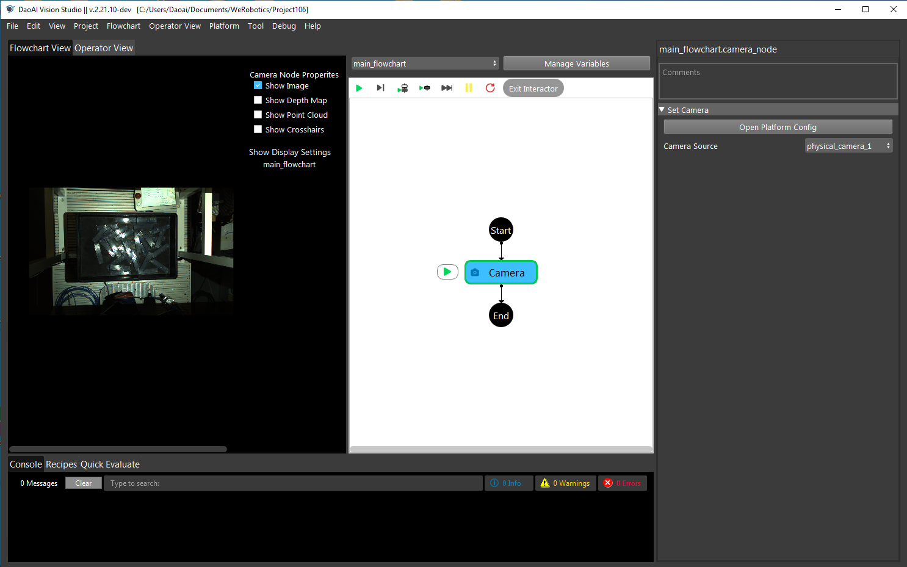
    
|

