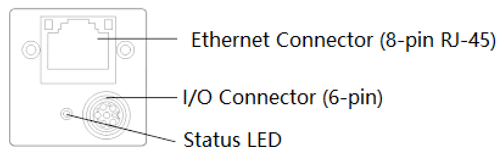
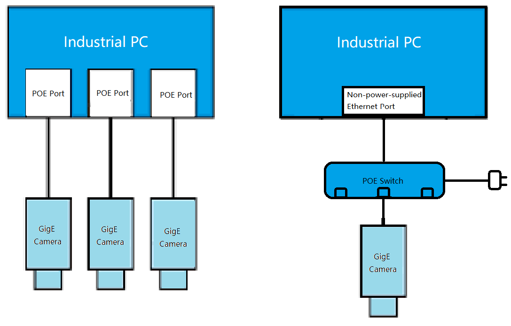
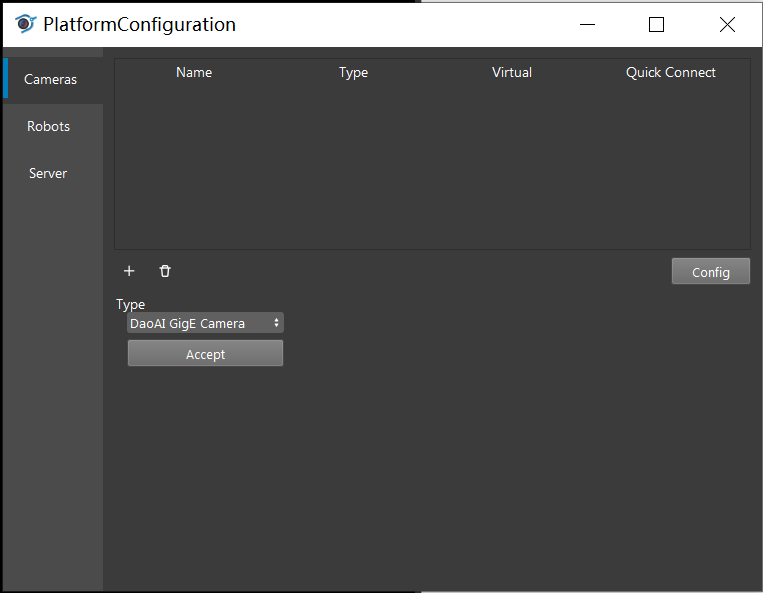
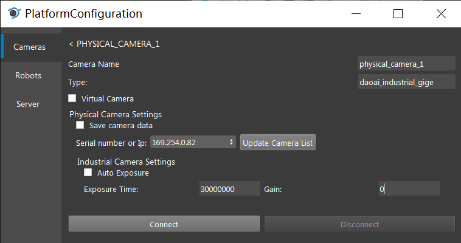
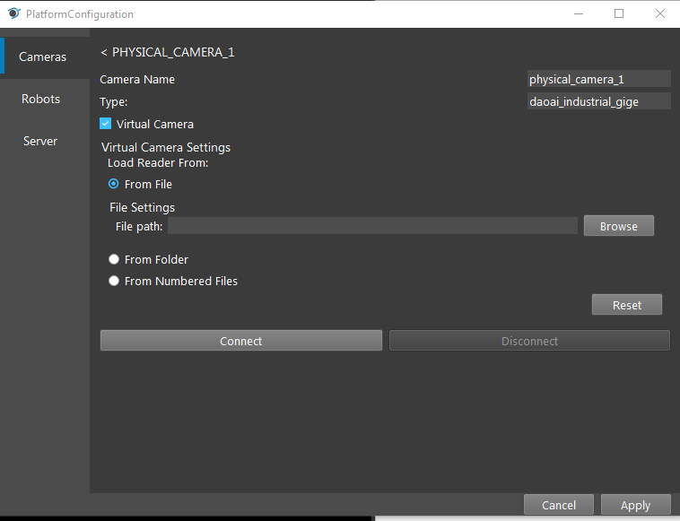
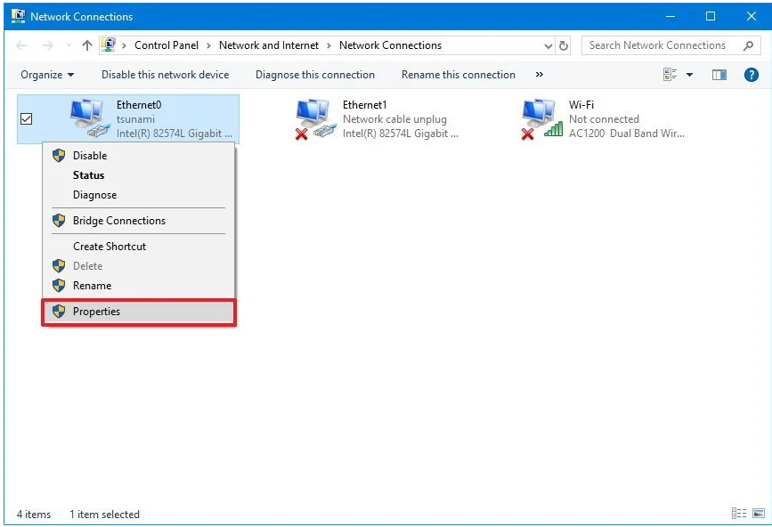
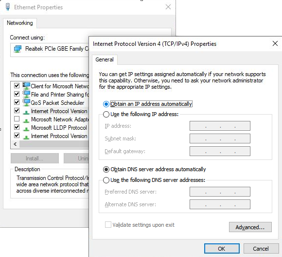

Daoai Gige Camera
=================

Physical Camera Wire Connection
-------------------------------
Gige Cameras are usually connected through Ethernet cables, you can find the ethernet port on camera.

The Gige camera can directly connect to the **Power Of Ethernet(POE)** port of the industrial PC, or through a **POE** switch to connect to a none-power-supplied ethernet port.  

.. Attention:: 
    * In order to have stable connection, the ethernet cable need to meet industrial usage standard, and CAT6 above. If there is any sudden disconnection, most likely it's the cable issue. 
    * Once camera connected, the **power** and **POE** connection status indicator on the camera and industrial pc should be green. Otherwise, could check if the industrial PC/switch **POE** power is stable or not.

Connect the camera via DaoAI Vision Studio
------------------------------------------

Once physically connected, on the top menu bar click the **Platform** -> **Platform config**, click the **+** button, and select **DaoAI Gige Camera**, click accept.

Click the **Update Camera List**, and select the camera you wanna connect. In order to tune the camera, sometime you want to change the Exposure time and Gain. Then click connect button.

.. Attention:: 
    * In order to connect the PC with the Gige camera, both has to fall within the same sub network. Check the **Network configuration**
    * The larger the exposure time and gain, the brighter the image. Some model of the camera has a available range for the exposure time and gain, will need to check the model. 

Connect the virtual camera via DaoAI Vision Studio
--------------------------------------------------

The virtual camera will read the \*.png files, and select the way you would like the system to find the \*.png files.

.. Attention:: 
    * From file: Select a single png file
    * Fron folder: It reads out all the \*.png file from the folder
    * From numeric: Read specific files with dedicated prefix.

Use Camera with Camera Node
---------------------------

Once configuring the camera, switch back to the flowchar. Right click the "+" sign and add the camera node. 

.. image:: camera-image/Picture29.png
   :align: center

.. image:: camera-image/Picture30.png
   :align: center

Then click on the camera node and select the camera you just added in platform config window.

.. image:: camera-image/Picture31.png
    :align: center

Now if you run the ``Camera`` node, it will generate camera capture or virtual camera image.

Network configuration
---------------------
In order to let the camera and industrial pc to connect, they both need to fall in the same subnet. Usually the camera was configured to automatically get an IP from the industrial PC, in this way, the camera can get an IP which can directly communicate.

Sometimes, the Gige camera was configured to a different subnet that the **POE** network driver. In this way, you need to either change the **PC** network to a static IP that could match the Gige camera, or set the camera to automatically get a new IP address (usually by reset to factory settings). The subnet usually means the last number of the ip is different, but all the other numbers are the same, and the mask is 255.255.255.1

1. To change the PC network to static IP, first you need to know the IP address of your camera. Open command line prompt, enter ``ipconfig``. You can see your computer IP and the connected camera IP here. Leave the window open and proceed to next step.
2. Next thing is to press ``Win+R`` and enter ``ncpa.cpl`` to open Network Connection window. Find the Network adapter for your computer network connection, and right click > **Properties**.

3. Find the ``Internet Protocol Version 4(TCP/IPv4) Properties``, double click it and you should see the following window.
  

4. Change the ``Obtain an IP address automatically`` to ``Use the following IP address``. Then change the first line ``IP address`` to match first three parts of the camera IPv4 address. For example, if your Camera IP address is 196.254.42.xxx, then you should enter 196.254.42.yyy(yyy must differ from xxx).
5. Then in the next line, enter 255.255.255.0 for subnet mask. Click OK to save the changes.

Common Issues
-------------
Packet Loss
~~~~~~~~~~~
1. First confirm the Gige Camera IP is under the same subnet with your PC. 
2. Then press ``Win+R`` and enter ``ncpa.cpl`` to open Network Connection window. Right click the Ethernet port your camera connects to. Click **Properties**
3. Find ``Client for Microsoft Networks`` and click ``Configure`` button.
    .. image:: gige-images/gige-client-for-microsoft-networks.png
        :align: center
4. Go to **Advanced** and in the Property List find ``Jumbo Packet``. In the Value dropdown list, select 9014 Bytes.
    .. image:: gige-images/gige-jumbo-packet.png
        :align: center
5. Continue in the Property List, find ``Receive Buffers``, set the value to 2048.
    .. image:: gige-images/gige-receive-buffers.png
        :align: center
6. Continue in the Property List, find ``Transmit Buffers``, set the value to 2048.
    .. image:: gige-images/gige-transmit-buffers.png
        :align: center
7. Continue in the Property List, find ``Speed & Duplex``, set the value to 1.0 Gbps Full Duplex.
    .. image:: gige-images/gige-speed-duplex.png
        :align: center
8. Click OK to save your changes.