Daoai Laser Camera
==================

.. Physical Camera Wire Connection
.. ~~~~~~~~~~~~~~~~~~~~~~~~~~~~~~~

Connect the camera via Webpage
~~~~~~~~~~~~~~~~~~~~~~~~~~~~~~

Open a web browser, and enter the ip address to use the camera interface.
The default IP address of the laser camera is 192.168.1.10 . 

The interface looks like this:

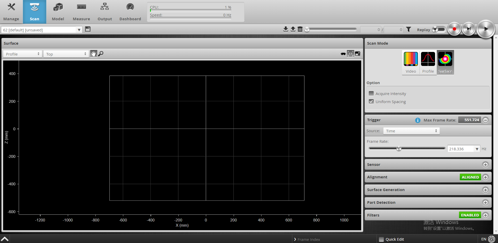

|

However, sometimes, the laser camera was configured to a different subnet that the POE network driver. In this way, 
you need to change the PC network to a static IP that could match the laser camera.

1. To change the PC network to static IP, first, you need to know the IP address of your camera. Open the command line prompt, and enter ``ipconfig``. You can see your computer IP and the connected camera IP here. Leave the window open and proceed to the next step.

2. Next thing is to press ``Win+R`` and enter ``ncpa.cpl`` to open Network Connection window. Find the Network adapter for your computer network connection and right click > **Properties**.

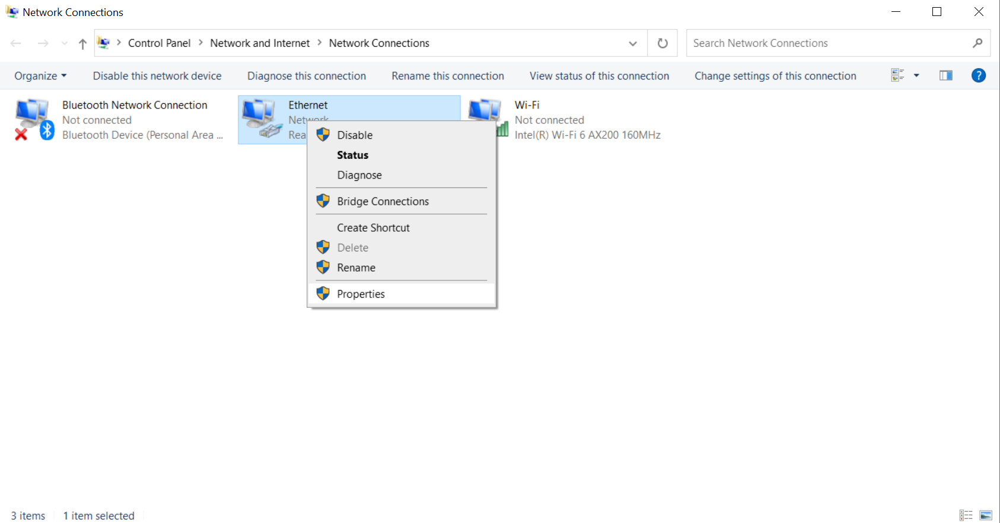

|

3. Find the ``Internet Protocol Version 4(TCP/IPv4) Properties``, double click it and you should see the following window.

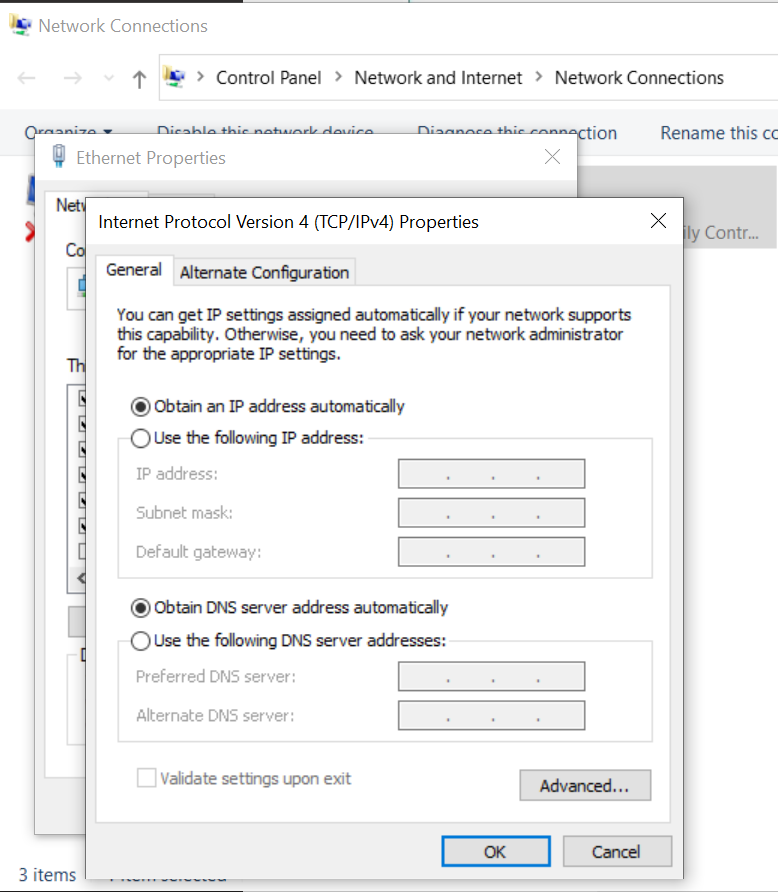

|

4. Select "Use the following IP address", and enter "192.168.1.XX" in the "IP address". "XX" can be any number but 10, 
in the following example, 11 is used. Enter "255.255.255.0" in the "Subnet mask". 

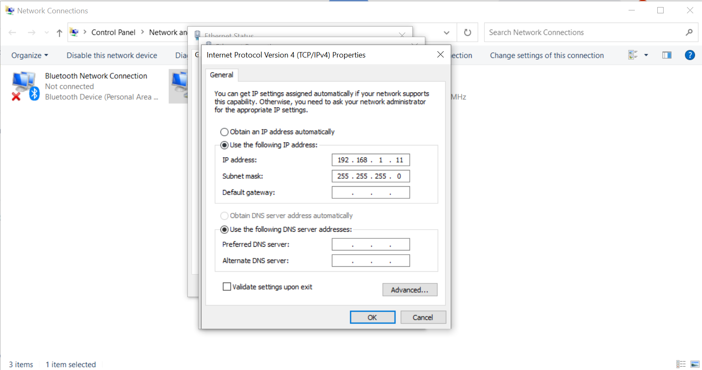

|

5. After applying the changes, the connection should be made.

.. tip:: How to change the IP address
    If you want to change the IP address of the camera from default to the IP address you want.

    Open a web browser and enter 192.168.1.10

    .. image:: laser-images/9.png
        :align: center

|

    Click "Manage", "Networking", and enter the desired IP address, "206.12.6.211" in this case,
    and "255.255.255.128" for the "Subnet mask".

    .. image:: laser-images/10.png
        :align: center

|

    You can ping the IP address in the command prompt to check if the changes are successful.

    Press ``Win+R`` and enter ``ncpa.cpl`` to open the Network Connection window. Find the Network adapter for your computer network connection, and right click > **Properties**, 
    Find the ``Internet Protocol Version 4(TCP/IPv4) Properties``, double click it and you should see the following window. 
    Select "Obtain an IP address automatically".

    .. image:: laser-images/11.png
        :align: center

|

    Enter the IP address you set to a web browser and a shown interface indicates the change of IP address is successful.

Trigger
~~~~~~~

Select "Trigger" to modify the frame rate.

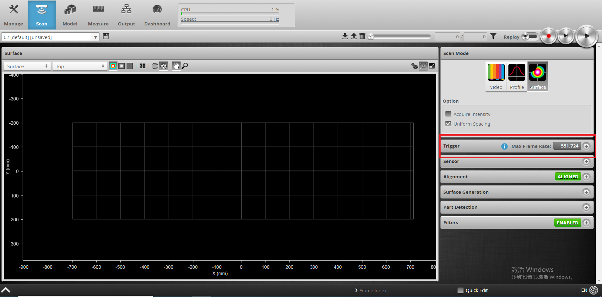

|

Set the "source" to "Time"

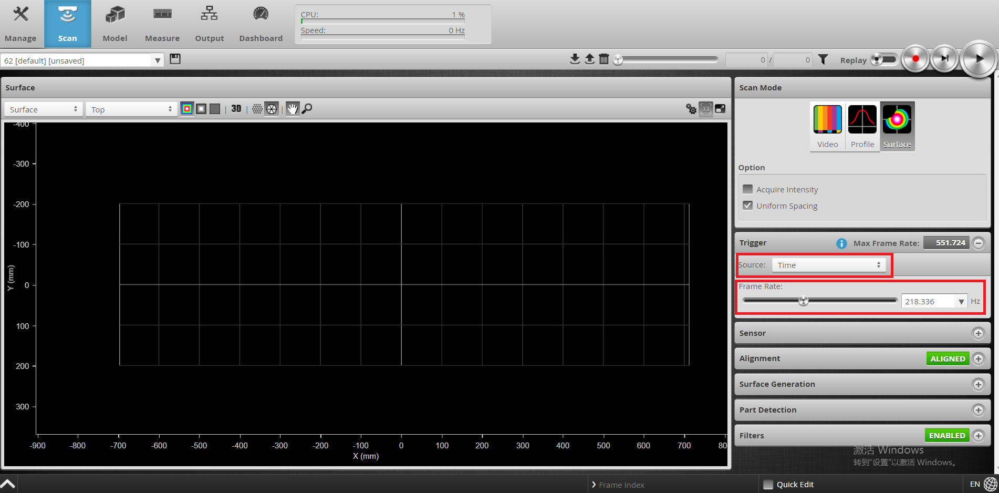

|

.. note::
    **Frame rate**: Frame rate represents how many cameras scan per second. A higher frame rate means a more precise scan.
    However, it comes with a higher performance requirement and possibly more time to proceed as a tradeoff. 
    A higher frame rate also decreases the maximum scan range of the X and Z direction.

.. note:: 
    **Calculation of the optimal frame rate**: The laser camera has 1040 pixels in the X range. Assuming the field of view 
    is 1000 mm. 1000/1040 = 1.04 mm/pixel, there is 1.04 mm distance between each pixel. The optimal frame rate depends on the precision requirement 
    of the project. If the speed of the conveyor is 20 mm/s. 20/1.04 = 19.2 hz for 1.04 mm/pixel. However, if the 
    requirement is 0.2 mm distance between each pixel (5 pixels per mm), 20/0.2 = 100 hz. Set the 
    frame rate to 100 hz will satisfy the precision.

Sensor
~~~~~~

Use the "Active Area" to set the area of interest. This operation crops the "Surface" window 
on the left and let users focus on the area with image. 

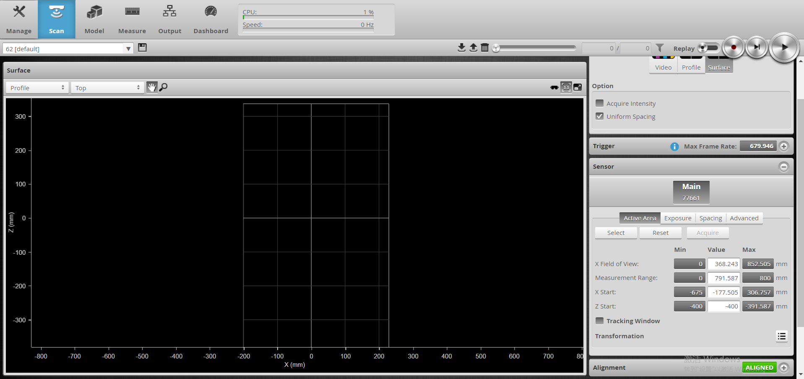

|

1. Click "Select" to activate the area selection box and "Acquire" an image with only the conveyor belt. 
It is expected to show a flat surface.

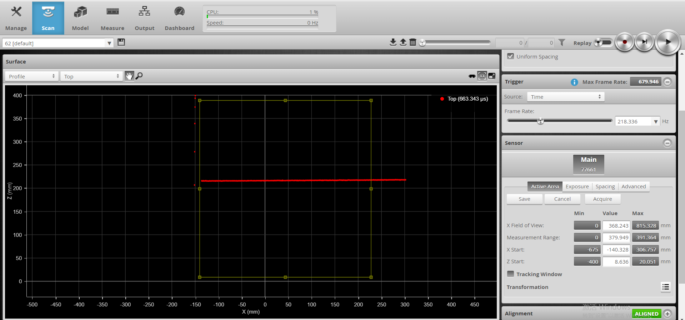

|

2. Adjust the selection box so the bottom of it is slightly higher than the surface of the conveyor. Therefore, 
only the surface of the interested item will show in the scan.

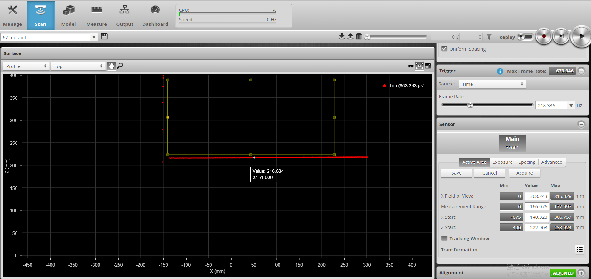

|

3. Adjust the height and width of the selection box based on the dimension of the scanned items. Leave enough
 room so the items fit in the area.

|

Alignment
~~~~~~~~~

For alignment, a moving bar is used. Set the "Height" to 25 mm and "Width" to 135 mm. Set the "Hole Count" 
to 0. For the "Degrees Of Freedom", use "X, Y, Z, Y Angle,Z Angle". Make sure the "Encoder or Speed Calibration" is ticked.

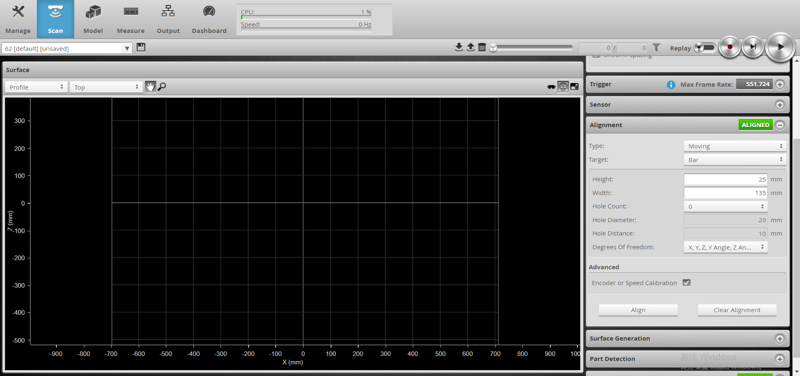

|

Place the bar like the image below. The blue lines represent the conveyor belt. Click "Align" to start the alignment. 

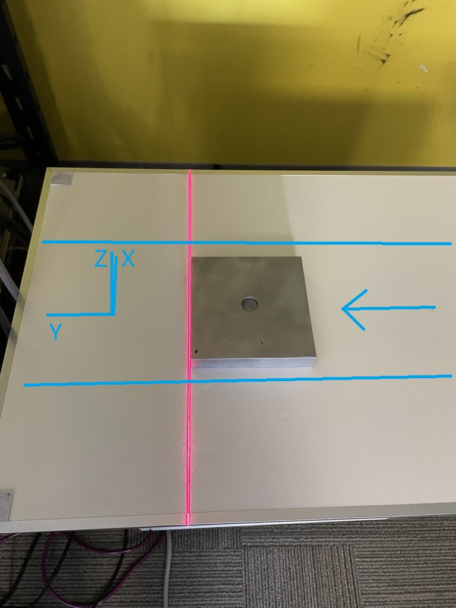

|

The image below shows environment with non-zero Y Angle.

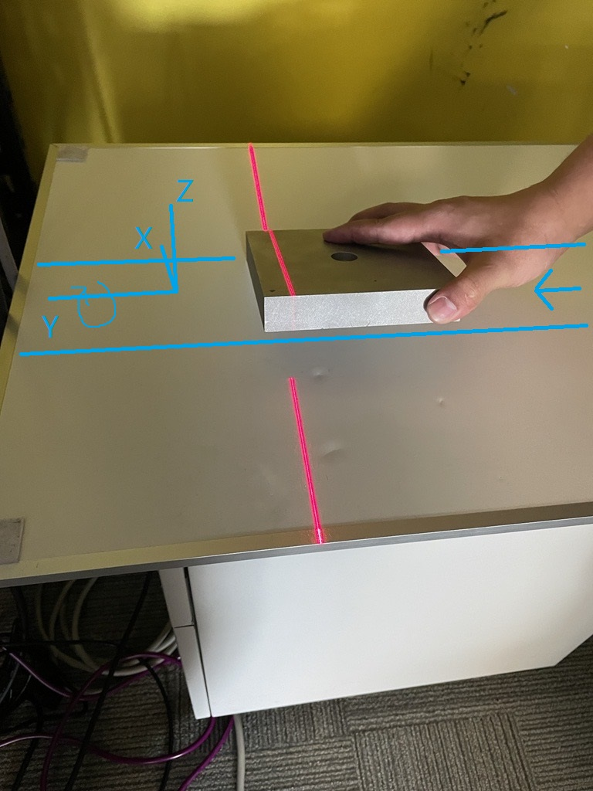

|

The image below shows environment with non-zero Z Angle.

.. image:: laser-images/20.png
    :align: center

|

The laser camera can not do alignment with X Angle.

Surface Generation
~~~~~~~~~~~~~~~~~~

The Surface Generation section set the length of scan.

Set "Type" to "Fixed Length": The camera scans a fixed length at each trigger.

Set "Start Trigger" to "External Input": The trigger is read from an external input, like a photoelectric sensor.

Set "Length" depends on the length of the interested items. Set it slightly higher than the actual length to provide buffer for the distance between the sensor and the actual scanning point (See Laser Camera Workflow for more details). 
"Length" >= (Actual length + buffer length)

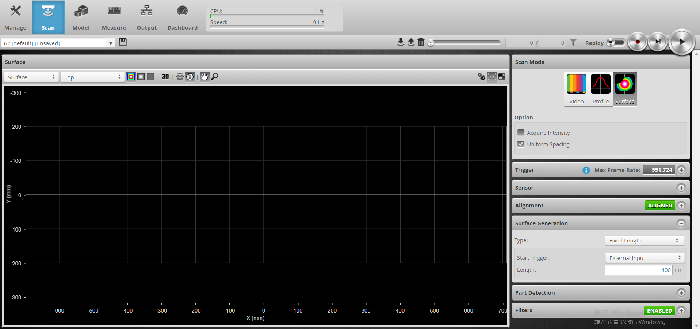

|

Save Settings
~~~~~~~~~~~~~

The settings of the laser camera can be named and saved here: 

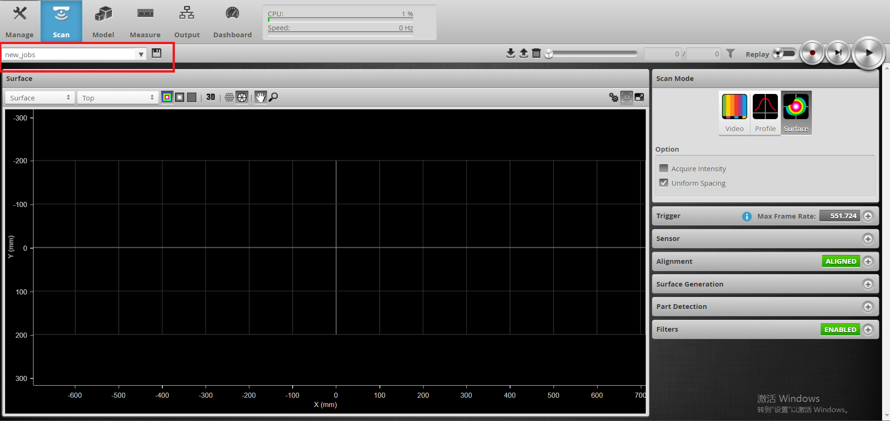

|

The settings can be loaded from "Manage"->"Jobs"

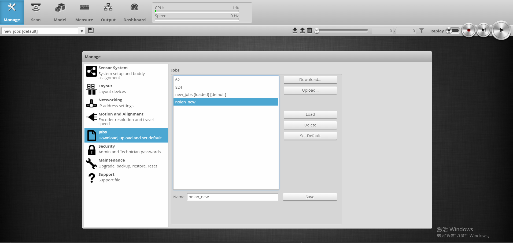

|

Connect the camera via DaoAI Vision Studio
~~~~~~~~~~~~~~~~~~~~~~~~~~~~~~~~~~~~~~~~~~

1. DaoAI Vision and insert a Camera node.

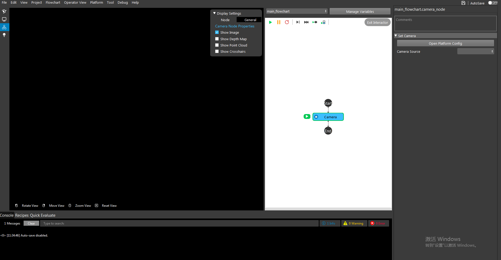

|

2. Click "Open Platform Config"

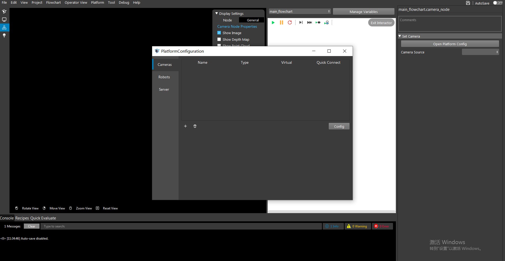

|

3. Click "+" to add a new camera, add a "DaoAI Laser Camera"

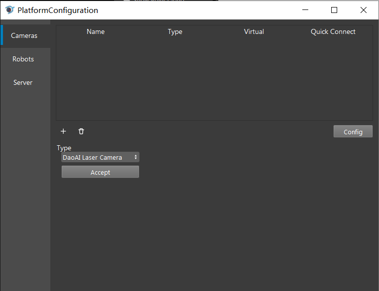

|

4. Enter the Ip address of the laser camera. The default Ip address is 192.168.1.10 The tutorial changed it to 206.12.6.211 previously. Click "Connect" to connect the camera.

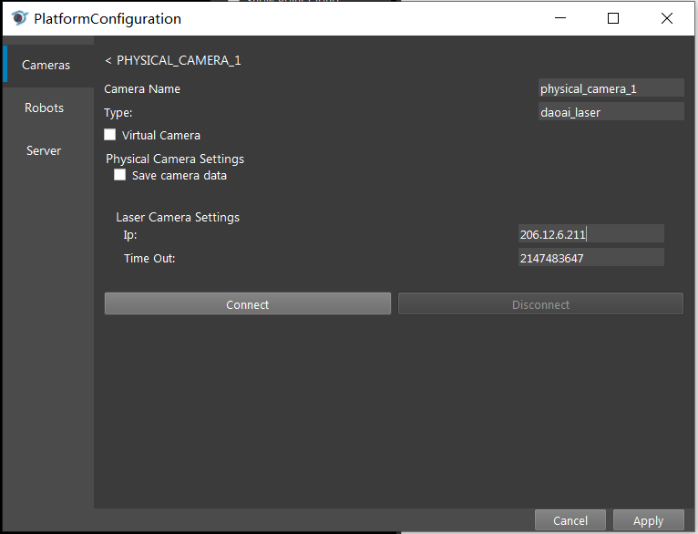

|

Laser Camera Workflow
~~~~~~~~~~~~~~~~~~~~~

Unlike other cameras, which capture a frame of image when the Camera node runs, the laser camera works differently. 
Laser camera scan items while the conveyor is moving. The laser camera start scanning when a photoelectric sensor 
detects an item and sends a trigger signal. Place the photoelectric sensor next to the conveyor belt, and slightly in front of the scanning line (Red laser line, Y = 0). 

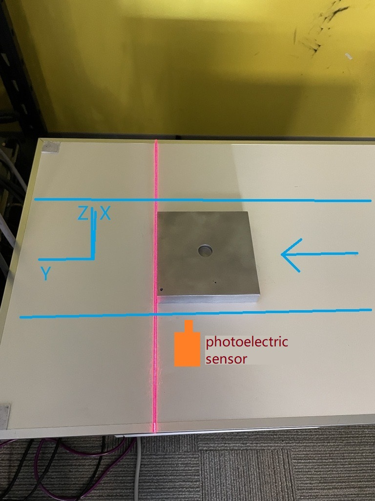

|

When the Camera node runs, it turn on the laser camera. The laser camera capture is triggered by a photoelectric sensor. 
When the sensor detects an item, it sends a signal to the laser camera to capture. The detection & capture process 
continues while the camera is on, no matter if the Camera node is running or not. The images from the laser camera is stored in a queue. 
When the Camera node runs, if the queue is not empty, the first image will be dequeued and read to the Camera node. 

Queue has the characteristics of First In First Out. 

Images stored in the queue in the order of 1->2->3.

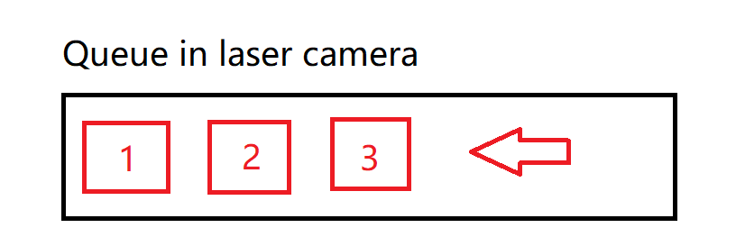

|

When the Camera node runs once, the earliest input image (1) in the queue will be read. And the flowchart runs the next node.

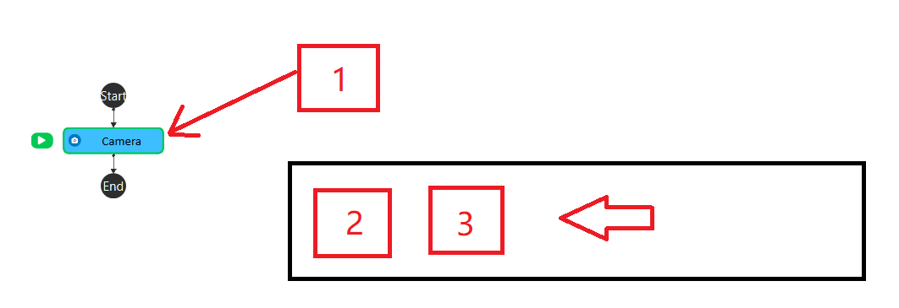

|

If the queue is empty, the Camera node will be waiting until there is a new input image.

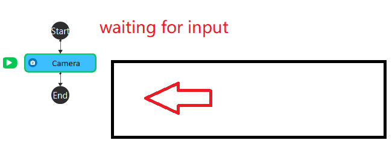

|

Coordinates System
~~~~~~~~~~~~~~~~~~

The image below illustrates the coordinates system of the laser camera. 

X axis is the width of the item. The X = 0 line align with the scanning line (red laser).

Y axis is the length of the item. The Y = 0 line perpendicular at the mid point of the scanning line.

Z axis is the height of the item. The Z = 0 lies at the surface of conveyor.

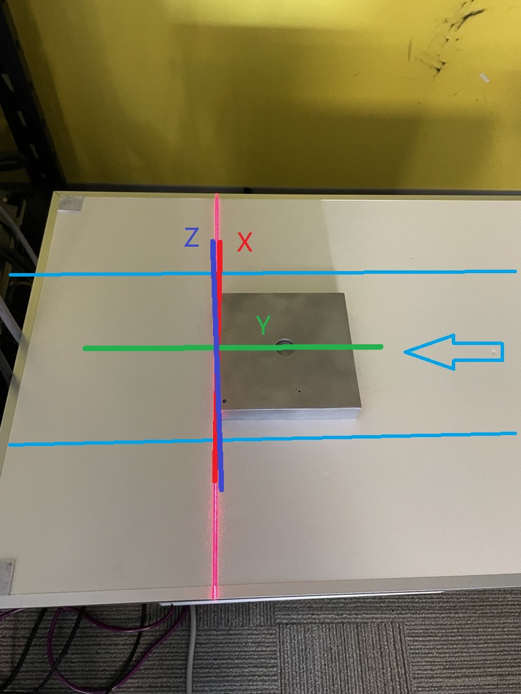

|

The direction of the Z axis is always up. However, the direction of the X axis and Y axis is tricky to identify because they change with different direction positions of the camera and conveyor. 
Therefore, a test scan needs to be made.

Test the direction of Y. Place a directional item like this:

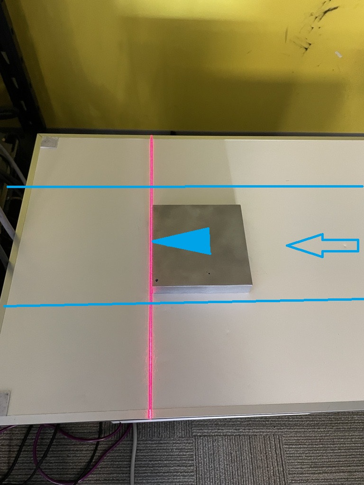

|

Scan the item. If the scanned image looks like the image below, then the Y increases to the left direction.

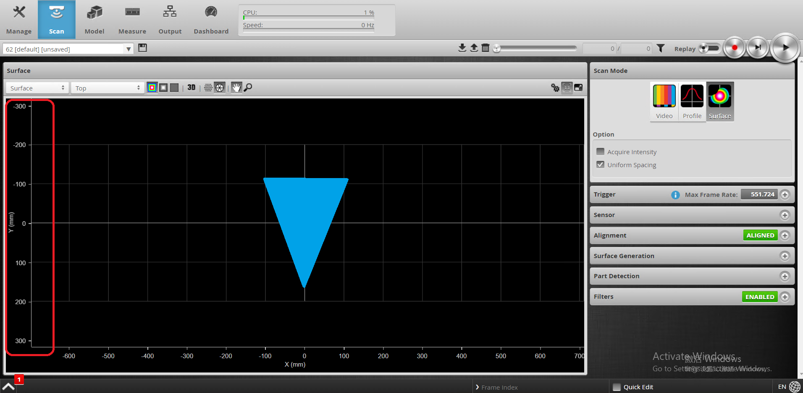

|

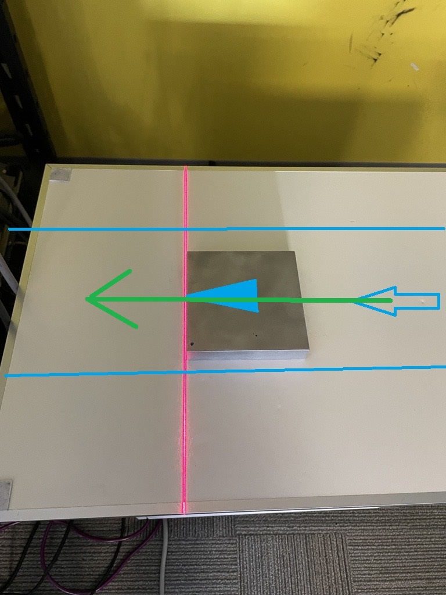

|

The X direction can be tested the same way.

After the X, Y, Z directions are identified, left or right hand rule can be identified. The laser camera can output in both ways, but 
the DaoAI Vision only accept coordinates with right-hand rule applied. 

The right-hand rule is displayed below. If the direction of the coordinates of the laser camera satisfy the right-hand rule, then no further action is required.

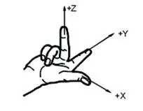

|

However, if left-hand rule is applied. The output need to be inversed to right-hand rule coordinates. "Manage" -> "Layout" -> "Inverse" to change the coordinates direction.

.. note::
    Keep in mind that the coordinates system in Vision has a displacement in positive Z direction of 1000 mm. For example, X,Y,Z(100,200,300) in laser camera corresponds to X,Y,Z(100,200,1300) in Vision.

|

At the moment the photoelectric sensor detects an object, the laser camera start to scan, and a coordinates system is established for the item. The robot create its own coordinates system at the same time. 
The distance difference between two coordinates is always the same while the conveyor is moving. The robot read the position of the target based on the robot coordinates system. The robot pick the object when it can reach the position of the item. 

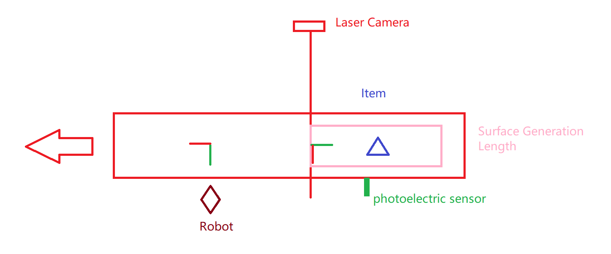

|

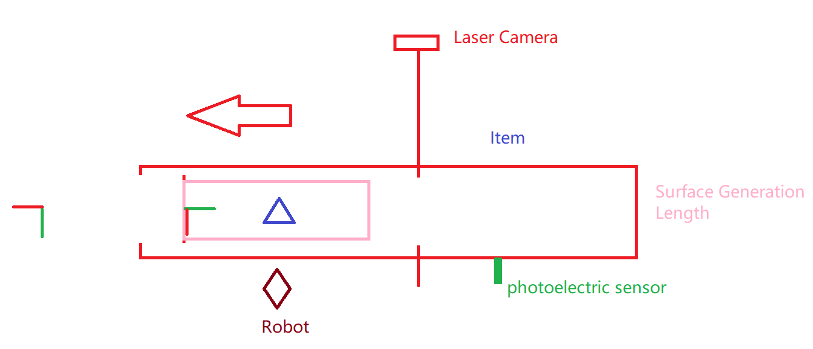

|

Calibration
~~~~~~~~~~~

For the calibration, place the calibration target (sphere) on the four different positions like the image below, so each time it has a changing X position or changing Y position. 
The following calibration process is the standard sphere calibration.

.. note::
    Place an item in front of the target to trigger the sensor to start the scan.

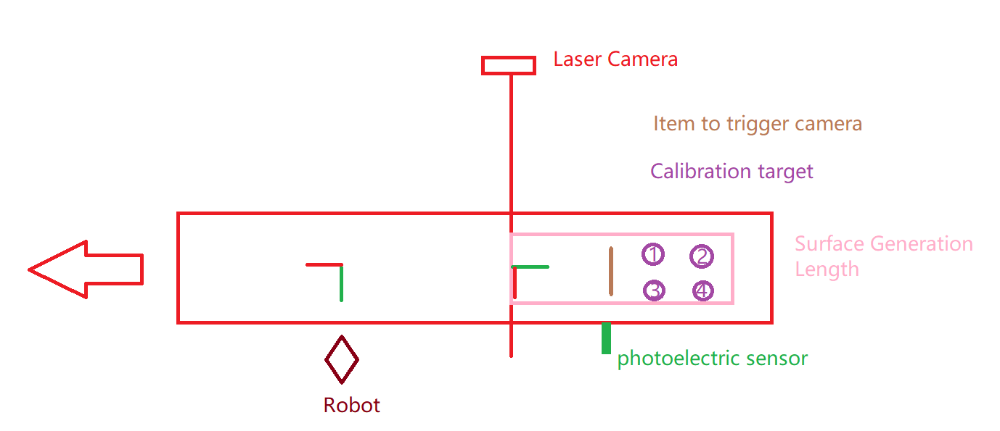

|

.. Connect the virtual camera via DaoAI Vision Studio
.. ~~~~~~~~~~~~~~~~~~~~~~~~~~~~~~~~~~~~~~~~~~~~~~~~~~

.. Network configuration
.. ~~~~~~~~~~~~~~~~~~~~~

Common Issues
~~~~~~~~~~~~~

**Unable to detect the moving bar at alignment:**

*Solution*: In the "Sensor"->"Active Area", drag the bottom of the area of interest to the lowest position possible.