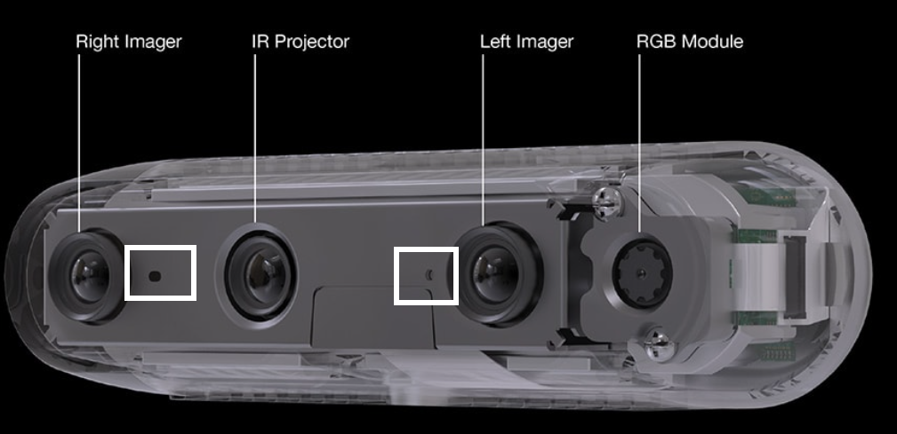
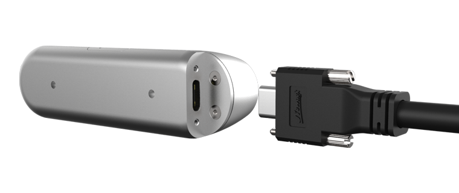
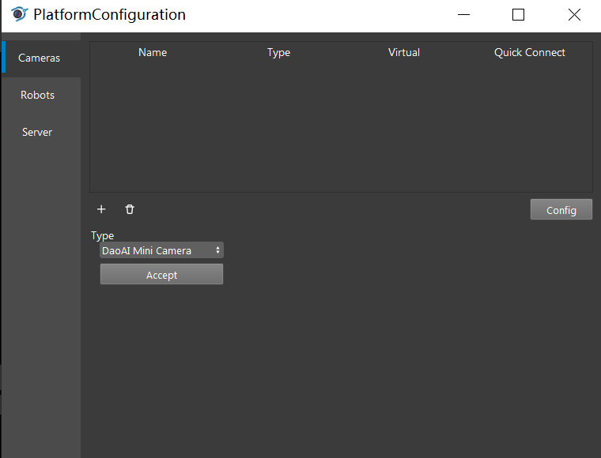
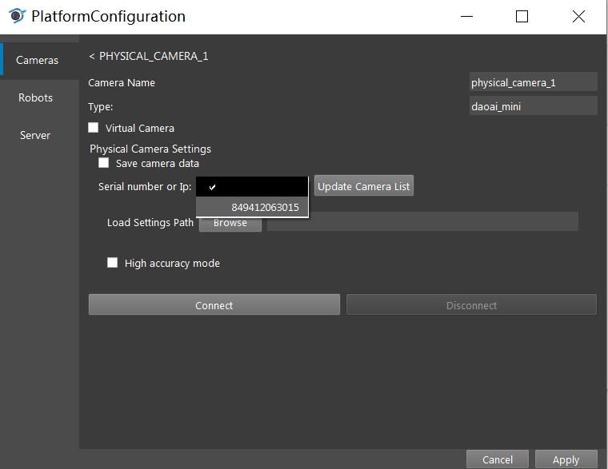
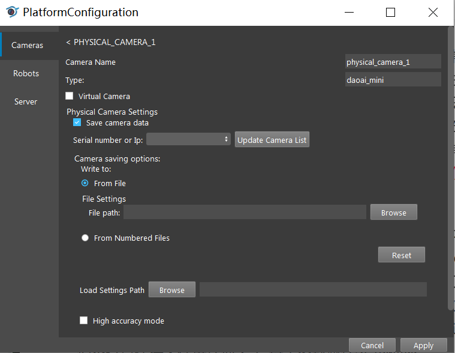
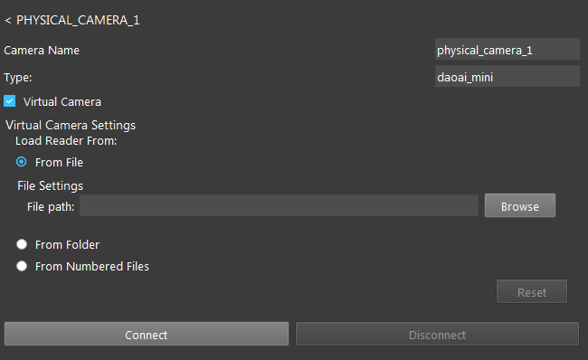

Daoai Mini Camera
=================

Physical Camera Wire Connection
-------------------------------

On the front, there are three lenses. Two of them are for image capture and the middle lense is for IR projection. RGB module is an additional components on certain modules like D455. Two small holes bounded by white rectangle are for depth detection.

On the back, the USB-C connector on the side of the camera is for connection to PC. Two whole on the back of the camera are for mounting purpose.

.. caution:: Make sure you are connecting to a USB-3 port that is intergrated on the motherboard. If you are connecting to the front panel that is connected indirectly to the motherboard, you might lack power supply when you capture.

.. hint:: The RealSense D400 series cameras will function when recognized as USB 2 and also when connected to USB 2 ports. However, there is limited support for USB 2.

Connect the camera via DaoAI Vision Studio
------------------------------------------

Open the Vision Software and click on the New Project button on the top left. 

.. image:: camera-image/Picture17.png
   :width: 100%

In the New Project dialog, you can name the project and select the file location, then press “ok”.

.. image:: camera-image/Picture18.png
   :width: 100%

Once you finished creating the new project, on the top menu bar click the ``Platform`` -> ``Platform config`` to config the camera.  

There are three categories are listed on the left side of the Platform Config Window and the selected catogory will be highlighted by a vertical blue bar. You can add cameras in Camera catogory by pressing the “+” button. 

.. image:: camera-image/Picture20.png
   :width: 80%

Under the Type, click the Dorpdown list to see the options and add a DaoAI Mini Camera by selecting it and clicking the Accept button. A new dialog will pop up for configuring the mini camera. You can load the cfg file saved from the studio into the “Load Settings Path” as the setting used for configuring the camera node in the Vision software. To delete the camera, you can click on the camera and press the trash bin icon to delete it. 

.. image:: camera-image/Picture22.png
   :width: 80%

To add a camera, you can press the “Updated Camera List”, then press the blank box on the left to discover if the camera's serial number has been updated. If the number pops up, you can select the camera by clicking it. The load Setting Path function allows you to load the mini camera config file (not the .cfg one that ds camera use) to enhance the image quality. You can also active high accuracy mode here. Then, press the “Connect” button to connect the camera with other nodes. 

.. note:: ``High Accuacy Mode`` will limit the point cloud generated in the way of filtering the points having lower confidence. Thus if ``High Accuracy Mode`` is enabled, the point cloud generated will be less condent.

Connect the virtual camera via DaoAI Vision Studio
--------------------------------------------------

To generate virtual camera files, you can simply check the ``Save camera data`` checkbox in the Camera Configuration window. Everytime ``Camera`` node runs, it will save the virtual camera file to your destination folder as .dmf format.

You can load dmf files that were generated from the previous step as the camera input. To do so, you need to check the ``Virtual Camera`` checkbox, and choose the loading option to load the dmf files. You can either iterate every single .dmf through a folder or just load a single dmf file. Then press the “Connect” button to connect the virtual camera.  

Use Camera with Camera Node
---------------------------

Once configuring the camera, switch back to the flowchar. Right click the "+" sign and add the camera node. 

.. image:: camera-image/Picture29.png
   :width: 60%

.. image:: camera-image/Picture30.png
   :width: 80%

Then click on the camera node and select the camera you just added in platform config window.

.. image:: camera-image/Picture31.png
   :width: 80%

Now if you run the ``Camera`` node, it will generate camera capture or virtual camera image.

Common Issues
-------------

USB connection
~~~~~~~~~~~~~~

You must use a USB-3 -- USB-C connection wire in order for the camera to run properly. If you still have connection problems try the following workarounds.
  
  * Unplug the camera and plug it back in quickly.
  * Connect the cable to the camera side first then to the host second.
  * Reverse the orientation of the C-Type connector to the camera.
  * Plug in the camera to other PCs with USB 3 ports and plug it back into the original PC.

Image quality
~~~~~~~~~~~~~

Since Mini Camera is using binocular stereo vision, it has a valid depth range where both of the imager can capture the scene. If the camera is too close to the scene, it is not able to generate valid depth information of the scene.
  
   .. image:: mini-images/mini-invalid-depth-band.png
      :width: 80%

Here's an example of bad point cloud quality due to short distance between camera and scene.

   .. image:: mini-images/mini-invalid-depth-example.png
      :width: 80%