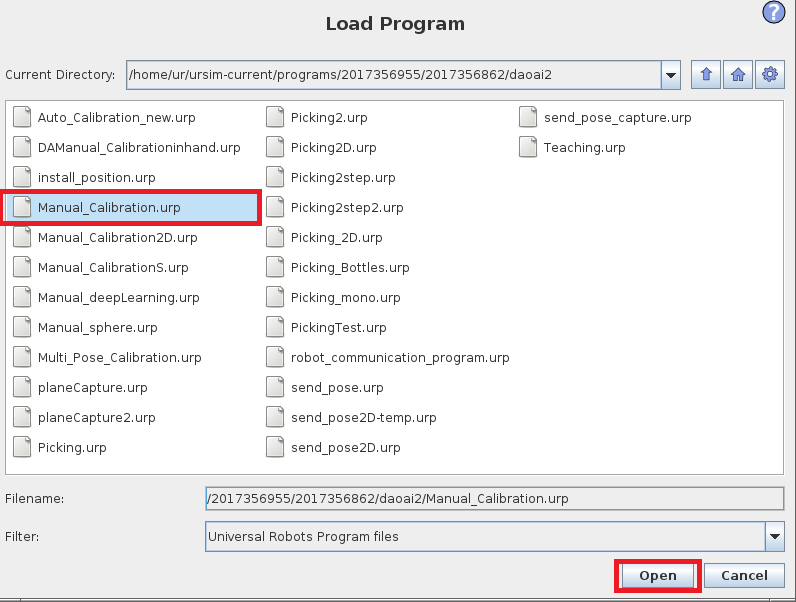
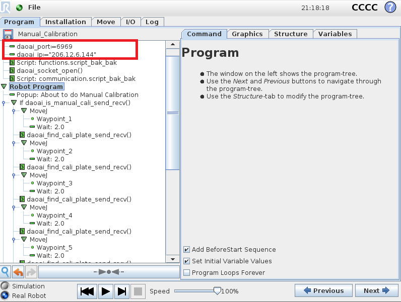
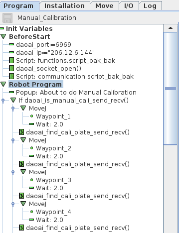
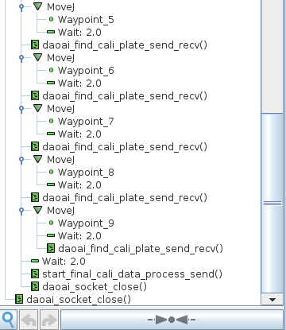
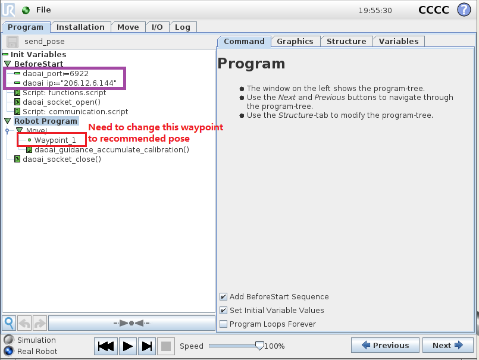
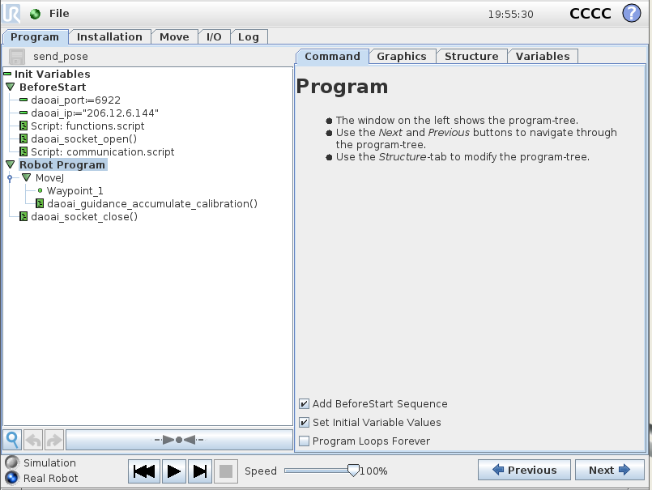
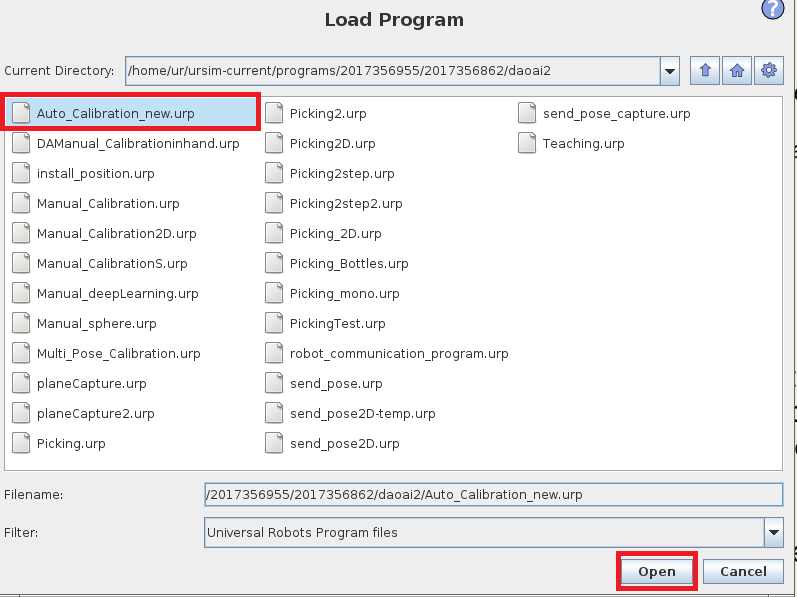
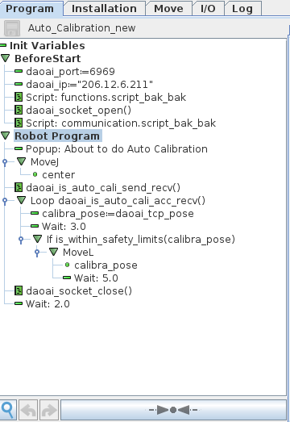
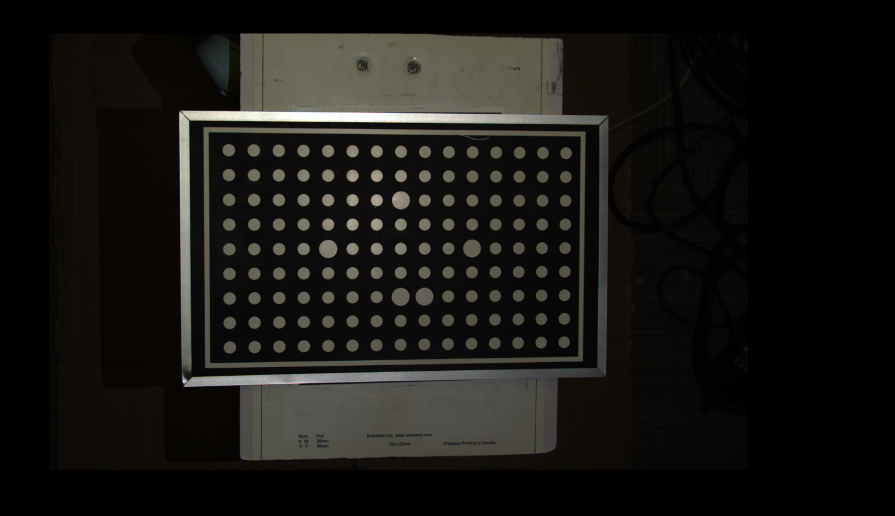

Calibration Program
===============

This page is about **Universal Robot** (alias as UR) specific instruction of Calibration. Please make sure you have read `Installation and Setup <link URL>`_ and `Calibration <https://daoai-robotics-inc-daoai-vision-user-manual.readthedocs-hosted.com/en/latest/complete-vision-guidance/overview.html#calibration>`_.

.. Note ::
	The Calibration programs in default DaoAI package is ready to use. If user does not plan to change the Calibration process flow, we recommend to leave the program as it is. 
	If user decides to modify the program, please make sure it matches the communication protocols with DaoAI Vision side. For detail of communication details please see `Socket <https://daoai-robotics-inc-daoai-vision-user-manual.readthedocs-hosted.com/en/latest/hardware/robot/socket.html>`_ and `Communication Flow <https://daoai-robotics-inc-daoai-vision-user-manual.readthedocs-hosted.com/en/latest/hardware/robot/comm.html>`_ .

The goal of Calibration is to confirm the relation between Robot Base and Camera(Camera to Base).

.. image:: Images/calibration_goal.png
    :align: center
    
|

Different Calibration Programs
-----------------------

Manual Calibration
**********************

First of all, we opens up the Manual_Calibration.urp, connect robot with **Vision**.

    
|

    
|

The program flow would looks like this:

    
|

In this Manual Calibration sample program, robot opens socket connecting to **Vision**, traverse all the waypoints, then ends Calibration process and close the socket. In pseudo code:

.. code-block:: python

   Manual Calibration():
	open_socket()
	if(vision is in Calibration_mode):
		loop until(No_more_waypoints):
			send(current_pose)
			move_robot(waypoint_n)
			wait(2 second)
		end_of_loop

		send(done_Calibration_message)
		close_socket()
	else:
		close_socket()
   end_of_function

Guidance Calibration
**********************

Opening up the Guidance_Calibration.urp, connect robot with **Vision**.

    
|

The program flow would looks like this:

    
|
In this Guidance Calibration sample program, robot opens socket connecting to **Vision**, sending current pose and message to **Vision** and start Guidance Calibration process. 

Repeat: UR sends the current pose to **Vision**; **Vision** determine if the pose is good; 
	* if good, accumulates the pose then calculates and replies back the recommended pose to UR; then user moves UR to next pose; 
	* if bad, **Vision** outputs the calculated recommended pose; then user moves UR to the recommended pose;

Until **Vision** has collected enough poses, it sends a stop signal to UR terminating the Guidance Calibration process. UR closes the socket. 
In pseudo code:

.. code-block:: python

	Guidance_Calibration():
		open_socket()
		send(current_pose)
		close_socket()
	end_of_function

|

.. note ::
	In Guidance Calibration process, robot program needs to be rerun in each waypoint. And changing the waypoint as recomended pose in program.

Auto Calibration
**********************
Opening up the Auto_Calibration.urp, connect robot with **Vision**.

    
|

.. image:: Images/setup_auto_cali.PNG
    :align: center
    
|

The program flow would looks like this:

    
|

In this Auto Calibration sample program, robot opens socket connecting to **Vision**, sending message to **Vision** to confirm Auto Calibration process. 

Repeat: UR sends the current pose to **Vision**; **Vision** accumulates the pose then calculates and replies back the next pose to UR; then UR moves to next pose; 

Until **Vision** has collected enough poses, it sends a stop signal to UR terminating the Auto Calibration process. UR closes the socket. 
In pseudo code:

.. code-block:: python
	Auto_Calibration():
		open_socket()
		move_robot(waypoint_1)
		send(start_auto_calibration)
		recieve(start_calibration)
		loop until(calibration_done):
			robot_move(receive_pose)
			send(next_pose)
			receive(next_pose)
		end_of_loop
		close_socket()
	end_of_function

The Waypoints
-----------------------

Waypoints are important for the Calibration output. If the waypoints are not good, the Calibration output would have large error. Which would affect the detection pose results and robot might not be able to pick.

Waypoint locations should try to follow the clockwise or counter-clockwise direction within camera scene. The first waypoint can be at the middle(Or anywhere you could remember). Then central top, central top to the right......until the wapoint can form a circle to produce enough poses.
Each waypoints should have slightly tilt and rotation. Try to keep tilting degree small, and rotate around the wrists.

.. warning ::
	Guidance Calibration and Auto Calibration only needs to setup the first waypoint. For Guidance Calibration and Auto Calibration, first wapoint should always be the central location.

    
This is the sample central waypoint. 

|
.. image:: Images/cali_waypoint_layout.png
    :align: center

This is the sample waypoints layout poses, this is 9 waypoints. If user decides to add more waypoints to minimize the error, user need to modify the program. 
But the basic concept of wayppoints is the same: waypoints can form a circle around the central waypoint.

Execute the Program
-----------------------

Click ``Run`` on both **Vision** and UR, now you should see the robot moves to different poses, Camera captures and **Vision** accumulates the data. You just need to sit back and relax, wait for it to be done!

.. warning ::
	Even though you can sit back and relax, but remember to MONITOR the robot movement!!! Do NOT hit anything!!!
