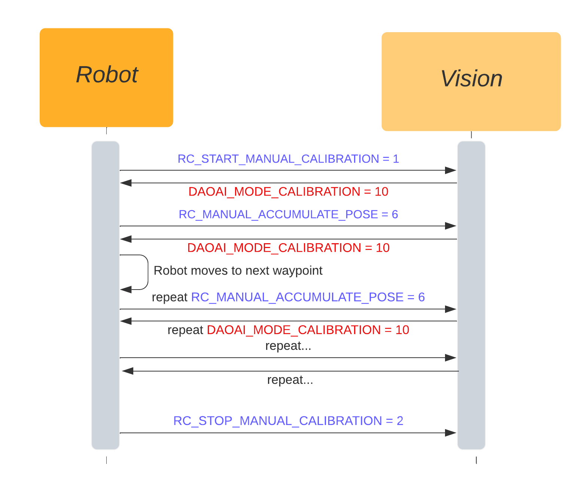
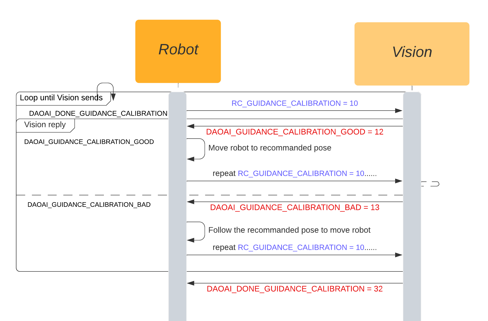
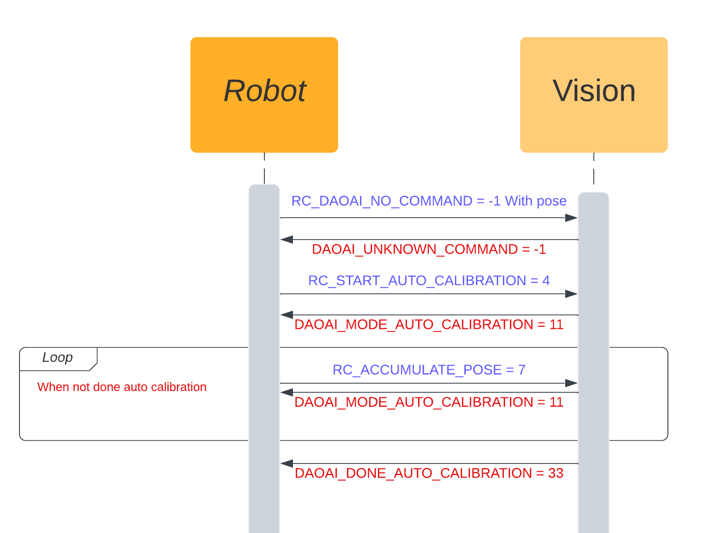
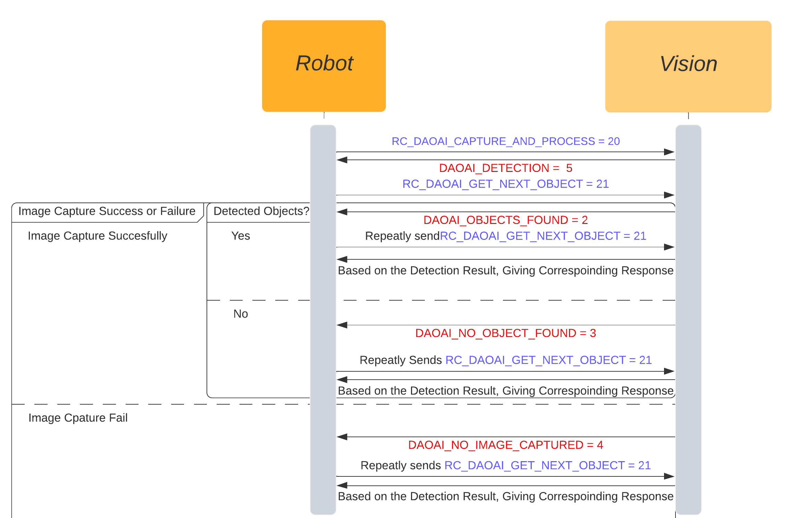

Communication Flow
=================

Calibration
~~~~~~~~~

Manual Calibration
***************

The flow of Manual Calibration is like followed:

1. Setup all the waypoints in the program.

2. Robot sends ``RC_START_MANUAL_CALIBRATION`` initating the manual calibration mode.

3. Vision replies ``DAOAI_MODE_CALIBRATION`` acknowledge the manual calibration mode.

4. Robot sends ``RC_MANUAL_ACCUMULATE_POSE`` and requests **Vision**  to enter accumulate mode, accumulates the poses and images for calibration. Then **Vision** replies 
``DAOAI_MODE_CALIBRATION`` to continue manual calibration, robot moves to next waypoint.

5. After robot traversed all the waypoints, robot will send ``RC_STOP_MANUAL_CALIBRATION`` to exits **Vision** from manual calibration mode.

    
|

Guidance Calibration
***************

The flow of Guidance Calibration is like followed:

1. Setup the first calibration pose.

2. Robot sends ``RC_GUIDANCE_CALIBRATION`` to request start of Guidance Calibration.

3. **Vision** collects the first pose then calculate and show the next recommanded calibration pose.

4. Robot would be manually moved by user to the recommanded pose, then collect this pose with ``RC_GUIDANCE_CALIBRATION`` command to **Vision** .

5. Based on the pose sent back from robot, **Vision** will calculate and decide if it is a good pose:

	a. if this pose is acceptable, **Vision** sends ``DAOAI_GUIDANCE_CALIBRATION_GOOD`` as well as showing the next recommanded pose for user;

	b. if this pose is not good enought, **Vision** would recalculate the current pose then output the recalculated pose showing to user, user should move to this pose then repeat the calculation;

6. Repeats tje 4-5 step until **Vision** has collected enough poses to perform final calibration.

7. After the accumulations, **Vision** sends ``DAOAI_DONE_GUIDANCE_CALIBRATION`` to terminate Guidance Calibration process on robot.

   
|

Auto Calibration
*************

The flow of Auto Calibration is like followed:

1. Setup the first calibration pose

3. Robot sends ``RC_START_AUTO_CALIBRATION`` to initate the calibration process, **Vision** replies ``DAOAI_MODE_AUTO_CALIBRATION`` to enter Auto Calibration process. This command also sends the current pose to **Vision**.

4. Robot follows this status, it sends back the pose(after moving to the calibration pose) and command ``RC_ACCUMULATE_POSE`` to **Vision** . **Vision** will collect this pose and calculate the next calibration mode, replies ``DAOAI_MODE_AUTO_CALIBRATION`` and the calculated pose.

5. Repeating step 4 until **Vision** has collected enough poses for calibration result. Then, **Vision** sends ``DAOAI_DONE_AUTO_CALIBRATION`` to terminate the Auto Calibration process at robot side.

   
|

Picking
~~~~~~~~~

The flow of picking process is like followed:

1. Setup the detection pose. When the camera is capturing image, robot needs to stay outside of the scene. Hence, this pose is where the robot should be when camera is capturing the image.

2. Robot sends ``RC_DAOAI_CAPTURE_AND_PROCESS`` to initating the start of picking process, this is acknowledge stage. **Vision** replies back ``DAOAI_DETECTION`` to inform it is at picking process.

3. Robot sends ``RC_DAOAI_GET_NEXT_OBJECT`` to request the detection results from **Vision** . Based on the detection results, there are 3 possibilities from the detection: image capture failed, no objects detected on scene and objects found.
So that, **Vision** has 3 status to reply: ``DAOAI_NO_IMAGE_CAPTURED`` , ``DAOAI_NO_OBJECT_FOUND`` and  ``DAOAI_OBJECTS_FOUND`` respectively. 

4. According to **Vision** replies, robot would perform picking:

	a. When **Vision** has failed capturing image, robot holds still and sends ``RC_DAOAI_GET_NEXT_OBJECT`` to request detection again, and repeats;

	b. When **Vision** cannot detect any objects, robot holds still and sends ``RC_DAOAI_GET_NEXT_OBJECT`` to request detection again, and repeats;

	c. When **Vision** detected objects in scene, robot will receive the pose, and robot performs picking. Then, robot moves back to detection pose.The replies from **Vision** contains ``payload_`` which represents the number of remaining objects in scene. Then robot sends back ``RC_DAOAI_GET_NEXT_OBJECT`` waiting for next object pose, and repeats;

   
|

