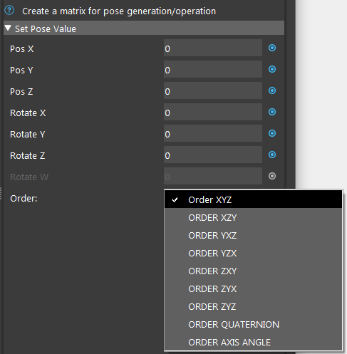
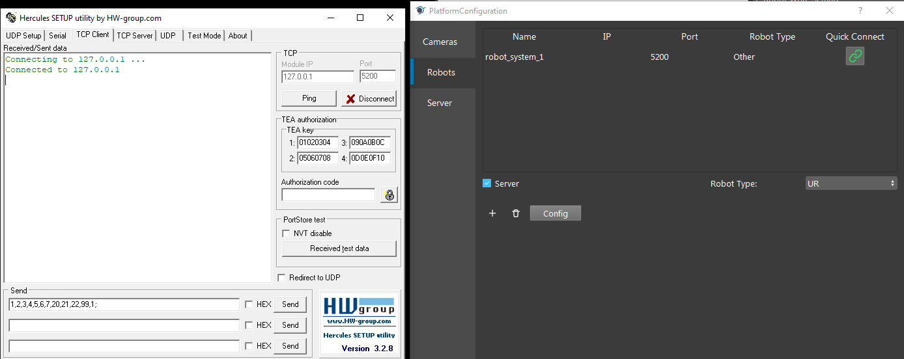
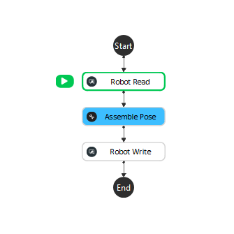
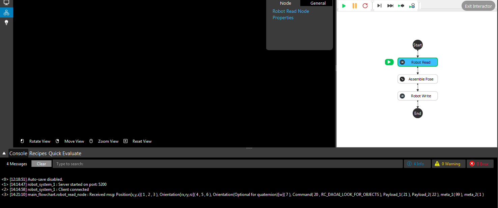
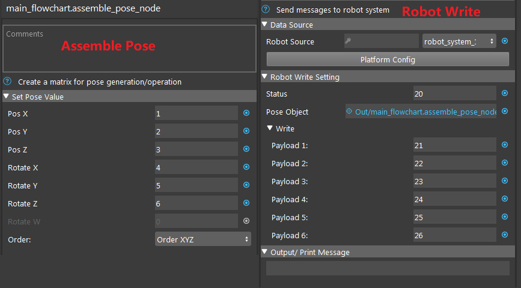
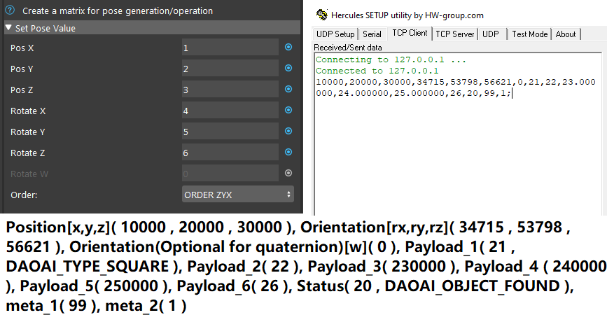

Euler Angle Order
-----------------

One of the common issue you will encounter when you start working with **Vision** and robot is the Euler Angle Order. EUler Angle is the order of Orientation for robot poses. They are also referred as rotations(rx, ry & rz). 
The orders for these orientation will affect the actual robot's poses. Therefore, you should pay attention on the robot & **Vision** Euler Angle orders for communications.

|

Different robots have different orders for their Euler Angle. Since these order is fixed when the robot is manufactured. 
We can alter the Euler Angle on **Vision** side to match the Euler Angle on different robots. 
As the image shown above, there is an option **Order** in **Vision**. 
This is the order for different Euler Angle. 

This is important when working with a new robot or a robot which you are not familiar with. **Vision** is using **XYZ** order by default. 
If you do not change this Euler Angle order, robot will read the pose differently. 
Below is an example of applying the wrong Euler Angle:

Here we connected Hercules virtual robot to **Vision**. And Hercules will the the message **1,2,3,4,5,6,7,20,21,22,99,1;** to **Vision**. 

On **Vision** side, we receive message with **Robot Read** node. The message will display on the console. Pay attention to the Orientation vector: **rx => 5, ry => 5, rz => 6**. 

.. note::
    We recommend you to read `Request and Response <https://daoai-robotics-inc-daoai-vision-user-manual.readthedocs-hosted.com/en/latest/hardware/robot/socket.html#request-message>`_ for details about robot communication, so that you will have a better understanding of the rest of the article. 

And keep in mind that **Vision** has Euler Angle order of **XYZ** by default. Therefore the Orientation is **XYZ order => rx, ry then rz**.

|

The received message on **Vision** side is:

 **main_flowchart.robot_read_node : Received msg: Position[x,y,z]( 1 , 2 , 3 ), Orientation[rx,ry,rz]( 4 , 5 , 6 ), Orientation(Optional for quaternion)[w]( 7 ), Command( 20 , RC_DAOAI_LOOK_FOR_OBJECTS ), Payload_1( 21 ), Payload_2( 22 ), meta_1( 99 ), meta_2( 1 )**

Then we put these number in **Assemble Pose** node and using default **Order XYZ**. Filling in the payloads in **Robot Write** node. 

|

Then, sending this message by executing **Robot Write** node, you will see the message on **Hercules** side. 

.. image:: Images/her_rec_xyz.png
    :align: center

The received message on **Hercules** side is:

 **10000,20000,30000,40000,50000,60000,0,21,22,23.000000,24.000000,25.000000,26,20,99,1;** 

The order of orientation remains the same since we assemble the pose with **Order XYZ**. 

.. note::
    You might notice the pose **Vision** sent back is all multiply with **10000** in value. This is another factor which you need to pay attention to: the **MULT** factor in communication. You will see more information about this factor in the next article.

Now we will show you the message with different orders: 

Order **ZYX** is another common order for robots. You can see even if we assemble the pose with exact same values, the actual pose robot receive is totally different. 
This could cause serious of failure in actual project or working environment. Hence, the Euler Angle is extremely important.

You use the example above to test your robot's Euler Angle. If you see the values are matching, you found your Euler Angle order. Another way to 
find out what is your Euler Angle order, you can record all the calibration poses into **.bag** files. Calibrate with all these poses. You might see the 
Calibration error is larger than 10mm(usually 30-40mm). It means your Euler Angle order is not right. Exhausting all the other Euler Angle orders, you will find 
**ONE** Euler Angle order will calibrate with good error(usually error around 1mm or smaller is good). Then, this is the Euler Angle for your robot.
