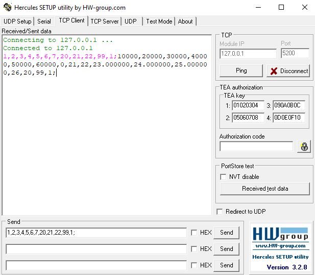
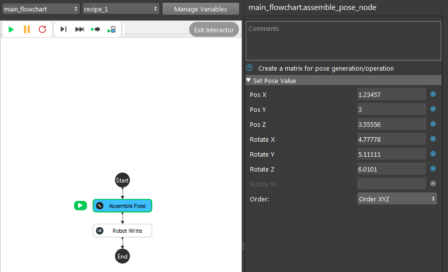
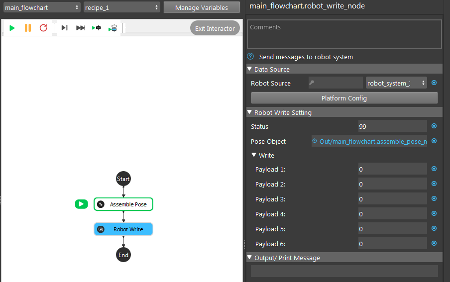
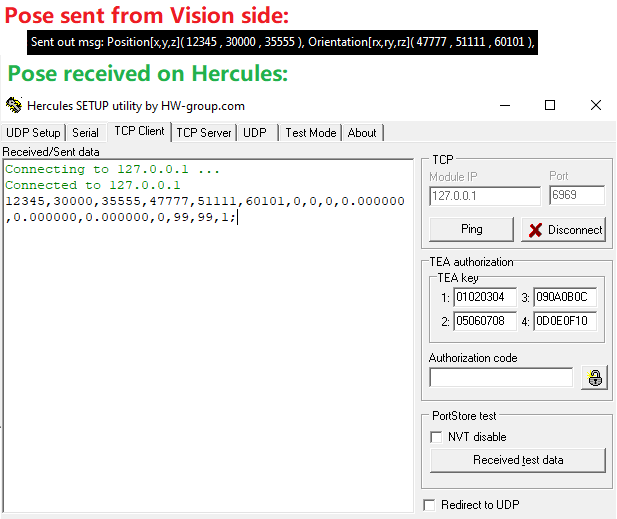

MULT Factor
====================

You might have already noticed that, robot poses are in **double/float** format while **Vision** is **integers**. This is mainly because of 
the communication is through a fixed size of socket. The maximum amount of numbers it can fit is limited(You can checkout `this article <https://daoai-robotics-inc-daoai-vision-user-manual.readthedocs-hosted.com/en/latest/hardware/robot/socket.html>`_ to 
see the structure of this message and the data types for better understanding). While there are some robots are sending poses in unit of **meter**. 
It will remain a long number behind the decimal. To restrict the number in proper length, we multiply the number with a **MULT** factor. 

Message **Vision** sent: 

 **Position[x,y,z]( 10000 , 20000 , 30000 ), Orientation[rx,ry,rz]( 34715 , 53798 , 56621 ), Orientation(Optional for quaternion)[w]( 0 ), Payload_1( 21 , DAOAI_TYPE_SQUARE ), Payload_2( 22 ), Payload_3( 230000 ), Payload_4 ( 240000 ), Payload_5( 250000 ), Payload_6( 26 ), Status( 20 , DAOAI_OBJECT_FOUND ), meta_1( 99 ), meta_2( 1 )**

Message **Hercules** received:

| 

You see from the image above, **Hercules** receives the pose with values multiply with **10000**. 
This **MULT** factor only apply to **x, y, z** coordinates, **rx, ry, rz** orientation/rotations. 
The rest of the fields are remain the same(some of them format changed from **Integers** to **Doubles/Floats**, but does not change the values). 

Some robots have the **MULT** transformation integrated on **Vision** side, some do not. All the listed types of robot will 
have the transformation done by **Vision**, but if you are using a robot new type of robot, you will need to process the transformation on robot's script or using an external script to process the transformation. 

Check the Values!!!
-------------------

After all the process with **MULT** factor, you have to check if the essential data(numbers) were kept. Many robots supports preview of the received poses, which allows you 
to check the coordinates before the robot perform any movements. 

You can check by the following steps:

    #. Send a customized double with long numbers after the decimal;
    #. Send the customized pose to **Hercules** and check how many numbers after the decimal had kept;

|

|

You can see the received pose on both **Vision** side and  **Hercules** side: ensure that the pose sent is matching the pose received.

|

Now that you see the pose **Vision** sent is exactly the same as the pose **Hercules** received. 
Also note that, the pose **Vision** sent is trimmed down to 4 numbers after decimal, which is **MULT** factor **10000**. 
In this case, the process after **MULT** factor is correct and the values of a pose will be kept 4 numbers after the decimal in this type of robot.