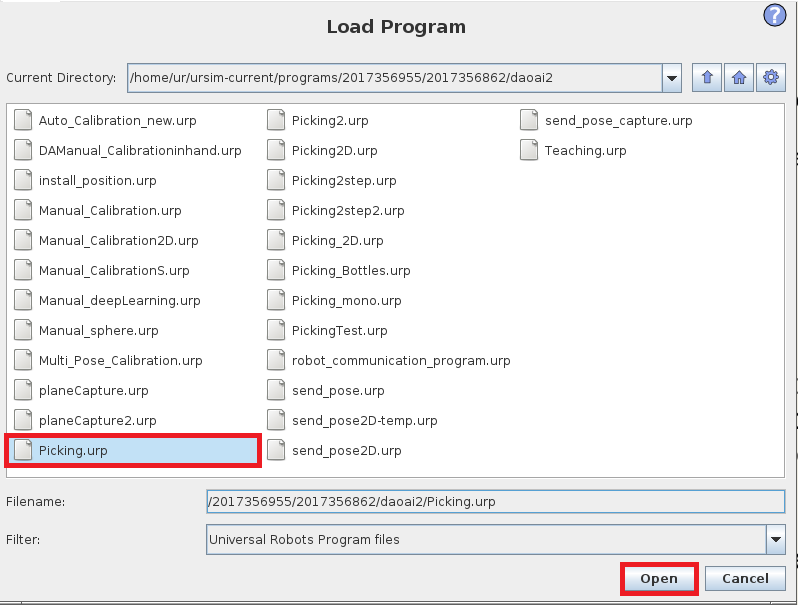
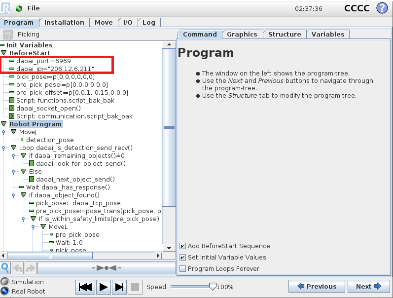
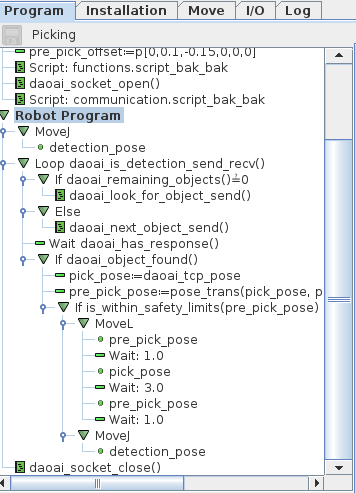
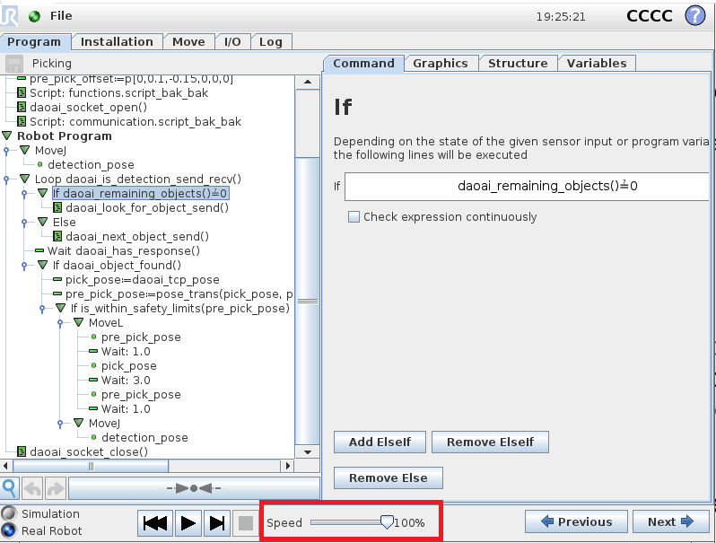
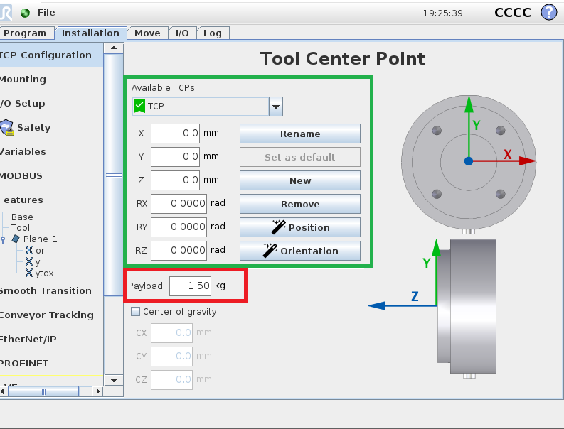

Picking Program
================

This page is about **Universal Robot** (alias as UR) specific instruction of picking process. Please make sure you have read `Installation and Setup <https://daoai-robotics-inc-daoai-vision-user-manual.readthedocs-hosted.com/en/latest/hardware/robot/ur_setup.html>`_ and `Picking <https://daoai-robotics-inc-daoai-vision-user-manual.readthedocs-hosted.com/en/latest/complete-vision-guidance/picking/overview.html>`_.

.. Note ::
	The Picking programs in default DaoAI package is ready to use. If user does not plan to change the picking process flow, we recommend to leave the program as it is. 
	If user decides to modify the program, please make sure it matches the communication protocols with DaoAI Vision side. For detail of communication details please see `Socket <https://daoai-robotics-inc-daoai-vision-user-manual.readthedocs-hosted.com/en/latest/hardware/robot/socket.html>`_ and `Communication Flow <https://daoai-robotics-inc-daoai-vision-user-manual.readthedocs-hosted.com/en/latest/hardware/robot/comm.html>`_ .

Program
--------------
First of all, we opens up the Manual_Calibration.urp, connect robot with **Vision**.

    
|

    
|

The program flow would looks like this:

    
|

In this Picking sample program, robot opens socket connecting to Vision; camera captures image, **Vision** performs detection, then **UR** performs picking. In pseudo code:

.. code-block:: python
	Picking():
		move(detection_pose)
		open_socket()
		send(start_picking)
		receive(detection_mode)
		loop until(disconnected):
			send(detection)
			if(receive is object_found):
				move(pick_pose)
				move(drop_pose)
				send(detection)
			else if(receive is object_not_found):
				send(detection)
			else if(receive is image_capture_failed):
				send(detection)
		end_of_loop
		close_socket()
	end_of_function

Execute Picking
--------------

.. attention ::
	Before picking, **Vision** needs to have a correct relationship between camera and robot base, **Tool Centre Point** to flange and correct setup.
		* We need a Calibration result for the current robot base and camera. The robot base and camera relationship needs to be the same for Calibration and this picking.(Because we need camera to base relationship in picking, and Calibration result is the camera to base relationship)
		* The **Tool Centre Point(TCP)** is correctly set at robot side
		* **REDUCE ROBOT SPEED!** This can prevent destructive collision! Monitor robot movement at all time!

.. image:: Images/calibration_goal.png
    :align: center

Calibration is required for accurate picking

    
Speed at 100% is pretty quick. While at experimental stage, set the speed below 30% to observe the robot movement.

TCP setting is in ``Installation`` tab. The green box area is the TCP in flange relationship, at default, TCP is centre point of flange. Red box area is the Payload weight, this should set to a correct weight of the object. 
If this Payload is larger than object, robot might have unexpected movement. Hence, **Make Sure TCP** and **Payload** are Set **Correctly**.

.. image:: Images/picking_vis.PNG
    :align: center

Checking the Visualize node in **Vision** is able to see the virtual picking pose.

Now, you can see the magic of Modern Machine Learning!

Collision Avoidance & Safety Related
--------------

**Vision** has Collision Avoidance feature to prevent collisions. This is helpful when robot arm is working in tiny area or pick from box. Collision Avoidance can visualize a box in the sceneto restrict a collision free are for robot arm.

.. warning ::
	Robot might have unexpected movement. And due to constrains in real world(such as tight working space for robot), robot needs to be monitor in developing and experimental stage. 
	Observe robot behavior until user ensures the program and work flow is correct.

If robot is about to hit anything, please initiate the Emergency Stop on UR panel. After Emgergency Stop, user should find the issue and fix it before restart the process.